<!-- deckrun: theme=midnight template=classic transition=slide -->

<style>
.mermaid svg p, .mermaid svg span, .mermaid svg div, .mermaid svg foreignObject * {
  font-size: 16px !important; line-height: 1.5 !important; margin: 0 !important; padding: 0 !important;
  font-family: "trebuchet ms", verdana, arial, sans-serif !important; letter-spacing: normal !important; text-transform: none !important;
}
.mermaid svg .node rect, .mermaid svg .node polygon, .mermaid svg .node circle, .mermaid svg .node path.basic {fill: var(--surface0) !important; stroke: var(--accent) !important; }
.mermaid svg .cluster rect {fill: var(--mantle) !important; stroke: var(--surface2) !important; }
.mermaid svg .edgeLabel, .mermaid svg .edgeLabel p, .mermaid svg .labelBkg {background: var(--base) !important; background-color: var(--base) !important; }
.mermaid svg .nodeLabel, .mermaid svg .nodeLabel p {color: var(--text) !important; }
.pet {display: none !important; }
</style>

# MicroPython

### Python on bare metal, and how to bend it to your build

<p style="color:var(--subtext0);max-width:62ch;margin-top:24px">Six parts: what MicroPython is next to CPython, building firmware from source,
every level at which you can patch and customise it, how the heap and garbage
collector actually work, memory tuning and the several kinds of "snapshot", and
a workflow that holds together in production.</p>

<!-- notes: Source references in this deck are from the MicroPython tree (py/gc.c, py/mpconfig.h, docs/develop, docs/reference). Version numbers and defaults drift, so check the tree you are building. -->

---

## How This Deck Is Organised

Difficulty rises as you go. Each part builds on the one before it.

<div style="display:grid;grid-template-columns:repeat(3,1fr);gap:12px;margin-top:16px">
<div style="background:var(--surface0);border:1px solid var(--surface1);border-radius:10px;padding:12px 16px"><div style="font-family:var(--font-mono);font-size:0.7em;letter-spacing:.09em;text-transform:uppercase;color:var(--overlay1)">Part 1 · basics</div><b>Python, CPython, MicroPython</b><br><small style="color:var(--subtext0)">implementations, differences, Microdot</small></div>
<div style="background:var(--surface0);border:1px solid var(--surface1);border-radius:10px;padding:12px 16px"><div style="font-family:var(--font-mono);font-size:0.7em;letter-spacing:.09em;text-transform:uppercase;color:var(--overlay1)">Part 2 · build</div><b>Building firmware</b><br><small style="color:var(--subtext0)">tree layout, ports, boards, flashing</small></div>
<div style="background:var(--surface0);border:1px solid var(--surface1);border-radius:10px;padding:12px 16px"><div style="font-family:var(--font-mono);font-size:0.7em;letter-spacing:.09em;text-transform:uppercase;color:var(--overlay1)">Part 3 · customise</div><b>Patching a build</b><br><small style="color:var(--subtext0)">six levels, and how patches are made</small></div>
<div style="background:var(--surface0);border:1px solid var(--surface1);border-radius:10px;padding:12px 16px"><div style="font-family:var(--font-mono);font-size:0.7em;letter-spacing:.09em;text-transform:uppercase;color:var(--overlay1)">Part 4 · internals</div><b>Heap and GC</b><br><small style="color:var(--subtext0)">blocks, mark and sweep, fragmentation</small></div>
<div style="background:var(--surface0);border:1px solid var(--surface1);border-radius:10px;padding:12px 16px"><div style="font-family:var(--font-mono);font-size:0.7em;letter-spacing:.09em;text-transform:uppercase;color:var(--overlay1)">Part 5 · internals</div><b>Memory & snapshots</b><br><small style="color:var(--subtext0)">config knobs, freezing, ROMFS, persistence</small></div>
<div style="background:var(--surface0);border:1px solid var(--surface1);border-radius:10px;padding:12px 16px"><div style="font-family:var(--font-mono);font-size:0.7em;letter-spacing:.09em;text-transform:uppercase;color:var(--overlay1)">Part 6 · practice</div><b>A workflow that holds</b><br><small style="color:var(--subtext0)">dev loop, OTA, debugging, quiz</small></div>
</div>

<small style="color:var(--overlay1)">basics → build → customise → internals → practice</small>

---

# Part 1 · Python, CPython and MicroPython

*One language, several implementations*

---

## The Language Is Not the Program

**Python** is a language specification. **CPython** is the program most people mean when they say "Python".

| Implementation | Written in | Made for |
| --- | --- | --- |
| **CPython** | C | the reference implementation: desktops, servers, anything with an OS |
| **MicroPython** | C | microcontrollers, bare metal, tens of KB of RAM |
| **CircuitPython** | C | a MicroPython fork aimed at beginners and Adafruit boards |
| **PyPy** | RPython | long-running programs that benefit from a JIT |
| **GraalPy · RustPython · Jython** | Java / Rust / Java | embedding Python in another runtime |

Each makes different trade-offs against the same language. The useful question is never "is this real Python", it is **which subset, at what cost**.

---

## CPython in One Slide


- Written in C. Runs on an operating system, with a filesystem, threads and virtual memory
- Memory: **reference counting** plus a generational cycle collector
- Batteries included: a very large standard library, plus PyPI through `pip`
- A typical install is tens of megabytes; the interpreter alone needs a few MB of RAM

Perfect on a Raspberry Pi or a server. Impossible on a chip with 264 KB of RAM.

---

## What MicroPython Is

A **re-implementation of Python 3** written from scratch in C, for microcontrollers.

<div style="display:grid;grid-template-columns:repeat(3,1fr);gap:14px;margin-top:10px">
<div style="background:var(--surface0);border:1px solid var(--surface1);border-radius:10px;padding:14px 16px"><b>Tiny</b><br><small style="color:var(--subtext0)">A full build fits in a few hundred KB of flash and runs in tens of KB of RAM.</small></div>
<div style="background:var(--surface0);border:1px solid var(--surface1);border-radius:10px;padding:14px 16px"><b>Bare metal</b><br><small style="color:var(--subtext0)">No operating system required. The interpreter is the firmware.</small></div>
<div style="background:var(--surface0);border:1px solid var(--surface1);border-radius:10px;padding:14px 16px"><b>Interactive</b><br><small style="color:var(--subtext0)">A REPL over the serial port, on the chip, while it runs your code.</small></div>
<div style="background:var(--surface0);border:1px solid var(--surface1);border-radius:10px;padding:14px 16px"><b>Hardware first</b><br><small style="color:var(--subtext0)"><code>machine.Pin</code>, <code>I2C</code>, <code>SPI</code>, <code>PWM</code>, <code>ADC</code>, timers, deep sleep.</small></div>
<div style="background:var(--surface0);border:1px solid var(--surface1);border-radius:10px;padding:14px 16px"><b>Has a filesystem</b><br><small style="color:var(--subtext0)">Your <code>main.py</code> lives in flash; edit it and reset.</small></div>
<div style="background:var(--surface0);border:1px solid var(--surface1);border-radius:10px;padding:14px 16px"><b>Open and portable</b><br><small style="color:var(--subtext0)">MIT licensed, with ports for most popular MCU families and a Unix build.</small></div>
</div>

---

## The Same Program, Two Worlds

```python
# CPython, on a Linux box
import psutil
print(psutil.cpu_percent())
```

```python
# MicroPython, on an ESP32
from machine import Pin, ADC
import time

led = Pin(2, Pin.OUT)
sensor = ADC(Pin(34))

while True:
    led.value(not led.value())
    print("adc:", sensor.read_u16())
    time.sleep_ms(500)
```

Same syntax, same mental model. What changes is the library surface and the resources underneath.

---

## The Ports

| Port | Chips | Notes |
| --- | --- | --- |
| `esp32` | ESP32, S2/S3, C3/C6 | Wi-Fi, BLE, PSRAM support, built on ESP-IDF |
| `rp2` | RP2040, RP2350 | Raspberry Pi Pico family, CMake + pico-sdk |
| `stm32` | STM32 F/H/L/WB… | the original port, very mature |
| `esp8266` | ESP8266 | tight RAM; the classic constrained target |
| `samd`, `nrf`, `mimxrt`, `renesas-ra`, `alif` | various | vendor families |
| `zephyr` | anything Zephyr supports | MicroPython as a Zephyr app |
| `unix`, `windows` | your PC | testing, CI, and a real scripting host |
| `webassembly` | browser / Node | MicroPython in a page |
| `bare-arm`, `minimal` | reference | the smallest possible builds, for learning the build system |

The Unix port matters more than it looks: it is how you test logic without hardware.

---

## How MicroPython Differs From CPython

| Area | What to expect |
| --- | --- |
| **Standard library** | A subset, deliberately. `os`, `time`, `json`, `struct`, `socket`, `asyncio`, `re` and friends exist in reduced form |
| **Packages** | No `pip`. `mip` installs from micropython-lib or a URL |
| **Numbers** | Small ints are unboxed; big ints depend on the port. Floats are often single precision |
| **Classes** | Multiple inheritance is limited, some dunder protocols are missing, `__init_subclass__` and full descriptor support are not there |
| **Introspection** | `locals()` is not a live symbol table; tracebacks are shorter; no `inspect` |
| **Errors** | Messages are terse by design; some raise different exception types |
| **Concurrency** | `asyncio` is a reimplementation; `_thread` exists only on some ports |
| **Performance** | Fast to start, slower per operation than CPython on a PC, and far faster than nothing at all |

The MicroPython tree documents the exact cases in `tests/cpydiff/`, one small file per difference.

---

## What Is Actually Missing

```python
# Common surprises, all fixable once you know
import os                    # not 'pathlib'
import json                  # no 'pickle'
import time                  # time.ticks_ms(), not time.monotonic() everywhere
from micropython import const

_WIDTH = const(320)          # compile-time constant, no RAM, no lookup

# f-strings work, but not every corner of the grammar
# {} format spec, str.format and % all exist
```

- No `typing` at runtime (annotations are parsed, mostly ignored); keep type hints in comments or accept the cost
- No `dataclasses`, `enum`, `abc` in the core; several exist in **micropython-lib**
- No `threading`; use `asyncio` or a scheduler
- `sys.settrace` and profilers are absent or optional at build time

---

## CircuitPython, Briefly

A fork of MicroPython maintained by Adafruit, aimed at beginners and their boards.

| | MicroPython | CircuitPython |
| --- | --- | --- |
| Device appears as | serial REPL + internal filesystem | a **USB drive** you drop `code.py` onto |
| Hardware API | `machine` | `board`, `digitalio`, `busio` |
| Concurrency | `asyncio`, `_thread` on some ports | asyncio available, no threads |
| Interrupts | Python callbacks on some ports | mostly avoided by design |
| Focus | breadth of ports, production use | ease of use, huge driver library |

Drivers often port between them with small changes. For a product, MicroPython's port coverage and build flexibility usually win.

---

## Microdot: a Web Framework That Fits

**Microdot** is "the impossibly small web framework for Python and MicroPython" — Flask-shaped, asyncio-based, and small enough to run on a microcontroller.

```python
from microdot import Microdot

app = Microdot()

@app.route('/')
async def index(request):
    return 'Hello from the ESP32'

@app.get('/api/temp')
async def temp(request):
    return {'temp_c': read_sensor()}        # dict → JSON automatically

app.run(port=80)
```

- Routing, request/response objects, JSON, query args and form data in a single file
- Runs unchanged on CPython, so you can develop and test the app on your laptop

---

## Microdot in the Real World

| Extension | What it adds |
| --- | --- |
| `microdot.websocket` | WebSocket endpoints, for live dashboards |
| `microdot.sse` | Server-sent events |
| `microdot.utemplate` / `microdot.jinja` | HTML templating (uTemplate on device, Jinja on CPython) |
| `microdot.session` | Signed cookie sessions |
| `microdot.auth` | Basic and token authentication |
| `microdot.cors`, `microdot.csrf` | Browser-facing safety |
| `microdot.test_client` | Tests without a network |
| ASGI / WSGI adapters | Serve the same app from a real server on CPython |

```bash
mpremote mip install github:miguelgrinberg/microdot     # or copy the files yourself
```

---

## A Device That Serves Its Own UI

```python
import network, asyncio
from microdot import Microdot
from machine import Pin

led = Pin(2, Pin.OUT)
app = Microdot()

@app.get('/')
async def index(req):
    return '<button onclick="fetch(\'/toggle\',{method:\'POST\'})">Toggle</button>', \
           {'Content-Type': 'text/html'}

@app.post('/toggle')
async def toggle(req):
    led.value(not led.value())
    return {'led': led.value()}

async def main():
    wlan = network.WLAN(network.STA_IF); wlan.active(True)
    wlan.connect('ssid', 'password')
    while not wlan.isconnected():
        await asyncio.sleep_ms(200)
    print('http://%s/' % wlan.ifconfig()[0])
    await app.start_server(port=80)

asyncio.run(main())
```

---

## Choosing the Right Runtime

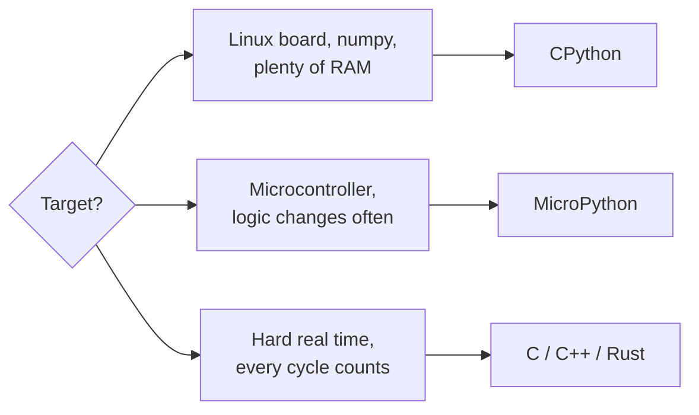

| Also worth knowing |
| --- |
| CircuitPython for teaching, makers and Adafruit boards |
| MicroPython **plus** C for the few hot paths: a user C module or a native `.mpy` |
| The Unix port of MicroPython for running the same logic in CI |

The common production answer is **both**: MicroPython for orchestration and business logic, C for what must be fast or exact.

---

## How MicroPython Runs Your Code

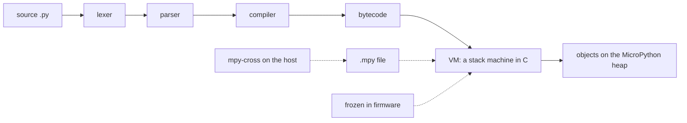

- The compiler is **on the device** by default, so the REPL can compile what you type
- `mpy-cross` moves that step to your PC, producing `.mpy` bytecode files
- Frozen modules are `.mpy` content linked into the firmware image
- Turning the compiler off (`MICROPY_ENABLE_COMPILER 0`) is possible when everything is frozen — it saves substantial flash, at the price of no REPL compilation

---

## Objects Are Mostly Pointers, Sometimes Not

The default object representation packs small values into the pointer itself.

```c
// py/obj.h, representation A
small int   : ...xxxxxxx1     value = o >> 1     no heap allocation at all
qstr        : ...xxxxx010     interned string id
immediate   : ...xxxxx110     None, True, False and friends
everything else: a real pointer to a heap object
```

- Arithmetic on small integers allocates **nothing**, which is why integer loops are cheap
- A float, a large int, a string, a list or an instance is a heap object with a type pointer
- Other representations exist (`MICROPY_OBJ_REPR_B/C/D`, including NaN-boxing) for different word sizes

Knowing this explains a lot: why `bytearray` beats a list of ints, and why string building costs more than it looks.

---

## `mip` and micropython-lib

```bash
mpremote mip install aioble            # from micropython-lib, onto the device
mpremote mip install github:org/repo
mpremote mip install --target=/lib logging
```

```python
import mip                              # or on-device, if the board has network
mip.install("umqtt.simple")
```

| | `pip` / PyPI | `mip` / micropython-lib |
| --- | --- | --- |
| Source | PyPI wheels | micropython-lib, GitHub, any URL |
| Format | wheels, often with C extensions | `.py` and `.mpy` files |
| Installs to | site-packages on a host | `/lib` on the device, or a frozen manifest |
| Dependencies | full resolver | simple, declared in `package.json` |

Anything you `mip install` can also be `require()`d in a manifest and frozen instead.
---

## Recap of Part 1

- Python is a language; **CPython** and **MicroPython** are two implementations with very different budgets
- MicroPython is a from-scratch Python 3 for microcontrollers: REPL, filesystem, `machine`, no OS needed
- The differences are a **subset**, documented case by case in `tests/cpydiff/`
- `mip` replaces `pip`; micropython-lib replaces much of the standard library
- **Microdot** gives a device a real HTTP/WebSocket interface in a few kilobytes
- CircuitPython is a friendlier fork; C is still the answer for the hardest real-time work

**Next:** getting from a git clone to firmware on a board.

---

# Part 2 · Building the Firmware

*From a git clone to a board that boots*

---

## The Source Tree

```text
micropython/
├── py/          the core: VM, compiler, runtime, objects, gc.c, mpconfig.h
├── extmod/      shared modules on top of py/ (asyncio, ssl, vfs, btree, lwip glue)
├── shared/      helpers shared by ports (readline, timeutils, netutils)
├── lib/         third-party submodules (tinyusb, lwip, littlefs, berkeley-db, cmsis)
├── drivers/     display, sensor and flash drivers in C and Python
├── ports/       one directory per target: esp32, rp2, stm32, unix, zephyr…
├── mpy-cross/   the cross-compiler: .py → .mpy bytecode
├── tools/       mpremote, mpy_ld.py, manifestfile.py, pyboard.py, CI helpers
├── tests/       the test suite, including tests/cpydiff
└── docs/        the documentation you are quoting in code review
```

Two rules of thumb: **`py/` is the language**, **`ports/` is the machine**. Most customisation happens in `ports/` and in build-time configuration.

---

## Build Once: the Unix Port

The fastest way to understand the build, and the way to test logic without hardware.

```bash
git clone https://github.com/micropython/micropython.git
cd micropython
make -C mpy-cross                      # the cross-compiler, needed by most ports

cd ports/unix
make submodules
make                                   # produces build-standard/micropython
./build-standard/micropython -c "import sys; print(sys.implementation)"
```

```text
(name='micropython', version=(1, 30, 0), _machine='linux [GCC 12.2] version 1.30.0-preview', _mpy=4102)
```

Variants exist for coverage and for testing configurations: `make VARIANT=coverage`, `VARIANT=minimal`.

---

## Build for an ESP32

```bash
# 1. the vendor SDK, at the version MicroPython pins
git clone -b v5.4.2 --recursive https://github.com/espressif/esp-idf.git
cd esp-idf && ./install.sh esp32 && source export.sh

# 2. MicroPython
cd ~/micropython/ports/esp32
make submodules
make BOARD=ESP32_GENERIC                        # or BOARD=ESP32_GENERIC_S3
make BOARD=ESP32_GENERIC BOARD_VARIANT=SPIRAM   # a variant of the same board

# 3. flash it
make BOARD=ESP32_GENERIC erase
make BOARD=ESP32_GENERIC deploy
```

⚠️ The ESP-IDF version is not optional: each MicroPython release pins one. Mismatches fail in confusing ways, usually deep inside the SDK.

---

## Build for a Pico, and for STM32

```bash
# rp2: CMake and the pico-sdk come as submodules
cd ports/rp2
make submodules
make BOARD=RPI_PICO_W
cp build-RPI_PICO_W/firmware.uf2 /media/$USER/RPI-RP2/    # drag and drop flashing
```

```bash
# stm32: plain make, and a board directory per target
cd ports/stm32
make submodules
make BOARD=PYBV11
make BOARD=PYBV11 deploy                 # via DFU
```

```bash
# what boards exist?
ls ports/esp32/boards ports/rp2/boards ports/stm32/boards
```

---

## What a Board Definition Contains

```text
ports/esp32/boards/ESP32_GENERIC/
├── mpconfigboard.cmake     board name, sdkconfig fragments, variants, frozen manifest
├── mpconfigboard.h         C-level defaults: MICROPY_HW_BOARD_NAME, feature switches
├── board.json              metadata for the downloads page
├── sdkconfig.*             ESP-IDF settings for this board or variant
└── mpconfigvariant_*.cmake one per variant: SPIRAM, OTA, UNICORE…
```

```cmake
# mpconfigboard.cmake, in essence
set(IDF_TARGET esp32)
list(APPEND SDKCONFIG_DEFAULTS boards/sdkconfig.base boards/sdkconfig.240mhz)
set(MICROPY_FROZEN_MANIFEST ${MICROPY_BOARD_DIR}/manifest.py)
```

A **custom board is just a new directory here**, and it is the cleanest customisation point in the whole system.

---

## The Configuration Layers

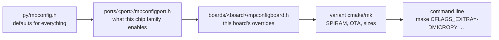

Each layer overrides the one before it with plain `#ifndef` / `#define`. There is no hidden magic: grep `py/mpconfig.h` for any `MICROPY_` name to see its default and its comment.

---

## Feature Levels

```c
// py/mpconfig.h
#define MICROPY_CONFIG_ROM_LEVEL_MINIMUM        (0)
#define MICROPY_CONFIG_ROM_LEVEL_CORE_FEATURES  (10)
#define MICROPY_CONFIG_ROM_LEVEL_BASIC_FEATURES (20)
#define MICROPY_CONFIG_ROM_LEVEL_EXTRA_FEATURES (30)
#define MICROPY_CONFIG_ROM_LEVEL_FULL_FEATURES  (40)
#define MICROPY_CONFIG_ROM_LEVEL_EVERYTHING     (50)
```

One line in a port or board header sets the **baseline** for hundreds of options:

```c
#define MICROPY_CONFIG_ROM_LEVEL (MICROPY_CONFIG_ROM_LEVEL_EXTRA_FEATURES)
```

Then override individual features around it. This is how a build for a 64 KB chip and a build for an ESP32-S3 share the same source.

---

## Getting Code Onto the Device

```bash
pip install mpremote

mpremote connect list                       # find the port
mpremote                                    # REPL
mpremote fs ls                              # list the device filesystem
mpremote fs cp main.py :main.py             # copy a file
mpremote fs cp -r lib/ :lib/                # copy a tree
mpremote run app.py                         # run without storing
mpremote mount .                            # mount the host directory live — best dev loop
mpremote mip install github:miguelgrinberg/microdot
mpremote reset
```

| Boot file | When it runs |
| --- | --- |
| `boot.py` | first, on every reset. Keep it tiny: network, mounts, watchdog |
| `main.py` | after `boot.py`. Your application |
| `_boot.py` | frozen into firmware; mounts the filesystem before the two above |


---

## What the Build Produces

```bash
ls ports/esp32/build-ESP32_GENERIC/
```

```text
micropython.elf        with symbols — what you load into a debugger
micropython.bin        the raw image that gets flashed
micropython.map        the linker map: where every byte of flash went
bootloader/            vendor bootloader
partition_table/       the flash layout
frozen_content.c       generated: your manifest, compiled to bytecode arrays
genhdr/qstrdefs.*      generated: the interned string table
```

- The **map file** answers "why did the firmware grow by 40 KB" faster than any guess
- `frozen_content.c` is worth reading once: it makes freezing concrete
- `genhdr/` is generated; never patch it, patch what generates it

---

## Choosing a Port

| If the project needs… | Look at |
| --- | --- |
| Wi-Fi and BLE, cheap modules, big community | `esp32` |
| Deterministic timing, PIO, dual core, low cost | `rp2` |
| Mature peripherals, industrial parts, CAN | `stm32` |
| Vendor RTOS integration and drivers | `zephyr` |
| Ultra low power radio stacks | `nrf` |
| Running tests and tooling in CI | `unix` |

Two practical criteria beyond the chip: does the port expose the peripherals you need from Python already, and is the vendor SDK one you are willing to pin for years?
---

## Recap of Part 2

- `py/` is the language, `ports/` is the machine, `extmod/` is the shared library layer
- Build the **Unix port** first: it is the fastest way to learn the tree and to test logic
- Each port has its own toolchain; the ESP32's pinned ESP-IDF version is a hard requirement
- A **board directory** carries the board's C defines, SDK settings, variants and frozen manifest
- Configuration cascades: `mpconfig.h` → port → board → variant → command line
- `mpremote` is the tool for copying files, mounting a host directory and installing packages

---

# Part 3 · Patching and Customising a Build

*Six levels, from a config flag to a maintained fork*

---

## Pick the Lowest Level That Works

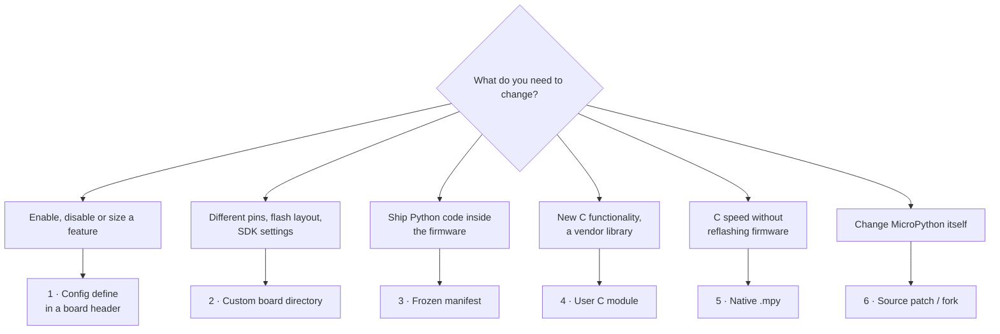

Every level up costs maintenance. Level 6 means you own a merge conflict for as long as the product lives.

---

## Level 1 · Configuration Defines

The whole of `py/mpconfig.h` is overridable. Examples worth knowing:

```c
// boards/MYBOARD/mpconfigboard.h
#define MICROPY_HW_BOARD_NAME               "ACME Sensor v3"
#define MICROPY_CONFIG_ROM_LEVEL            (MICROPY_CONFIG_ROM_LEVEL_EXTRA_FEATURES)

#define MICROPY_ENABLE_COMPILER             (1)   // 0 = frozen code only, saves a lot of flash
#define MICROPY_PY_BUILTINS_HELP            (0)   // drop help() text
#define MICROPY_PY_SYS_SETTRACE             (0)
#define MICROPY_ENABLE_SOURCE_LINE          (1)   // line numbers in tracebacks
#define MICROPY_ERROR_REPORTING             (MICROPY_ERROR_REPORTING_NORMAL)
#define MICROPY_FLOAT_IMPL                  (MICROPY_FLOAT_IMPL_FLOAT)  // or _DOUBLE, _NONE
#define MICROPY_LONGINT_IMPL                (MICROPY_LONGINT_IMPL_MPZ)
#define MICROPY_STACK_CHECK                 (1)
```

```bash
# a quick experiment without editing files
make BOARD=ESP32_GENERIC CFLAGS_EXTRA='-DMICROPY_PY_BUILTINS_HELP=0'
```


---

## Finding the Right Define

```bash
# every option, with its default and a comment explaining it
grep -n "MICROPY_PY_SSL\b" -A6 py/mpconfig.h

# what does this port already set?
grep -rn "MICROPY_" ports/esp32/mpconfigport.h | head -40

# which features come with each ROM level?
grep -n "ROM_LEVEL_AT_LEAST" py/mpconfig.h | head
```

```c
// the pattern every option follows
#ifndef MICROPY_PY_SSL
#define MICROPY_PY_SSL (MICROPY_CONFIG_ROM_LEVEL_AT_LEAST_EXTRA_FEATURES)
#endif
```

Because every option is `#ifndef`-guarded, **defining it earlier wins**. That is the whole override mechanism: board header, then port header, then the default.
---

## Level 2 · Your Own Board

```bash
cp -r ports/esp32/boards/ESP32_GENERIC_S3 ports/esp32/boards/ACME_SENSOR
```

```cmake
# ports/esp32/boards/ACME_SENSOR/mpconfigboard.cmake
set(IDF_TARGET esp32s3)

list(APPEND SDKCONFIG_DEFAULTS
    boards/sdkconfig.base
    boards/sdkconfig.usb
    boards/sdkconfig.240mhz
    boards/ACME_SENSOR/sdkconfig.board          # your overrides last
)

set(MICROPY_FROZEN_MANIFEST ${MICROPY_BOARD_DIR}/manifest.py)
set(MICROPY_USER_C_MODULES  ${CMAKE_SOURCE_DIR}/../../../acme_modules/micropython.cmake)
```

```text
# ports/esp32/boards/ACME_SENSOR/sdkconfig.board
CONFIG_ESPTOOLPY_FLASHSIZE_8MB=y
CONFIG_PARTITION_TABLE_CUSTOM=y
CONFIG_PARTITION_TABLE_CUSTOM_FILENAME="partitions-acme.csv"
CONFIG_FREERTOS_UNICORE=n
```

Everything about the product that is not code now lives in **one directory you own**, inside a tree you can still rebase.


---

## Three Real Customisations

| Goal | Level | What you actually do |
| --- | --- | --- |
| Firmware must fit a 1 MB partition | 1 | lower `MICROPY_CONFIG_ROM_LEVEL`, disable `help()`, `sys.settrace`, unused modules; freeze the app instead of shipping `.py` |
| A modem bursts more than the UART buffer holds | 6 | patch the port's UART buffer size, keep it as `0001-*.patch`, upstream the configurability |
| A vendor crypto library must be callable from Python | 4 | user C module wrapping the vendor API, built with `USER_C_MODULES` |

```c
// the first one, in one place
#define MICROPY_CONFIG_ROM_LEVEL (MICROPY_CONFIG_ROM_LEVEL_BASIC_FEATURES)
#define MICROPY_PY_BUILTINS_HELP (0)
#define MICROPY_PY_FRAMEBUF      (0)
#define MICROPY_PY_BLUETOOTH     (0)
```

Start at the top of the table and only move down when the level above cannot express the change.

---

## Pins and Board Hardware

Ports differ in how a board describes its pins, and this is usually the first thing a custom board changes.

```text
# ports/rp2/boards/ACME/pins.csv         name,pin
LED,GPIO25
SDA,GPIO4
SCL,GPIO5
```

```c
// ports/esp32 style: plain defines in mpconfigboard.h
#define MICROPY_HW_I2C0_SCL (5)
#define MICROPY_HW_I2C0_SDA (4)
#define MICROPY_HW_SPI1_MOSI (11)
```

```python
from machine import Pin
led = Pin("LED", Pin.OUT)          # named pins, where the port supports them
```

Keeping pin names in the board definition means the application code never carries a magic GPIO number.
---

## Level 3 · Freezing Python Into the Firmware

A `manifest.py` lists the Python that is compiled to bytecode at build time and linked into the firmware image.

```python
# boards/ACME_SENSOR/manifest.py
include("$(PORT_DIR)/boards/manifest.py")     # the port's usual set

require("aioble")                             # from micropython-lib
require("logging")

package("acme", base_path="$(BOARD_DIR)/../../../../app")   # your package
module("provisioning.py", base_path="$(BOARD_DIR)/../../../../app")

freeze("$(BOARD_DIR)/modules")                # everything in a directory
```

| Manifest call | Meaning |
| --- | --- |
| `module(path)` | freeze one `.py` file |
| `package(path)` | freeze a package directory |
| `require(name)` | pull a package from micropython-lib and freeze it |
| `include(manifest)` | compose another manifest |
| `freeze(path, script)` | the older general form, still used widely |
| `opt=N` | bytecode optimisation level for these files |

---

## What Freezing Actually Does

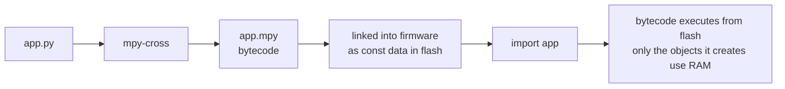

- Saves RAM twice: the source is never read into RAM, and the bytecode is not copied there either
- Saves flash compared with storing `.py` files in the filesystem, and speeds up boot
- Constants and strings live in ROM, so they cost no heap

⚠️ Frozen modules cannot be edited on the device. Keep the fast-changing part of the app on the filesystem during development, and freeze it for release.

---

## Level 4 · User C Modules

For a vendor library, a protocol, or a function that must be fast.

```c
// acme_modules/acmecrc/acmecrc.c
#include "py/runtime.h"

static mp_obj_t acmecrc_crc16(mp_obj_t buf_in) {
    mp_buffer_info_t buf;
    mp_get_buffer_raise(buf_in, &buf, MP_BUFFER_READ);
    uint16_t crc = 0xFFFF;
    for (size_t i = 0; i < buf.len; i++) {
        crc ^= ((uint8_t *)buf.buf)[i];
        for (int b = 0; b < 8; b++)
            crc = (crc & 1) ? (crc >> 1) ^ 0xA001 : crc >> 1;
    }
    return mp_obj_new_int_from_uint(crc);
}
static MP_DEFINE_CONST_FUN_OBJ_1(acmecrc_crc16_obj, acmecrc_crc16);

static const mp_rom_map_elem_t acmecrc_globals_table[] = {
    { MP_ROM_QSTR(MP_QSTR___name__), MP_ROM_QSTR(MP_QSTR_acmecrc) },
    { MP_ROM_QSTR(MP_QSTR_crc16),    MP_ROM_PTR(&acmecrc_crc16_obj) },
};
static MP_DEFINE_CONST_DICT(acmecrc_globals, acmecrc_globals_table);

const mp_obj_module_t acmecrc_module = {
    .base = { &mp_type_module },
    .globals = (mp_obj_dict_t *)&acmecrc_globals,
};
MP_REGISTER_MODULE(MP_QSTR_acmecrc, acmecrc_module);
```

---

## Wiring a C Module Into the Build

```cmake
# acme_modules/micropython.cmake
add_library(usermod_acmecrc INTERFACE)

target_sources(usermod_acmecrc INTERFACE
    ${CMAKE_CURRENT_LIST_DIR}/acmecrc/acmecrc.c)

target_include_directories(usermod_acmecrc INTERFACE
    ${CMAKE_CURRENT_LIST_DIR}/acmecrc)

target_link_libraries(usermod INTERFACE usermod_acmecrc)
```

```bash
# CMake ports (esp32, rp2)
make BOARD=ACME_SENSOR USER_C_MODULES=~/acme_modules/micropython.cmake

# Make ports (stm32, unix)
make USER_C_MODULES=~/acme_modules
```

```python
>>> import acmecrc
>>> hex(acmecrc.crc16(b"123456789"))
'0x4b37'
```

The module lands **inside the firmware**, with no filesystem entry and no import cost beyond a dictionary lookup.

---

## Level 5 · Native .mpy Modules

The same C code, compiled into a relocatable `.mpy` file that is **imported at runtime** — no firmware rebuild.

```makefile
# Makefile next to your C file
MPY_DIR = ../../micropython
MOD = acmecrc
SRC = acmecrc.c
ARCH = xtensawin          # armv6m, armv7m, armv7emsp, xtensa, xtensawin, rv32imc, x64…
include $(MPY_DIR)/py/dynruntime.mk
```

```bash
make            # → acmecrc.mpy, built by tools/mpy_ld.py
mpremote fs cp acmecrc.mpy :lib/acmecrc.mpy
```

| | User C module | Native .mpy |
| --- | --- | --- |
| Deployment | rebuild and reflash firmware | copy a file |
| Architecture | whatever the firmware targets | tied to one architecture |
| API available | the full internal API | the restricted dynamic runtime API |
| Best for | core platform features | optional accelerators, field updates |

---

## Level 6 · Patching MicroPython Itself

Sometimes the change is inside `py/` or a port: a fix not yet upstream, a driver quirk, a VM tweak, a vendor requirement.

```bash
# start from the exact upstream release you ship
git clone https://github.com/micropython/micropython.git
cd micropython
git checkout v1.26.0
git switch -c acme/v1.26.0            # your vendor branch

# …make the change…
git commit -am "esp32: raise default UART RX buffer to 2048 bytes"
```

Two workable strategies:

| Strategy | How it works | When |
| --- | --- | --- |
| **Vendor branch** | commits on top of an upstream tag, rebased on each upgrade | a handful of changes, a team that knows git |
| **Patch series** | upstream stays pristine, changes live as `.patch` files applied at build time | build systems like Yocto, Buildroot, CI that fetches upstream |

---

## How a Patch Is Generated

```bash
# from commits — one file per commit, with message and authorship
git format-patch v1.26.0..acme/v1.26.0 -o patches/
# → patches/0001-esp32-raise-default-UART-RX-buffer-to-2048-bytes.patch

# from the working tree — a plain diff, no metadata
git diff > patches/0001-uart-buffer.patch
git diff --staged > patches/0001-uart-buffer.patch

# without git at all
diff -u ports/esp32/machine_uart.c.orig ports/esp32/machine_uart.c > uart.patch
```

```bash
# applying them again, on a clean checkout
git am patches/*.patch           # keeps commits, authors and messages
git apply patches/0001-*.patch   # just changes the files
patch -p1 < patches/0001-*.patch # the portable classic
git apply --3way patches/*.patch # merge-resolves when context has moved
```

---

## What a Patch Looks Like

```diff
From 3f2a9c1e... Mon Sep 17 00:00:00 2001
From: ACME Firmware <fw@acme.example>
Date: Fri, 19 Sep 2026 10:12:03 +0530
Subject: [PATCH 1/2] esp32: raise default UART RX buffer to 2048 bytes

Our modem bursts 1.5 KB before the task is scheduled; the stock 256 byte
buffer overflows and drops frames.
---
 ports/esp32/machine_uart.c | 2 +-
 1 file changed, 1 insertion(+), 1 deletion(-)

diff --git a/ports/esp32/machine_uart.c b/ports/esp32/machine_uart.c
index a1b2c3d..e4f5a6b 100644
--- a/ports/esp32/machine_uart.c
+++ b/ports/esp32/machine_uart.c
@@ -58,7 +58,7 @@
-#define MICROPY_HW_UART_RXBUF (256)
+#define MICROPY_HW_UART_RXBUF (2048)
```

Read it as: which file, which line range (`@@`), context lines unchanged, `-` removed, `+` added. Everything above the first `diff --git` is metadata `git am` restores.

---

## Applying Patches in a Build

```bash
#!/usr/bin/env bash
# build.sh — reproducible firmware from pristine upstream plus our patches
set -euo pipefail

MPY_VERSION=v1.26.0
test -d micropython || git clone https://github.com/micropython/micropython.git
cd micropython
git fetch --tags
git checkout --force "$MPY_VERSION"
git clean -xfd
git submodule update --init --recursive

for p in ../patches/*.patch; do
  echo "applying $(basename "$p")"
  git apply --3way --whitespace=nowarn "$p"
done

make -C mpy-cross
make -C ports/esp32 submodules
make -C ports/esp32 BOARD=ACME_SENSOR USER_C_MODULES=$PWD/../acme_modules/micropython.cmake
```

Numbered file names (`0001-`, `0002-`) keep the order deterministic. Commit the patches **and** the pinned version together.

---

## Keeping Patches Alive Across Upgrades

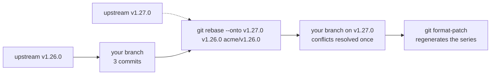

- **Rebase, do not merge.** A rebased series stays readable and regenerates cleanly as patches
- Keep each patch **small and single-purpose**; large patches rot fastest
- Write the *why* in the commit message: the next upgrade is done by someone without your context
- **Upstream what you can.** Every accepted patch is one you never rebase again
- Track upstream releases deliberately: pin a tag, upgrade on purpose, never float on master

---

## Patching Pitfalls

<div style="display:grid;grid-template-columns:1fr 1fr;gap:14px">
<div style="background:var(--surface0);border-left:3px solid var(--red);border-radius:10px;padding:10px 16px"><b>Editing a submodule</b><br><small style="color:var(--subtext0)">Changes in <code>lib/</code> live in another repository; patch it separately or your build silently resets it.</small></div>
<div style="background:var(--surface0);border-left:3px solid var(--red);border-radius:10px;padding:10px 16px"><b>Patching generated files</b><br><small style="color:var(--subtext0)">QSTR headers and frozen content are produced by the build. Patch the source that generates them.</small></div>
<div style="background:var(--surface0);border-left:3px solid var(--red);border-radius:10px;padding:10px 16px"><b>Stale build directory</b><br><small style="color:var(--subtext0)">Config changes often need a clean build; a half-rebuilt tree produces baffling behaviour.</small></div>
<div style="background:var(--surface0);border-left:3px solid var(--red);border-radius:10px;padding:10px 16px"><b>Floating on master</b><br><small style="color:var(--subtext0)">Yesterday's firmware becomes unreproducible. Pin the tag and the SDK version together.</small></div>
<div style="background:var(--surface0);border-left:3px solid var(--red);border-radius:10px;padding:10px 16px"><b>Patching what config already exposes</b><br><small style="color:var(--subtext0)">Check <code>py/mpconfig.h</code> first — most "needed" patches are a define.</small></div>
<div style="background:var(--surface0);border-left:3px solid var(--red);border-radius:10px;padding:10px 16px"><b>No version stamp in firmware</b><br><small style="color:var(--subtext0)">Bake the upstream tag, patch hash and build id into a module your app can print.</small></div>
</div>

---

## Recap of Part 3

- Six levels: **config define → custom board → frozen manifest → user C module → native .mpy → source patch**
- Always take the lowest level that solves the problem; each step up is maintenance you carry
- A **custom board directory** is the cleanest home for product-specific settings
- **Freezing** ships Python inside the firmware and runs it from flash
- **User C modules** extend the firmware; **native .mpy** files add C without reflashing
- Patches come from `git format-patch` (with metadata) or `git diff` (plain), and apply with `git am`, `git apply --3way` or `patch -p1`
- Rebase the series onto each upstream tag, keep patches small, and upstream what you can

---

# Part 4 · The Heap and the Garbage Collector

*Where objects live, and who cleans up*

---

## The Memory Map of a Running Board

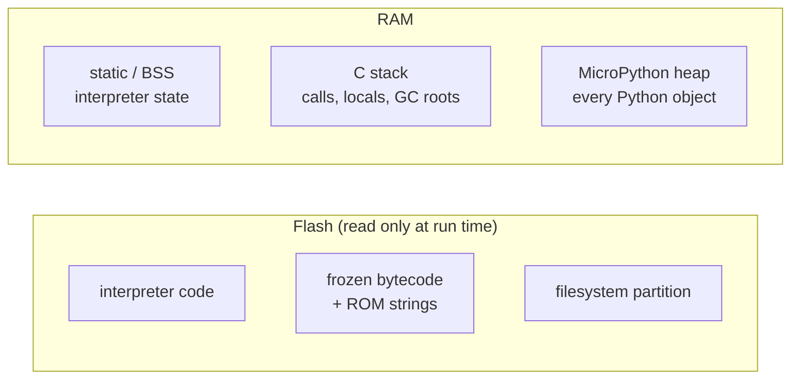

| Region | Holds | Sized by |
| --- | --- | --- |
| Flash | code, constants, frozen modules, filesystem | the linker script and partition table |
| Static / BSS | interpreter globals, buffers, root pointers | the build |
| C stack | native calls, and the VM's own recursion | the port or RTOS task |
| **Heap** | lists, dicts, strings, class instances, buffers | `gc_init()` at boot |

---

## What the Heap Actually Is

The heap is one (or more) plain blocks of RAM handed to the GC at boot:

```c
// ports/esp32/main.c, simplified
void *mp_task_heap = MP_PLAT_ALLOC_HEAP(MICROPY_GC_INITIAL_HEAP_SIZE);
gc_init(mp_task_heap, mp_task_heap + MICROPY_GC_INITIAL_HEAP_SIZE);
```

```c
// ports/rp2/main.c — a fixed region carved out by the linker
gc_init(&__GcHeapStart, &__GcHeapEnd);
```

- On the ESP32 the heap is taken from the ESP-IDF allocator, so it shares RAM with Wi-Fi and BLE stacks
- On the RP2040 it is a linker-defined region, fixed at build time
- With PSRAM, the heap can be much larger and may be split across regions

---

## Blocks, Not Bytes

MicroPython does not track individual byte ranges. The heap is an array of **fixed-size blocks**.

```c
// py/mpconfig.h
#define MICROPY_BYTES_PER_GC_BLOCK (4 * MP_BYTES_PER_OBJ_WORD)   // 16 bytes on a 32-bit port
```

```text
heap ──► [ ATB: 2 bits per block ] [ finaliser table ] [ the pool of 16-byte blocks ]

ATB kinds:  FREE (0)   HEAD (1)   TAIL (2)   MARK (3)
```

- An allocation of any size becomes a run of blocks: `HEAD` then as many `TAIL`s as needed
- The **allocation table** costs 2 bits per 16 bytes of heap, about 1.6% overhead
- A 1-byte object still costs a whole 16-byte block. Many tiny objects are expensive

---

## Allocating

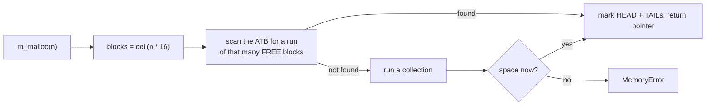

- The scan starts from a rolling pointer, so allocation is roughly first-fit over a circular sweep
- A collection happens **on demand**, when an allocation cannot be satisfied — not on a timer
- `MICROPY_GC_ALLOC_THRESHOLD` (exposed as `gc.threshold()`) can also trigger a collection after a set amount has been allocated

---

## Mark and Sweep

MicroPython uses a **mark and sweep** collector: no reference counts, no compaction, no generations.

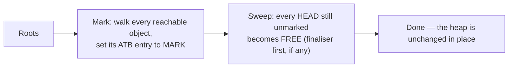

The roots, per the developer docs:

- The **C stack** of the Python runtime, and of each Python thread
- CPU **registers**, flushed to the stack before the scan
- Root pointers declared with `MP_REGISTER_ROOT_POINTER`
- Tracked allocations from `m_tracked_calloc()`

The stack scan is **conservative**: anything that looks like a heap pointer keeps its object alive.

---

## CPython's GC Compared

| | CPython | MicroPython |
| --- | --- | --- |
| Primary mechanism | reference counting | mark and sweep only |
| Cycles | a separate generational collector | handled naturally by marking |
| When it runs | refcount drops to zero, immediately | when allocation needs space, or on request |
| Moves objects | no | no |
| Pause behaviour | mostly incremental, small pauses | one stop-the-world pass over the heap |
| `__del__` | on refcount zero, usually prompt | only if the object has a finaliser slot, and only at collection |

**Consequence:** an object in MicroPython is not freed the moment the last name goes away. Close files and sockets explicitly; do not rely on `__del__` timing.


---

## Finalisers

```python
class Resource:
    def __init__(self):
        self.h = open_hardware()
    def __del__(self):          # runs only if the object has a finaliser slot
        close_hardware(self.h)
```

- Objects with `__del__` need a **finaliser table** entry, tracked alongside the allocation table
- Finalisers run during the **sweep phase**, not when the last reference disappears
- Some ports disable finalisers entirely (`MICROPY_ENABLE_FINALISER`)

```python
# the reliable pattern instead
with open("data.bin", "rb") as f:
    process(f)

sock = socket.socket()
try:
    ...
finally:
    sock.close()
```

Treat `__del__` as a safety net that may never fire, never as the plan.
---

## The `gc` Module

```python
import gc

gc.collect()            # run a full collection now
gc.mem_free()           # bytes free on the heap
gc.mem_alloc()          # bytes currently allocated
gc.threshold(4096)      # collect after this many bytes allocated; -1 disables
gc.disable(); gc.enable()
```

```python
def heap_report(tag=""):
    gc.collect()
    free, alloc = gc.mem_free(), gc.mem_alloc()
    print("%-12s free=%6d alloc=%6d total=%6d" % (tag, free, alloc, free + alloc))
```

```text
boot         free=105 216 alloc=  8 640 total=113 856
after wifi   free= 88 432 alloc= 25 424 total=113 856
after tls    free= 41 008 alloc= 72 848 total=113 856
```

Log this at a few fixed points and a slow leak becomes obvious long before it bites.

---

## Reading `mem_info`

```python
>>> import micropython
>>> micropython.mem_info(1)
```

```text
stack: 736 out of 15360
GC: total: 113856, used: 25424, free: 88432
 No. of 1-blocks: 312, 2-blocks: 74, max blk sz: 64, max free sz: 4021
GC memory layout; from 3ffe4b40:
00000: MDhhhhhhhhhhhhhhBBBBBBBBBBB.....hh.......=......
00400: hhhhhhhhhhhh....TTTTTTTT........DDDDDD..........
```

| Letter | Meaning |
| --- | --- |
| `.` | free block |
| `h` | head of an allocation |
| `=` | tail blocks |
| `M`, `D`, `T`, `B`, `S`, `A` | typed blocks: module, dict, tuple, byte/bytearray, string, array |

Each letter is one 16-byte block, each line 1 KB. Scattered `h` with `.` between them **is** fragmentation, visible at a glance.

---

## Fragmentation: the Real Enemy

```text
free = 40 KB, and yet:  MemoryError: memory allocation failed, allocating 8192 bytes

before:  hh..h...hhh..h....h..h...h.....h..h...h..h....   ← 40 KB free, longest run 3 KB
after gc.collect():     ..h.....h..........h..........    ← still no 8 KB run
```

The collector never moves objects, so free space is only usable in **contiguous runs**.

- Allocate big buffers **early**, at boot, while the heap is clean
- Reuse them (`memoryview`, `readinto`) instead of allocating per iteration
- Prefer `bytearray` of fixed size over growing lists of small objects
- Watch for churn: building strings in a loop leaves a trail of small holes


---

## Split Heaps and PSRAM

```c
#define MICROPY_GC_SPLIT_HEAP      (1)
#define MICROPY_GC_SPLIT_HEAP_AUTO (1)
```


- With a split heap the collector walks several areas, so the heap no longer has to be one contiguous block
- On the ESP32 the SPIRAM variant puts most of the heap in external RAM: megabytes, at a latency cost
- Keep hot, small objects in internal RAM where a port lets you choose; put big buffers in PSRAM
- Measure: PSRAM makes `MemoryError` rare and makes some loops noticeably slower

---

## A Collection, Step by Step

```python
data = [bytearray(64) for _ in range(100)]   # ~100 allocations of 4 blocks each
del data[50:]                                 # half of them become unreachable
gc.collect()
```

```text
before collect   hhh=hhh=hhh=hhh=hhh=hhh=hhh=hhh=hhh=hhh=   used 25 424
mark phase       walk the C stack, registers and root pointers
                 mark every block still reachable  →  MARK
sweep phase      every HEAD not marked → FREE, finalisers first
after collect    hhh=....hhh=....hhh=....hhh=....hhh=....   used 13 072
```

The cost is proportional to the **heap size**, not to the garbage: marking walks live objects, sweeping walks the table. That is why a very large heap on a slow chip produces a visible pause.
---

## Stack, Not Heap

```python
>>> import micropython
>>> micropython.stack_use()
736
```

- Deep recursion, long expressions and nested comprehensions consume the **C stack**, not the heap
- `MICROPY_STACK_CHECK` turns an overflow into a clean `RuntimeError: maximum recursion depth exceeded` instead of a hard fault
- Ports set the limit with `mp_stack_set_limit()`; on an RTOS it is bounded by the task's stack size
- An optional **pystack** (`MICROPY_ENABLE_PYSTACK`) moves Python call frames off the heap into a fixed region, which reduces fragmentation

---

## QSTRs: Interned Strings

Every identifier and short string literal becomes a **QSTR**, interned once.

```python
>>> micropython.qstr_info(1)
```

```text
qstrs: 89 total, 1421 bytes alloc, 1360 bytes used
Q(machine) Q(Pin) Q(value) Q(temperature) …
```

- QSTRs from the firmware and frozen modules live in **ROM** and cost no RAM
- QSTRs created at run time (dynamic attribute names, `eval`, imported source files) live on the heap **forever** — they are never collected
- Practical rule: avoid generating attribute names or `getattr` strings dynamically in a loop
- This is one more reason frozen code uses less RAM than the same file on the filesystem

---

## Interrupts and the Heap

```python
from machine import Pin
import micropython

micropython.alloc_emergency_exception_buf(100)   # do this once, at boot

buf = bytearray(4)          # pre-allocated: the ISR must not allocate

def handler(pin):
    buf[0] = 1              # writing into existing memory is fine
    micropython.schedule(process, pin)   # defer real work out of the ISR

def process(pin):
    print("pin fired", pin)  # allocation is safe here

Pin(0, Pin.IN).irq(trigger=Pin.IRQ_FALLING, handler=handler)
```

⚠️ **An interrupt handler must not allocate.** No new objects, no string formatting, no floats on some ports. If it does, you get `MemoryError` in an ISR, which is exactly as pleasant as it sounds.

---

## C Code That Plays Nicely With the GC

```c
// A global that points into the heap MUST be a registered root
MP_REGISTER_ROOT_POINTER(mp_obj_t acme_callback);

// …otherwise the collector never sees it and frees the object under you.
MP_STATE_PORT(acme_callback) = callback_obj;
```

The developer docs spell out what the collector will **not** find:

- Static or global C variables holding heap pointers (hence the macro above)
- Interior pointers — a pointer into the middle of a buffer does not keep it alive
- Stacks of RTOS tasks that are not running Python

```c
void *p = m_tracked_calloc(1, 512);   // always considered live, until m_tracked_free()
```

---

## Recap of Part 4

- The heap is a fixed region handed to `gc_init()` at boot, managed as **16-byte blocks** with a 2-bit-per-block allocation table
- Allocation is a scan for a contiguous run; failure triggers a **collection**, then `MemoryError`
- The collector is **mark and sweep**, conservative over the C stack, and **never moves objects**
- CPython frees on refcount zero; MicroPython frees at collection, so close resources explicitly
- **Fragmentation**, not total free bytes, is what usually causes `MemoryError`
- `gc.mem_free()`, `micropython.mem_info(1)` and `qstr_info()` are the instruments
- ISRs must not allocate; C globals pointing into the heap must be registered roots

---

# Part 5 · Memory Tuning and "Snapshots"

*Config knobs, images you can ship, and state that survives a reset*

---

## The Knobs That Change Memory

| Define | Effect |
| --- | --- |
| `MICROPY_GC_INITIAL_HEAP_SIZE` | how much RAM the heap starts with (ports that allocate it dynamically) |
| `MICROPY_BYTES_PER_GC_BLOCK` | block granularity; smaller wastes less per object, costs more table |
| `MICROPY_GC_SPLIT_HEAP` / `_AUTO` | let the heap span several regions, e.g. internal RAM plus PSRAM |
| `MICROPY_GC_ALLOC_THRESHOLD` | enables `gc.threshold()`, collecting before the heap is exhausted |
| `MICROPY_GC_CONSERVATIVE_CLEAR` | zero freed blocks, trading a little time for fewer stale pointers |
| `MICROPY_ENABLE_PYSTACK` | Python call frames in a fixed region instead of the heap |
| `MICROPY_STACK_CHECK` | turn stack overflow into a Python exception |
| `MICROPY_ALLOC_*` | initial sizes for parse chunks, qstr pools, dict and list growth |
| `MICROPY_ENABLE_COMPILER` | drop the compiler entirely: frozen/`.mpy` only, and a much smaller build |
| `MICROPY_CONFIG_ROM_LEVEL` | the baseline feature set for the whole build |

All of them are plain `#define`s you can set from a board header — level 1 of Part 3.

---

## Sizing the Heap on an ESP32

```c
// boards/ACME_SENSOR/mpconfigboard.h
#define MICROPY_GC_INITIAL_HEAP_SIZE (192 * 1024)
```

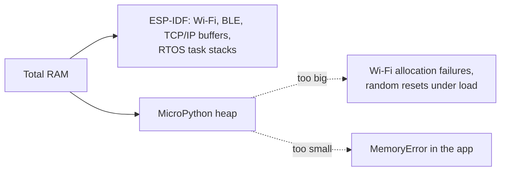

- The heap competes with the network stacks; the right size is found by measurement, not arithmetic
- With PSRAM, build the SPIRAM variant and the heap can grow by megabytes, at slower access speed
- `esp32.idf_heap_info(esp32.HEAP_DATA)` shows the **IDF** side, which `gc.mem_free()` knows nothing about


---

## What Does This Module Cost?

```python
import gc

def cost(name):
    gc.collect(); before = gc.mem_free()
    __import__(name)
    gc.collect()
    print("%-14s %6d bytes" % (name, before - gc.mem_free()))

for m in ("json", "ssl", "asyncio", "acme.protocol"):
    cost(m)
```

```text
json              1 392 bytes
ssl               2 016 bytes
asyncio           7 664 bytes
acme.protocol     4 512 bytes     ← 512 of that after freezing
```

Run this on the real board, in boot order. It turns "we are short on RAM" into a ranked list of things to freeze, trim or import lazily.

---

## Trimming Flash

| Turn off | Typical saving | Cost |
| --- | --- | --- |
| `MICROPY_PY_BUILTINS_HELP` | a few KB of text | no `help()` |
| `MICROPY_PY_FRAMEBUF` | ~2–4 KB | no `framebuf` displays |
| `MICROPY_PY_BLUETOOTH` | tens of KB | no BLE |
| `MICROPY_PY_SSL` | tens of KB | no TLS — rarely acceptable |
| `MICROPY_ENABLE_COMPILER` | a large chunk | no on-device compile, no REPL execution of new code |
| Lower `MICROPY_CONFIG_ROM_LEVEL` | broad | many small features at once |

```bash
# measure, do not guess
arm-none-eabi-size build-ACME/firmware.elf
grep -n "\.text" build-ACME/micropython.map | head
```

Trim in this order: your own code and frozen assets first, optional modules second, core features last.
---

## Four Things People Call a "Snapshot"

| What | When it is made | What it gives you |
| --- | --- | --- |
| **Frozen modules** | at firmware build time | code compiled into the image, executed from flash, no RAM copy |
| **ROMFS image** | after the build, deployed separately | a read-only filesystem in flash with zero-copy imports |
| **Filesystem image** | on the host, flashed as a partition | a prepared littlefs/FAT with your files |
| **Runtime state** | while the device runs | values that survive deep sleep or reset: RTC memory, NVS, a file |

MicroPython has **no process snapshot**: no `fork`, no CRIU-style memory image, no `pickle`. You cannot freeze a running heap and restore it later — you re-create state from one of the four above.

---

## Frozen Modules: the Build-Time Snapshot

```python
# manifest.py
package("acme", base_path="../../app")
require("logging")
```

```text
                RAM used by 'import acme.protocol'
  from filesystem .py   ████████████████████  source read + compiled + bytecode in RAM
  from filesystem .mpy  ██████████            bytecode copied into RAM
  frozen in firmware    ██                    executes from flash; only live objects use RAM
```

- Also the fastest to import: no filesystem read, no compile step
- Constants and string literals stay in ROM as QSTRs
- Trade-off: changing one line means rebuilding and reflashing the firmware

---

## `.mpy` Files: Precompiled, Deployable

```bash
mpy-cross -O2 app/protocol.py -o protocol.mpy      # -O sets optimisation level
mpy-cross -march=armv7emsp native_bits.py          # native code emitter for a specific CPU
mpremote fs cp protocol.mpy :lib/protocol.mpy
```

| Level | Effect |
| --- | --- |
| `-O0` (default) | keep asserts, `__debug__` is true, line numbers kept |
| `-O1` / `-O2` | drop asserts and `__debug__` code |
| `-O3` | also drop source line numbers — smallest, but tracebacks lose line info |

- A `.mpy` skips the on-device compiler, so it imports faster and needs far less RAM to load
- It is the unit ROMFS and frozen manifests both build on
- `sys.implementation._mpy` tells you the bytecode version a firmware accepts

---

## ROMFS: a Deployable Read-Only Image

Introduced for exactly the gap between "frozen" and "filesystem": flash-resident, zero-copy, but **deployable without rebuilding firmware**.

```bash
mpremote romfs query                      # is there a ROMFS partition, and how big?
mpremote romfs build app/ -o romfs.img    # build an image from a directory
mpremote romfs deploy romfs.img           # write it to the device partition
```

- `.mpy` files inside a ROMFS execute **directly from flash**; their string and bytes constants are referenced in place, not copied to RAM
- Mounted in the VFS like any filesystem, so `import` and `open()` just work
- Requires firmware built with `MICROPY_VFS_ROM` and a partition for it
- Complementary to the read-write littlefs partition, which keeps your logs and config

---

## Filesystem Images and Boot Layout

```text
ESP32 flash partitions
┌────────────┬───────────────┬──────────────┬───────────────┬──────────────┐
│ bootloader │ partition tbl │ firmware.bin │ romfs (opt.)  │ littlefs (rw)│
└────────────┴───────────────┴──────────────┴───────────────┴──────────────┘
```

```bash
# build a littlefs image on the host and flash it as a partition
python -m littlefs_python.mkfs ...        # or the tool your port provides
esptool.py write_flash 0x310000 fs.img
```

- Factory provisioning gets much faster when the filesystem is an image rather than a file copy loop
- Keep **code** in firmware or ROMFS, and **data that changes** in the read-write partition
- Reserve space deliberately: a full filesystem is a common field failure

---

## State That Survives a Reset

```python
import machine, json

rtc = machine.RTC()
rtc.memory(json.dumps({"boot_count": n, "last_ok": ts}))   # survives deep sleep
saved = rtc.memory()                                       # read it back on wake

if machine.reset_cause() == machine.DEEPSLEEP_RESET:
    state = json.loads(saved) if saved else {}
```

| Mechanism | Survives | Size | Notes |
| --- | --- | --- | --- |
| `RTC.memory()` | deep sleep, soft reset | small (a few hundred bytes) | fastest; lost on power loss |
| NVS (`esp32.NVS`) | power loss | key/value in flash | wear-levelled, good for counters and config |
| A file on the filesystem | power loss | whatever fits | write atomically: temp file then rename |
| Frozen defaults | always | build time | the fallback when nothing else is valid |

---

## Deep Sleep as a Memory Strategy

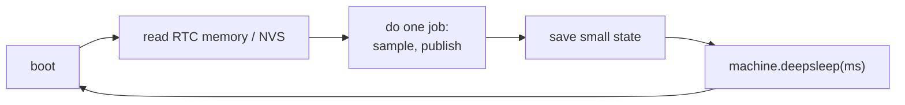

- On wake from deep sleep the **heap starts empty** — which is a feature: no fragmentation, no leaks
- Keep the awake path short and allocate its buffers in a fixed order every cycle
- The state you carry forward should be tiny and serialisable; anything large belongs in flash

This pattern turns "the device must run for months without a memory leak" into "the device must survive ninety seconds".

---

## Taking a Memory Snapshot for Debugging

```python
import gc, micropython

def snapshot(tag):
    gc.collect()
    print("[%s] free=%d alloc=%d" % (tag, gc.mem_free(), gc.mem_alloc()))
    micropython.mem_info(1)        # the block map
    micropython.qstr_info(1)       # interned strings

snapshot("before-request")
handle_request()
snapshot("after-request")
```

```python
# on an ESP32, the other side of the fence
import esp32
print(esp32.idf_heap_info(esp32.HEAP_DATA))   # [(total, free, largest_free, min_free), …]
```

Compare snapshots rather than reading absolute numbers: what matters is **what grew**, and whether `max free sz` is shrinking.

---

## Writing Code That Fits

- `const()` from `micropython` for compile-time constants — no lookup, no RAM
- Pre-allocate buffers and use `readinto()` / `memoryview()` instead of slicing
- `bytearray` and `array.array` beat lists of numbers by a wide margin
- Build strings with `"".join(parts)` or write directly into a buffer, not `s += x` in a loop
- Generators instead of building whole lists
- `@micropython.native` for speed, `@micropython.viper` for tight integer loops
- Import inside a function when a module is rarely used, so its cost is not paid at boot
- Delete big temporaries explicitly (`del buf`) before the next allocation

```python
from micropython import const
_BUF_LEN = const(512)
_buf = bytearray(_BUF_LEN)
_mv = memoryview(_buf)

n = uart.readinto(_buf)
frame = _mv[:n]              # no copy
```

---

## The Emitters

```python
@micropython.native        # compile to machine code, Python semantics
def crc_step(crc, b):
    return (crc >> 1) ^ (0xA001 if (crc ^ b) & 1 else 0)

@micropython.viper         # machine code with native int types — fastest, strictest
def sum_bytes(buf: ptr8, n: int) -> int:
    total = 0
    for i in range(n):
        total += buf[i]
    return total
```

| Emitter | Speed | Size | Caveats |
| --- | --- | --- | --- |
| bytecode (default) | baseline | smallest | fine for most code |
| `@micropython.native` | several times faster | larger | no generators in some cases |
| `@micropython.viper` | fastest | larger | restricted types, manual care with pointers |
| C module / native `.mpy` | fastest, full control | build complexity | for the genuinely hot path |

---

## Recap of Part 5

- Memory behaviour is configured by plain defines: heap size, block size, split heap, thresholds, pystack, compiler on or off
- On the ESP32 the heap shares RAM with Wi-Fi and BLE: size it by measurement
- "Snapshot" means four different things — **frozen modules**, a **ROMFS image**, a **filesystem image**, and **runtime state** in RTC memory, NVS or a file
- There is **no process snapshot**: no fork, no heap image, no pickle. Rebuild state from persisted values
- `mem_info(1)`, `qstr_info(1)`, `gc.mem_free()` and `esp32.idf_heap_info()` are how you see what is happening
- Deep sleep resets the heap, which is the cheapest leak protection there is
- Pre-allocation, `const()`, buffers and the right emitter do most of the tuning work

---

# Part 6 · A Workflow That Holds Together

*Dev loop, releases, and finding trouble before the field does*

---

## Project Layout for a Product

```text
acme-firmware/
├── micropython/            pinned upstream checkout (a submodule, or fetched by build.sh)
├── patches/                0001-…patch, 0002-…patch — applied on top of the pinned tag
├── boards/ACME_SENSOR/     board directory, copied into ports/esp32/boards at build time
├── modules/                user C modules (micropython.cmake + sources)
├── app/                    the Python application, frozen for release
│   ├── main.py
│   └── acme/…
├── tools/build.sh          pristine checkout + patches + build, reproducible
├── tests/                  runs on the Unix port in CI
└── VERSIONS                micropython tag, ESP-IDF tag, patch series hash
```

The point of `VERSIONS` and `build.sh`: anyone can rebuild **exactly** the firmware that shipped, a year later.

---

## The Development Loop

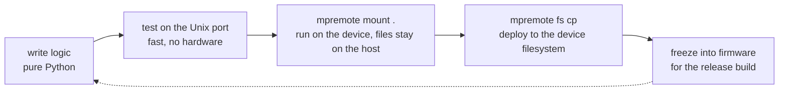

```bash
mpremote mount . run app/main.py      # edit on the host, run on the device, no copying
mpremote fs cp -r app/ :app/          # when you want it to persist
mpremote reset
```

Keep hardware access behind a thin layer so the logic above it can run on the Unix port in CI.

---

## Testing Without Hardware

```python
# app/acme/protocol.py — no machine imports here
def encode(seq, temp_c):
    return b"%d;%.2f" % (seq, temp_c)
```

```bash
# run the project's own tests with the Unix build
./micropython/ports/unix/build-standard/micropython -m unittest tests/test_protocol.py

# and MicroPython's own suite, when you have patched the core
cd micropython/tests && ./run-tests.py
./run-tests.py --target esp32 --device /dev/ttyUSB0      # on real hardware
```

A coverage build (`make VARIANT=coverage`) exercises paths a normal build optimises away — worth running in CI if you patch `py/`.

---

## Shipping Updates

| Mechanism | Granularity | Needs |
| --- | --- | --- |
| Full firmware OTA | everything, including patches and C modules | an OTA partition scheme, a rollback path |
| ROMFS image | all Python code, no firmware change | a ROMFS partition |
| Individual `.mpy` files | one module | a writable filesystem |
| Config only | values | NVS or a config file |

```python
# the shape of a safe update, whichever mechanism
1. download to a staging area          4. reboot into the new version
2. verify a hash and a signature       5. self-check, then mark it good
3. write it                            6. if the self-check fails, roll back
```

⚠️ Always keep a known-good fallback. A device that bricks on a bad update is a truck roll.

---

## Debugging Memory in the Field

```python
import gc, machine, time

def telemetry():
    gc.collect()
    return {
        "free": gc.mem_free(),
        "alloc": gc.mem_alloc(),
        "reset_cause": machine.reset_cause(),
        "uptime_s": time.ticks_ms() // 1000,
    }
```

- Publish `free`, `alloc` and `reset_cause` with your normal telemetry. A leak shows as a **downward staircase** in free memory across days
- Log uncaught exceptions to a file before rebooting: `sys.print_exception(e, f)`
- A watchdog (`machine.WDT`) turns a hang into a reset; count those resets and report them
- `machine.reset_cause()` distinguishes power-on, watchdog, deep sleep and panic


---

## Building in CI

```yaml
# .github/workflows/firmware.yml
name: firmware
on: [push, pull_request]

jobs:
  esp32:
    runs-on: ubuntu-latest
    container: espressif/idf:v5.4.2          # the pinned SDK, as a container
    steps:
      - uses: actions/checkout@v4
        with: { submodules: recursive }
      - name: Build
        run: ./tools/build.sh                # pristine checkout + patches + build
      - name: Size report
        run: arm-none-eabi-size micropython/ports/esp32/build-ACME_SENSOR/micropython.elf || true
      - uses: actions/upload-artifact@v4
        with:
          name: firmware
          path: micropython/ports/esp32/build-ACME_SENSOR/firmware.bin

  tests:
    runs-on: ubuntu-latest
    steps:
      - uses: actions/checkout@v4
      - run: make -C micropython/ports/unix submodules && make -C micropython/ports/unix
      - run: ./micropython/ports/unix/build-standard/micropython -m unittest tests/
```

Publishing the size report on every pull request is the cheapest way to stop slow firmware growth.

---

## Release Checklist

- Upstream tag, SDK version and patch series hash recorded in `VERSIONS` **and** compiled into the firmware
- `git apply` of every patch succeeds on a pristine checkout, in CI, not just on your laptop
- Application frozen, `.py` sources removed from the image, version string updated
- Boot tested from **erased flash**, not only from an incremental reflash
- Memory report captured at boot and after the main loop has run for an hour
- Watchdog enabled, `reset_cause()` reported in telemetry
- OTA path tested, including a deliberately corrupted image and the rollback
- Filesystem free space checked with the largest expected log/config set
---

## Common Traps

<div style="display:grid;grid-template-columns:1fr 1fr;gap:14px">
<div style="background:var(--surface0);border-left:3px solid var(--red);border-radius:10px;padding:10px 16px"><b>Allocating in an ISR</b><br><small style="color:var(--subtext0)">Use pre-allocated buffers and <code>micropython.schedule()</code>.</small></div>
<div style="background:var(--surface0);border-left:3px solid var(--red);border-radius:10px;padding:10px 16px"><b>Big buffer allocated late</b><br><small style="color:var(--subtext0)">The heap is fragmented by then. Allocate at boot and reuse.</small></div>
<div style="background:var(--surface0);border-left:3px solid var(--red);border-radius:10px;padding:10px 16px"><b>Relying on <code>__del__</code></b><br><small style="color:var(--subtext0)">No refcounting: close files and sockets explicitly.</small></div>
<div style="background:var(--surface0);border-left:3px solid var(--red);border-radius:10px;padding:10px 16px"><b>Dynamic attribute names</b><br><small style="color:var(--subtext0)">Every new name interns a QSTR that is never freed.</small></div>
<div style="background:var(--surface0);border-left:3px solid var(--red);border-radius:10px;padding:10px 16px"><b>Blocking in asyncio</b><br><small style="color:var(--subtext0)"><code>time.sleep()</code> stops every task. Use <code>await asyncio.sleep_ms()</code>.</small></div>
<div style="background:var(--surface0);border-left:3px solid var(--red);border-radius:10px;padding:10px 16px"><b>Floating on upstream master</b><br><small style="color:var(--subtext0)">Pin the tag and the SDK version; rebuild must be reproducible.</small></div>
<div style="background:var(--surface0);border-left:3px solid var(--red);border-radius:10px;padding:10px 16px"><b>Everything frozen during development</b><br><small style="color:var(--subtext0)">Reflashing to test a one-line change wastes days. Freeze at release.</small></div>
<div style="background:var(--surface0);border-left:3px solid var(--red);border-radius:10px;padding:10px 16px"><b>No version stamp</b><br><small style="color:var(--subtext0)">Bake tag, patch hash and build id into the firmware and report them.</small></div>
</div>

---

## asyncio on a Device

```python
import asyncio
from machine import Pin

async def blink(pin, period_ms):
    p = Pin(pin, Pin.OUT)
    while True:
        p.value(not p.value())
        await asyncio.sleep_ms(period_ms)

async def publish(client):
    while True:
        await client.publish(b"acme/telemetry", telemetry_bytes())
        await asyncio.sleep(10)

async def main():
    asyncio.create_task(blink(2, 500))
    asyncio.create_task(publish(client))
    while True:
        await asyncio.sleep(3600)     # keep the loop alive

asyncio.run(main())
```

MicroPython's `asyncio` is a compact reimplementation: tasks, `sleep_ms`, `Event`, `Lock`, `StreamReader`/`Writer`, `gather`, `wait_for`. It is the standard way to structure device code, and Microdot builds on it.

---

## Test Yourself (1/2)

- **1.** Why does MicroPython free objects later than CPython?
  - *No reference counting: memory is reclaimed by a mark-and-sweep collection, on demand.* {reveal}
- **2.** You have 40 KB free and an 8 KB allocation fails. What is happening?
  - *Fragmentation. The collector does not move objects, so only contiguous runs count.* {reveal}
- **3.** Which is the lowest-cost way to change a build: a patch or a define?
  - *A define in a board header. Patch only what configuration cannot reach.* {reveal}

---

## Test Yourself (2/2)

- **4.** How do you turn three commits on your vendor branch into a patch series?
  - *`git format-patch <upstream-tag>..<branch> -o patches/`, then apply with `git am` or `git apply --3way`.* {reveal}
- **5.** What does freezing a module save that a `.mpy` on the filesystem does not?
  - *The bytecode stays in flash and is executed in place, and its constants stay in ROM instead of the heap.* {reveal}
- **6.** Where can device state survive a deep sleep?
  - *RTC memory for small values, NVS or a file for anything that must survive power loss.* {reveal}

---

## Glossary

| Term | Meaning |
| --- | --- |
| **Port** | MicroPython adapted to a chip family (`esp32`, `rp2`, `stm32`, `unix`) |
| **Board** | A directory of settings for one product or dev board within a port |
| **Variant** | A named alternative build of a board (SPIRAM, OTA, unicore) |
| **Manifest** | `manifest.py`: which Python modules get frozen into firmware |
| **Frozen module** | Python compiled at build time and linked into the image |
| **`.mpy`** | Precompiled bytecode file, optionally containing native code |
| **mpy-cross** | The host compiler that produces `.mpy` files |
| **User C module** | C compiled into the firmware and exposed as a Python module |
| **Native .mpy** | C linked into an importable `.mpy`, no firmware rebuild |
| **ROMFS** | Read-only flash filesystem with zero-copy imports |
| **QSTR** | An interned string; ROM ones are free, run-time ones are permanent |
| **ATB** | Allocation table: 2 bits per heap block (free, head, tail, mark) |

---

## Your Learning Path


**Reading:** `docs/develop/` in the MicroPython tree (memory management, C modules, natmod, optimisations, porting) · `py/mpconfig.h` with its comments · `py/gc.c` · `tests/cpydiff/` · the `mpremote` and ROMFS reference pages · the Microdot documentation

---

## The Whole Story in One Picture

<div style="display:grid;grid-template-columns:repeat(4,1fr);gap:16px;margin-top:16px">
<div><div style="font-family:var(--font-mono);font-size:0.72em;letter-spacing:.09em;text-transform:uppercase;color:var(--overlay1);margin-bottom:8px">Language</div><div style="background:var(--surface0);border:1px solid var(--surface1);border-radius:8px;padding:8px 12px;margin-bottom:8px">Python 3 subset, no OS needed</div><div style="background:var(--surface0);border:1px solid var(--surface1);border-radius:8px;padding:8px 12px;margin-bottom:8px">mip, micropython-lib, Microdot</div></div>
<div><div style="font-family:var(--font-mono);font-size:0.72em;letter-spacing:.09em;text-transform:uppercase;color:var(--overlay1);margin-bottom:8px">Build</div><div style="background:var(--surface0);border:1px solid var(--surface1);border-radius:8px;padding:8px 12px;margin-bottom:8px">port → board → variant</div><div style="background:var(--surface0);border:1px solid var(--surface1);border-radius:8px;padding:8px 12px;margin-bottom:8px">config defines cascade</div></div>
<div><div style="font-family:var(--font-mono);font-size:0.72em;letter-spacing:.09em;text-transform:uppercase;color:var(--overlay1);margin-bottom:8px">Customise</div><div style="background:var(--surface0);border:1px solid var(--surface1);border-radius:8px;padding:8px 12px;margin-bottom:8px">freeze · C module · native .mpy</div><div style="background:var(--surface0);border:1px solid var(--surface1);border-radius:8px;padding:8px 12px;margin-bottom:8px">patch series, rebased per release</div></div>
<div><div style="font-family:var(--font-mono);font-size:0.72em;letter-spacing:.09em;text-transform:uppercase;color:var(--overlay1);margin-bottom:8px">Memory</div><div style="background:var(--surface0);border:1px solid var(--surface1);border-radius:8px;padding:8px 12px;margin-bottom:8px">16-byte blocks, mark and sweep</div><div style="background:var(--surface0);border:1px solid var(--surface1);border-radius:8px;padding:8px 12px;margin-bottom:8px">fragmentation is the enemy</div></div>
</div>

Left to right is also the order to learn them in.

---

# Thank You

### Now go run `micropython.mem_info(1)` on something real.

```text
>>> import gc; gc.collect(); gc.mem_free()
88432
```

Questions?
