<!-- deckrun: theme=midnight template=classic transition=slide -->

<style>
.mermaid svg p, .mermaid svg span, .mermaid svg div, .mermaid svg foreignObject * {
  font-size: 16px !important; line-height: 1.5 !important; margin: 0 !important; padding: 0 !important;
  font-family: "trebuchet ms", verdana, arial, sans-serif !important; letter-spacing: normal !important; text-transform: none !important;
}
.mermaid svg .node rect, .mermaid svg .node polygon, .mermaid svg .node circle, .mermaid svg .node path.basic {fill: var(--surface0) !important; stroke: var(--accent) !important; }
.mermaid svg .cluster rect {fill: var(--mantle) !important; stroke: var(--surface2) !important; }
.mermaid svg .edgeLabel, .mermaid svg .edgeLabel p, .mermaid svg .labelBkg {background: var(--base) !important; background-color: var(--base) !important; }
.mermaid svg .nodeLabel, .mermaid svg .nodeLabel p {color: var(--text) !important; }
.pet {display: none !important; }
</style>

# MQTT

### A lightweight publish/subscribe protocol for devices

<p style="color:var(--subtext0);max-width:62ch;margin-top:24px">Eight parts, from "why does a sensor need its own protocol" to packet internals,
AWS IoT Core, and what really speaks MQTT in your living room. With client code
in Python and C++.</p>

<!-- notes: This deck starts from first principles and ends at AWS IoT Core, Matter and home-automation bridges. Each part builds on the previous one. -->

---

## How This Deck Is Organised

Difficulty rises as you go. Each part builds on the one before it.

<div style="display:grid;grid-template-columns:repeat(3,1fr);gap:12px;margin-top:16px">
<div style="background:var(--surface0);border:1px solid var(--surface1);border-radius:10px;padding:12px 16px"><div style="font-family:var(--font-mono);font-size:0.7em;letter-spacing:.09em;text-transform:uppercase;color:var(--overlay1)">Part 1 · basics</div><b>What MQTT is</b><br><small style="color:var(--subtext0)">pub/sub, brokers, first messages</small></div>
<div style="background:var(--surface0);border:1px solid var(--surface1);border-radius:10px;padding:12px 16px"><div style="font-family:var(--font-mono);font-size:0.7em;letter-spacing:.09em;text-transform:uppercase;color:var(--overlay1)">Part 2 · basics</div><b>Topics</b><br><small style="color:var(--subtext0)">hierarchy, wildcards, naming</small></div>
<div style="background:var(--surface0);border:1px solid var(--surface1);border-radius:10px;padding:12px 16px"><div style="font-family:var(--font-mono);font-size:0.7em;letter-spacing:.09em;text-transform:uppercase;color:var(--overlay1)">Part 3 · internals</div><b>The protocol</b><br><small style="color:var(--subtext0)">packets, QoS, sessions, retain, MQTT 5</small></div>
<div style="background:var(--surface0);border:1px solid var(--surface1);border-radius:10px;padding:12px 16px"><div style="font-family:var(--font-mono);font-size:0.7em;letter-spacing:.09em;text-transform:uppercase;color:var(--overlay1)">Part 4 · practice</div><b>MQTT in IoT</b><br><small style="color:var(--subtext0)">architecture, payloads, constrained devices</small></div>
<div style="background:var(--surface0);border:1px solid var(--surface1);border-radius:10px;padding:12px 16px"><div style="font-family:var(--font-mono);font-size:0.7em;letter-spacing:.09em;text-transform:uppercase;color:var(--overlay1)">Part 5 · practice</div><b>Python & C++</b><br><small style="color:var(--subtext0)">paho, mosquitto, ESP32</small></div>
<div style="background:var(--surface0);border:1px solid var(--surface1);border-radius:10px;padding:12px 16px"><div style="font-family:var(--font-mono);font-size:0.7em;letter-spacing:.09em;text-transform:uppercase;color:var(--overlay1)">Part 6 · cloud</div><b>AWS IoT Core</b><br><small style="color:var(--subtext0)">policies, rules, shadows, jobs, limits</small></div>
<div style="background:var(--surface0);border:1px solid var(--surface1);border-radius:10px;padding:12px 16px"><div style="font-family:var(--font-mono);font-size:0.7em;letter-spacing:.09em;text-transform:uppercase;color:var(--overlay1)">Part 7 · the home</div><b>TVs, assistants, Matter</b><br><small style="color:var(--subtext0)">what speaks MQTT and what does not</small></div>
<div style="background:var(--surface0);border:1px solid var(--surface1);border-radius:10px;padding:12px 16px"><div style="font-family:var(--font-mono);font-size:0.7em;letter-spacing:.09em;text-transform:uppercase;color:var(--overlay1)">Part 8 · wrap-up</div><b>Production</b><br><small style="color:var(--subtext0)">hardening, monitoring, quiz, glossary</small></div>
<div style="background:var(--surface0);border:1px solid var(--surface1);border-radius:10px;padding:12px 16px"><div style="font-family:var(--font-mono);font-size:0.7em;letter-spacing:.09em;text-transform:uppercase;color:var(--overlay1)">Along the way</div><b>Runnable examples</b><br><small style="color:var(--subtext0)">CLI, Python, C++, ESP32, AWS</small></div>
</div>

<small style="color:var(--overlay1)">basics → internals → practice → cloud → advanced</small>

---

# Part 1 · What MQTT Is

*Why a sensor needs a protocol of its own*

---

## The Problem: A Sensor Wants to Talk

Picture a temperature sensor on a pipeline, a smart plug in a kitchen, a tracker on a truck.

<div style="display:grid;grid-template-columns:repeat(3,1fr);gap:14px;margin-top:14px">
<div style="background:var(--surface0);border:1px solid var(--surface1);border-radius:10px;padding:14px 16px"><b>Tiny</b><br><small style="color:var(--subtext0)">A few hundred KB of RAM, sometimes far less. No room for a heavy stack.</small></div>
<div style="background:var(--surface0);border:1px solid var(--surface1);border-radius:10px;padding:14px 16px"><b>Battery powered</b><br><small style="color:var(--subtext0)">Every byte and every radio wake-up costs runtime.</small></div>
<div style="background:var(--surface0);border:1px solid var(--surface1);border-radius:10px;padding:14px 16px"><b>Badly connected</b><br><small style="color:var(--subtext0)">Cellular, satellite, patchy Wi-Fi. Links drop mid-message.</small></div>
<div style="background:var(--surface0);border:1px solid var(--surface1);border-radius:10px;padding:14px 16px"><b>Behind NAT</b><br><small style="color:var(--subtext0)">No public address, so nobody can call the device. It must call out.</small></div>
<div style="background:var(--surface0);border:1px solid var(--surface1);border-radius:10px;padding:14px 16px"><b>One of thousands</b><br><small style="color:var(--subtext0)">The fleet grows; the backend cannot hold a socket per HTTP request.</small></div>
<div style="background:var(--surface0);border:1px solid var(--surface1);border-radius:10px;padding:14px 16px"><b>Chatty both ways</b><br><small style="color:var(--subtext0)">It reports readings, and it must also receive commands quickly.</small></div>
</div>

---

## Why Not Just HTTP?

HTTP is **request/response**: the client asks, the server answers, the connection is done.

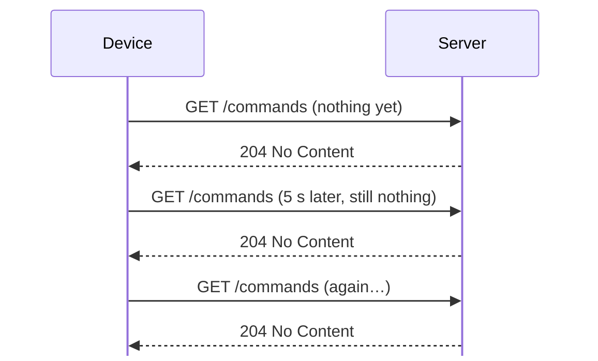

- To hear about a command, the device must **poll**, wasting radio time and battery
- Every request re-sends headers, and often re-does a TLS handshake
- A "turn the light off" command waits until the next poll
- The server must keep answering pointless requests from every device

---

## The Idea: Publish and Subscribe

MQTT flips it. A device holds **one long-lived connection** and messages flow either way, whenever there is something to say.

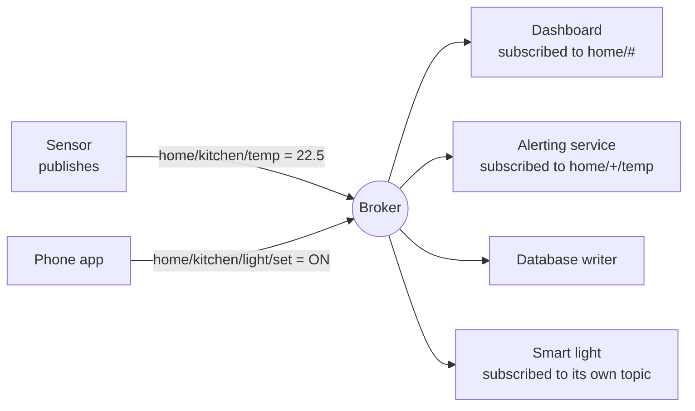

- A **publisher** sends a message to a **topic**
- A **subscriber** asks for topics it cares about
- The **broker** matches the two. Publishers and subscribers never know each other

---

## The Broker Sits in the Middle

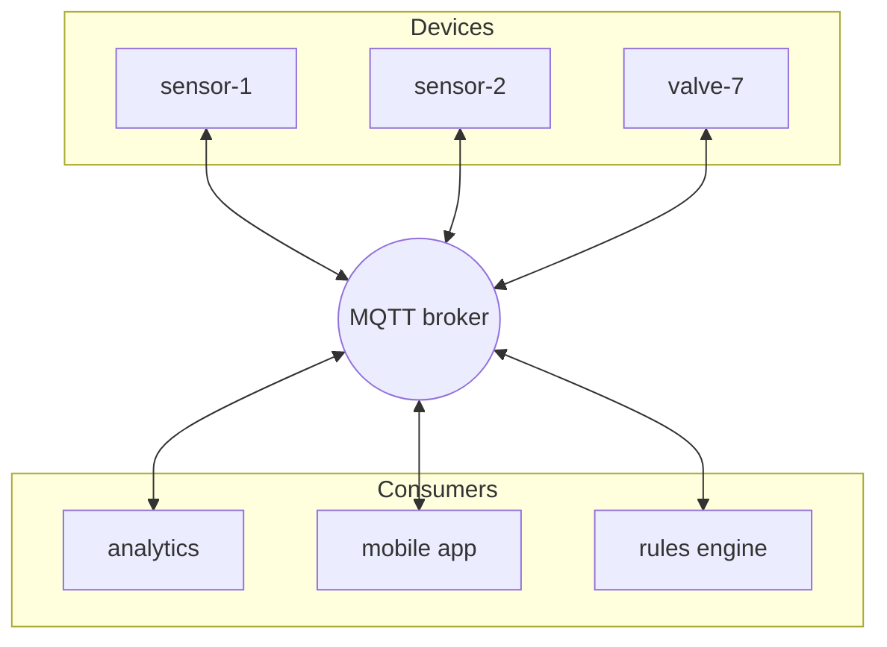

The broker: accepts connections, checks credentials, matches topics to subscriptions, holds session state, keeps retained messages, and enforces access rules.

---

## What MQTT Gives You

<div style="display:grid;grid-template-columns:repeat(3,1fr);gap:14px;margin-top:10px">
<div style="background:var(--surface0);border:1px solid var(--surface1);border-radius:10px;padding:14px 16px"><b>Tiny overhead</b><br><small style="color:var(--subtext0)">The fixed header is 2 bytes. A whole publish can be under 20 bytes.</small></div>
<div style="background:var(--surface0);border:1px solid var(--surface1);border-radius:10px;padding:14px 16px"><b>Push, not poll</b><br><small style="color:var(--subtext0)">The broker pushes the moment a message arrives. No polling loop.</small></div>
<div style="background:var(--surface0);border:1px solid var(--surface1);border-radius:10px;padding:14px 16px"><b>Delivery guarantees</b><br><small style="color:var(--subtext0)">Three QoS levels, from fire-and-forget to exactly once.</small></div>
<div style="background:var(--surface0);border:1px solid var(--surface1);border-radius:10px;padding:14px 16px"><b>Built for bad links</b><br><small style="color:var(--subtext0)">Sessions survive disconnects; queued messages arrive on reconnect.</small></div>
<div style="background:var(--surface0);border:1px solid var(--surface1);border-radius:10px;padding:14px 16px"><b>Knows when you die</b><br><small style="color:var(--subtext0)">A Last Will message is sent for you if the connection drops.</small></div>
<div style="background:var(--surface0);border:1px solid var(--surface1);border-radius:10px;padding:14px 16px"><b>Payload agnostic</b><br><small style="color:var(--subtext0)">Any bytes: JSON, CBOR, protobuf, a single number, an image chunk.</small></div>
</div>

---

## A Short History

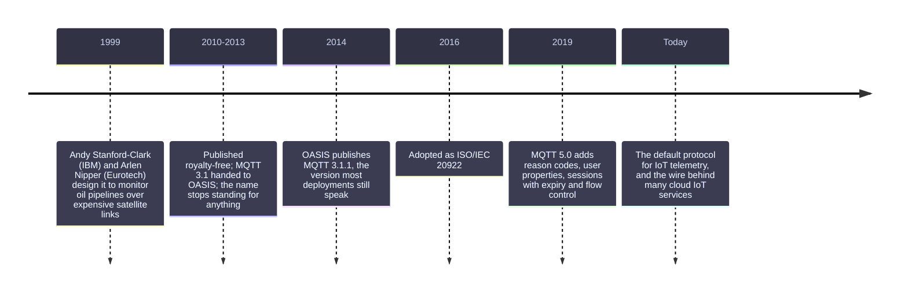

<!-- notes: The "MQ" came from IBM's MQ product family. Since 2013 the spec says MQTT is not an acronym, and it has never been a queueing protocol. -->

---

## Where MQTT Sits

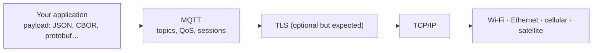

| Port | What runs there |
| --- | --- |
| `1883` | MQTT over plain TCP. Fine for a lab, never for the internet |
| `8883` | MQTT over TLS. The normal production choice |
| `443` | MQTT over WebSockets (`wss://`), for browsers and strict firewalls |

MQTT needs an **ordered, lossless, bidirectional** byte stream. TCP gives that; for networks without it there is **MQTT-SN** (Part 3).

---

## MQTT Compared With Its Neighbours

| | MQTT | HTTP/REST | CoAP | AMQP 1.0 | WebSocket |
| --- | --- | --- | --- | --- | --- |
| Shape | pub/sub | request/response | request/response | queues + pub/sub | raw duplex channel |
| Transport | TCP | TCP | UDP | TCP | TCP |
| Header cost | 2 bytes | hundreds of bytes | ~4 bytes | tens of bytes | 2–14 bytes |
| Server push | native | polling, SSE, webhooks | observe | native | native |
| Delivery levels | 0, 1, 2 | none built in | confirmable msgs | rich | none |
| Typical use | device telemetry & control | APIs, dashboards | very constrained nets | enterprise messaging | live web apps |

MQTT wins where devices are many, small, and badly connected; HTTP still wins for request-shaped APIs.

---

## Decoupling Is the Real Feature

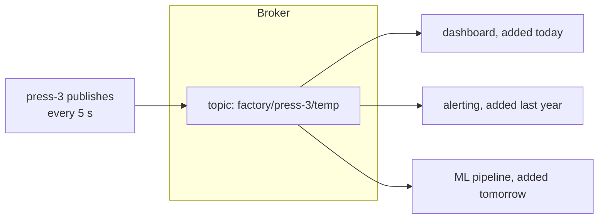

- **Space:** neither side knows the other's address
- **Time:** a subscriber can be offline when the message is sent (with sessions and retain)
- **Synchronisation:** publishing does not block on any consumer

Adding the fourth consumer requires **no change on the device**. That is why MQTT survives long device lifetimes.

---

## Run a Broker in One Minute

```bash
# Mosquitto, the small open-source broker from the Eclipse Foundation
docker run -it -p 1883:1883 eclipse-mosquitto:2 \
  mosquitto -c /mosquitto-no-auth.conf

# or natively
sudo apt install mosquitto mosquitto-clients
brew install mosquitto
```

Subscribe in one terminal, publish in another:

```bash
# terminal 1 — -v prints "topic payload"
mosquitto_sub -h localhost -t 'home/#' -v

# terminal 2
mosquitto_pub -h localhost -t 'home/kitchen/temp' -m '22.5'
```

```text
home/kitchen/temp 22.5
```

That is the whole protocol in miniature: a topic, a payload, a broker in between.

---

## Anatomy of One Published Message

```text
mosquitto_pub -h broker -t home/kitchen/temp -m '22.5' -q 1 -r
                        └── topic ──────────┘ └payload┘ │    │
                                                        │    └─ retain flag
                                                        └────── QoS level
```

| Part | Meaning |
| --- | --- |
| **Topic** | The address. A UTF-8 string with `/` separated levels |
| **Payload** | Any bytes at all, 0 to 256 MB. The broker never looks inside |
| **QoS** | 0, 1 or 2: how hard the protocol tries to deliver it |
| **Retain** | Keep this as the "last known value" for new subscribers |
| **Properties** | MQTT 5 only: expiry, content type, response topic, user properties |

---

## Clients, Client IDs and Connections

- A **client** is anything that connects: a sensor, a phone app, a backend service, `mosquitto_sub`
- Every client presents a **client ID**, unique per broker. Reusing an ID kicks the older connection off
- A client can publish, subscribe, or both. The protocol does not distinguish device from server
- One TCP connection carries **all** of a client's topics, in both directions

```bash
mosquitto_sub -h broker -i dashboard-1 -t 'home/#' -q 1
#                       └── client id
```

⚠️ Two devices flashed with the same client ID will disconnect each other in a loop. Derive it from something unique: a serial number, a MAC address, a provisioned name.

---

## Recap of Part 1

- MQTT is a **publish/subscribe** protocol over TCP, designed in 1999 for expensive, unreliable links
- A **broker** decouples publishers from subscribers in space, time and synchronisation
- Devices keep **one long connection** instead of polling, so commands arrive instantly
- A message is a **topic**, a **payload**, a **QoS level** and a **retain flag**
- Ports: `1883` plain, `8883` TLS, `443` over WebSockets

**Next:** topics, the addressing scheme everything else hangs off.

---

# Part 2 · Topics

*The addressing scheme everything hangs off*

---

## What a Topic Is

A **topic** is just a UTF-8 string, cut into levels by `/`.

```text
factory/line-2/press-3/temperature
   │       │       │         └── level 4
   │       │       └──────────── level 3
   │       └──────────────────── level 2
   └──────────────────────────── level 1
```

- **Nothing is created in advance.** Publishing to a topic makes it exist; nobody subscribed means nobody hears it
- **Case sensitive:** `Home/Temp` and `home/temp` are different topics
- **No queue behind it.** A topic is a routing label, not storage (except for one retained message)
- Up to 65,535 bytes, though anything past a hundred is a design smell

---

## The Rules of Topic Names

| Rule | Example | Note |
| --- | --- | --- |
| `/` separates levels | `a/b/c` | three levels |
| Levels may be empty | `a//c` | legal but confusing; avoid |
| A leading `/` adds an empty first level | `/a/b` | different from `a/b`. Avoid |
| Trailing `/` adds an empty last level | `a/b/` | different from `a/b`. Avoid |
| Spaces are legal | `living room/temp` | legal, still a bad idea |
| Must not be empty | `""` | rejected |
| `$` prefix is reserved | `$SYS/…`, `$share/…`, `$aws/…` | broker-owned namespaces |
| Publishers may not use wildcards | `home/+/temp` | only subscribers can |

Unicode is allowed, so emoji topics are legal. Your future self, grepping logs, will not thank you.

---

## Wildcards: `+` and `#`

Subscribers, and only subscribers, may use two wildcards.

<div style="display:grid;grid-template-columns:1fr 1fr;gap:16px;margin-top:12px">
<div style="background:var(--surface0);border:1px solid var(--surface1);border-radius:10px;padding:14px 18px"><b>+ single level</b><br><small style="color:var(--subtext0)">Matches exactly one level, anywhere in the filter.<br><code>home/+/temp</code> matches <code>home/kitchen/temp</code> and <code>home/attic/temp</code>, but not <code>home/a/b/temp</code>.</small></div>
<div style="background:var(--surface0);border:1px solid var(--surface1);border-radius:10px;padding:14px 18px"><b># multi level</b><br><small style="color:var(--subtext0)">Matches the rest of the tree. Must be the last character.<br><code>home/#</code> matches <code>home/kitchen/temp</code>, <code>home/attic/humidity/raw</code> and <code>home</code> itself.</small></div>
</div>

```bash
mosquitto_sub -t 'home/+/temp'      # every room's temperature
mosquitto_sub -t 'home/#'           # everything under home
mosquitto_sub -t '#'                # the entire broker (debug only)
```

---

## Wildcard Matching, Line by Line

| Filter | `home/kitchen/temp` | `home/kitchen/light/set` | `home` | `office/temp` |
| --- | --- | --- | --- | --- |
| `home/kitchen/temp` | match | no | no | no |
| `home/+/temp` | match | no | no | no |
| `home/+/+` | match | no | no | no |
| `home/#` | match | match | match | no |
| `+/kitchen/#` | match | match | no | no |
| `#` | match | match | match | match |

Two subtleties worth remembering:

- `home/#` also matches the parent `home`, but `home/+` does **not**
- `$SYS/#` is never matched by `#` alone: topics starting with `$` are excluded from root wildcards

---

## Designing a Topic Tree

Go from **general to specific**, left to right, so wildcards are useful.

```text
{prefix}/{site}/{device-type}/{device-id}/{channel}

acme/plant-1/press/press-3/telemetry
acme/plant-1/press/press-3/state
acme/plant-1/press/press-3/cmd
acme/plant-1/press/press-3/cmd/ack
```

That shape lets you subscribe at any zoom level:

```text
acme/plant-1/#                     everything at one site
acme/+/press/+/telemetry           all presses everywhere
acme/plant-1/press/press-3/#       one machine, all channels
```

---

## Three Channels Every Device Wants

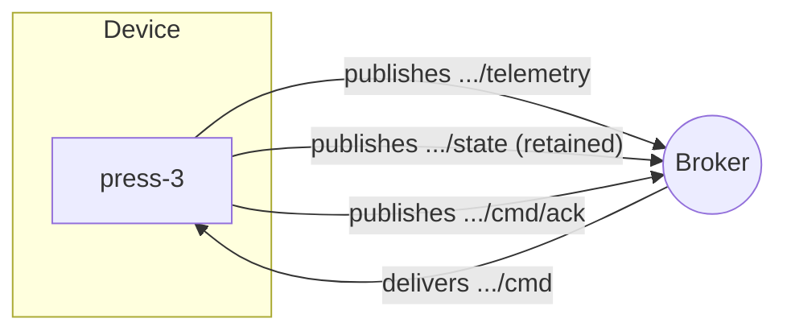

| Channel | Direction | Retained? | QoS |
| --- | --- | --- | --- |
| `telemetry` | device → cloud | no | 0 or 1 |
| `state` | device → cloud | **yes**, it is the last known value | 1 |
| `cmd` | cloud → device | no | 1 |
| `cmd/ack` | device → cloud | no | 1 |

Keeping commands on a **separate branch** from telemetry is what makes access rules simple: a device may publish only under its own telemetry branch, and subscribe only to its own command branch.

---

## Topic Anti-Patterns

<div style="display:grid;grid-template-columns:1fr 1fr;gap:14px">
<div style="background:var(--surface0);border-left:3px solid var(--red);border-radius:10px;padding:10px 16px"><b>Data in the payload that belongs in the topic</b><br><small style="color:var(--subtext0)">One <code>telemetry</code> topic for all devices forces every consumer to filter. Put the device id in the topic.</small></div>
<div style="background:var(--surface0);border-left:3px solid var(--red);border-radius:10px;padding:10px 16px"><b>Data in the topic that belongs in the payload</b><br><small style="color:var(--subtext0)"><code>…/temp/22.5</code> creates an unbounded number of topics and no history.</small></div>
<div style="background:var(--surface0);border-left:3px solid var(--red);border-radius:10px;padding:10px 16px"><b>Leading slashes</b><br><small style="color:var(--subtext0)"><code>/home/temp</code> has an invisible empty first level. Endless confusion, zero benefit.</small></div>
<div style="background:var(--surface0);border-left:3px solid var(--red);border-radius:10px;padding:10px 16px"><b>Subscribing to <code>#</code> in production</b><br><small style="color:var(--subtext0)">One client then receives the whole broker's traffic. Fine for debugging, ruinous at scale.</small></div>
<div style="background:var(--surface0);border-left:3px solid var(--red);border-radius:10px;padding:10px 16px"><b>Renaming topics casually</b><br><small style="color:var(--subtext0)">Deployed firmware may live for a decade. Version the scheme: <code>v1/...</code>.</small></div>
<div style="background:var(--surface0);border-left:3px solid var(--red);border-radius:10px;padding:10px 16px"><b>Secrets or PII in topics</b><br><small style="color:var(--subtext0)">Topics appear in logs, metrics and ACLs. Keep them boring.</small></div>
</div>

---

## `$SYS`: The Broker Talking About Itself

Most brokers publish their own metrics under `$SYS`.

```bash
mosquitto_sub -h localhost -t '$SYS/#' -v | head
```

```text
$SYS/broker/version mosquitto version 2.0.18
$SYS/broker/clients/connected 42
$SYS/broker/clients/maximum 57
$SYS/broker/messages/received 129481
$SYS/broker/messages/sent 401233
$SYS/broker/load/messages/received/1min 71.20
$SYS/broker/subscriptions/count 88
$SYS/broker/heap/current 1048576
```

Point Telegraf, Prometheus or a small script at these and you have broker monitoring for free. The exact tree differs per broker; the `$` prefix convention does not.

---

## Shared Subscriptions

Normally **every** subscriber to a topic gets **every** message. Sometimes you want a worker pool instead.

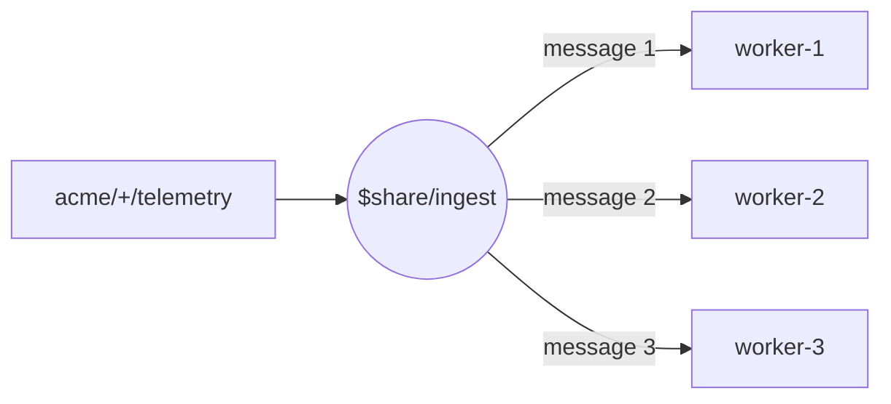

```text
$share/{group}/{topic-filter}

$share/ingest/acme/+/press/+/telemetry
```

- Members of the same **group** share the load, one message to one member
- Different groups each get their own full copy
- Standard in MQTT 5; many MQTT 3.1.1 brokers support it as an extension

This is how you scale the consumer side without giving each worker a different topic.

---

## Topic Aliases (MQTT 5)

Long topics are sent on every publish, which hurts when the topic is longer than the payload.

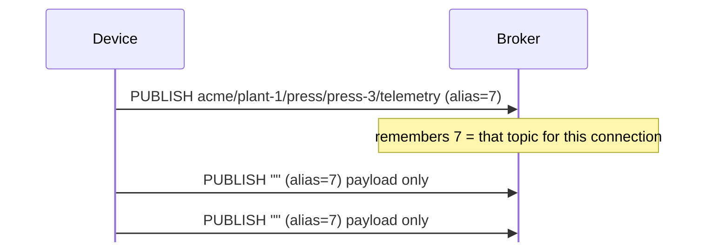

- The alias lives only for the life of that connection, in one direction
- The broker advertises a **Topic Alias Maximum**; zero means "do not use them"
- Saves real bandwidth on cellular and satellite links

---

## Recap of Part 2

- A topic is a `/` separated UTF-8 string; nothing is pre-created, and it is case sensitive
- Subscribers may use `+` (one level) and `#` (rest of the tree, last character only)
- `$`-prefixed trees (`$SYS`, `$share`, `$aws`) belong to the broker and are excluded from `#`
- Design general → specific, with separate branches for telemetry, state, commands and acks
- Shared subscriptions (`$share/group/filter`) spread one stream across a worker pool
- Version the scheme early: firmware outlives opinions

---

# Part 3 · The Protocol in Detail

*Packets, sessions, QoS, retain, wills and MQTT 5*

---

## The Shape of Every Packet

Every MQTT packet has the same three parts. Only the first is mandatory.

```text
┌───────────────────────────────┬──────────────┬──────────────────────┐
│ Fixed header (2–5 bytes)      │ Variable hdr │ Payload              │
│ ┌──────────┬────────────────┐ │ packet id,   │ message bytes,       │
│ │ type (4b)│ flags (4b)     │ │ topic name,  │ topic filters,       │
│ ├──────────┴────────────────┤ │ properties…  │ client id, will…     │
│ │ remaining length (1–4 B)  │ │              │                      │
│ └───────────────────────────┘ │              │                      │
└───────────────────────────────┴──────────────┴──────────────────────┘
```

- **Type** says what the packet is; **flags** carry QoS, DUP and RETAIN for a PUBLISH
- **Remaining length** is a variable-length integer: 7 bits of value plus a continuation bit per byte
- 1 byte covers up to 127 bytes, 4 bytes cover up to **256 MB**

A minimal publish is 2 bytes of header, a 2-byte topic length, the topic, and the payload.

---

## The Fourteen Control Packets

| Type | Name | Sent by | What it does |
| --- | --- | --- | --- |
| 1 | `CONNECT` | client | open a session |
| 2 | `CONNACK` | broker | accept or refuse it |
| 3 | `PUBLISH` | either | carry a message |
| 4 | `PUBACK` | either | QoS 1 acknowledgement |
| 5–7 | `PUBREC` `PUBREL` `PUBCOMP` | either | the QoS 2 handshake |
| 8 | `SUBSCRIBE` | client | ask for topic filters |
| 9 | `SUBACK` | broker | granted QoS per filter |
| 10 | `UNSUBSCRIBE` | client | stop a subscription |
| 11 | `UNSUBACK` | broker | confirm it |
| 12–13 | `PINGREQ` `PINGRESP` | client / broker | keep-alive heartbeat |
| 14 | `DISCONNECT` | either | clean shutdown (broker may send it in MQTT 5) |
| 15 | `AUTH` | either | MQTT 5 extended authentication |

Fourteen packet types is the entire protocol. That is the point.

---

## Connecting

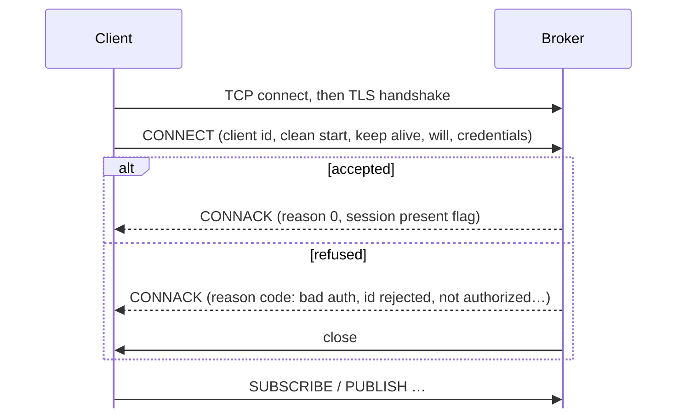

The **first** packet on the wire must be `CONNECT`, and only one per connection. A second one is a protocol error and the broker hangs up.

---

## Inside CONNECT

| Field | Meaning |
| --- | --- |
| Protocol name / level | `MQTT` + `4` (3.1.1) or `5` |
| **Client identifier** | Unique per broker. Empty asks the broker to assign one (needs clean session) |
| **Clean start / clean session** | Start fresh, or resume the stored session |
| **Keep alive** | Seconds; 0 disables the timer |
| **Will topic / payload / QoS / retain** | The message the broker publishes if you vanish |
| **User name / password** | Optional credentials, protected by TLS, not by MQTT |
| Properties (v5) | Session expiry, receive maximum, maximum packet size, topic alias max, auth method |

```text
CONNECT flags byte:
  bit 7 user name   6 password   5 will retain   4-3 will QoS
  bit 2 will flag   1 clean start   0 reserved(0)
```

---

## Sessions: What the Broker Remembers

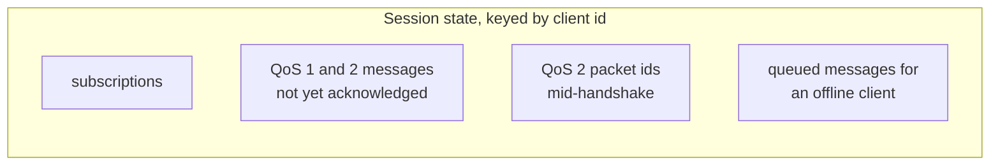

| | MQTT 3.1.1 | MQTT 5 |
| --- | --- | --- |
| Ask for a fresh start | `cleanSession = 1` | `cleanStart = 1` |
| Resume an old session | `cleanSession = 0` | `cleanStart = 0` |
| How long state survives | until the client returns (broker's choice) | **Session Expiry Interval**, in seconds |
| Told whether state was found | `sessionPresent` in CONNACK | same, plus reason codes |

A persistent session is what lets a sleepy device miss an hour of commands and still receive them on reconnect.

---

## Keep Alive

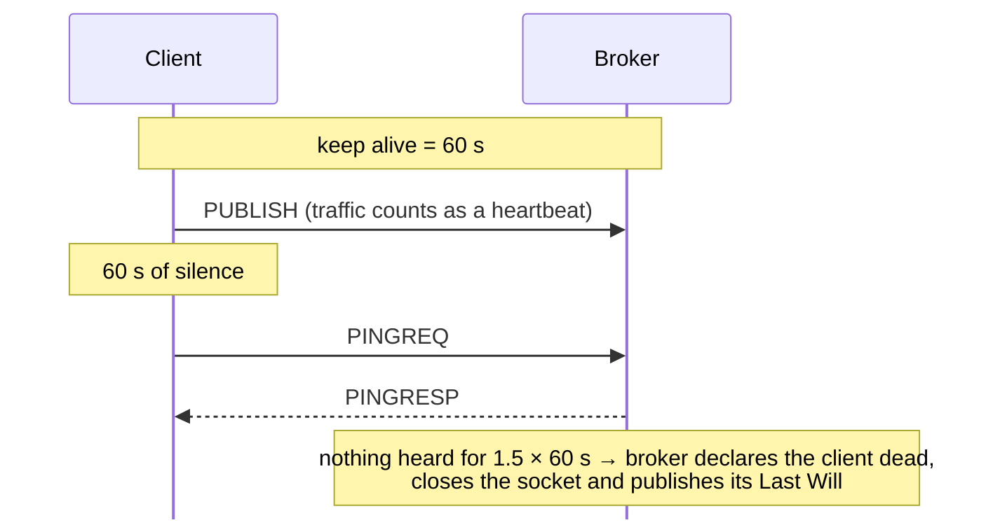

- Any packet resets the timer; `PINGREQ` exists for when there is nothing else to send
- The broker allows **1.5 × keep alive** before giving up
- Short keep alive = quick failure detection, more radio wake-ups. Long = the opposite
- Keep alive is how both sides notice a **half-open** connection, the kind TCP never reports

---

## PUBLISH, Field by Field

```text
Fixed header byte 1:  0011 D Q Q R
                           │ │ │ └── RETAIN
                           │ └─┴──── QoS (0, 1, 2)
                           └──────── DUP: this is a redelivery
Variable header:      topic name, packet id (QoS > 0), properties (v5)
Payload:              your bytes, verbatim
```

- The broker never inspects the payload. Content type is your business (MQTT 5 adds a hint property)
- `DUP` only means "I have sent this before" — the receiver may still have seen it
- `RETAIN` on the wire means two different things: "store this" when publishing, "this came from storage" when receiving

---

## QoS 0 — At Most Once

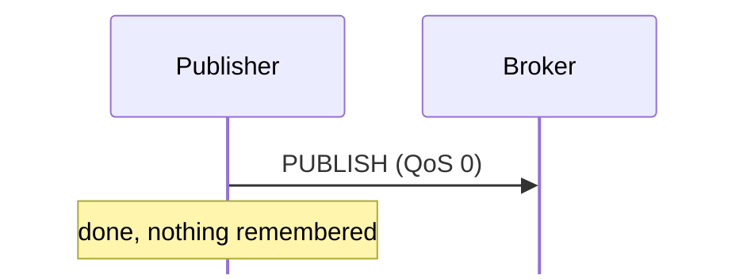

- Fire and forget. No acknowledgement, no retry, no storage
- Lost if the connection drops mid-flight. TCP guarantees nothing across a reconnect
- Cheapest in bandwidth, memory and battery

**Use for:** high-rate sensor readings where the next one arrives in a second anyway.

---

## QoS 1 — At Least Once

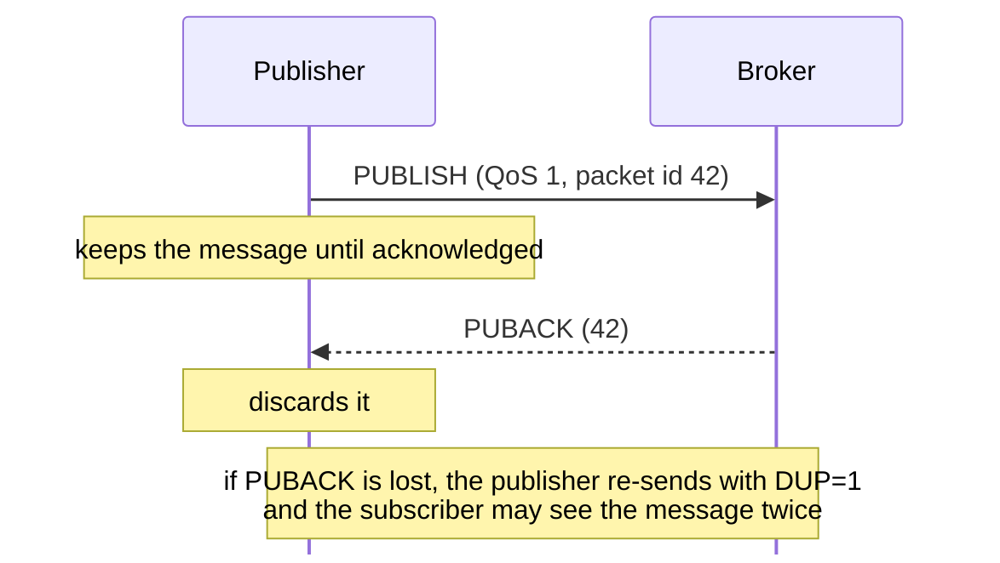

- The default for anything that matters
- **Duplicates are possible**, so make consumers idempotent: include a message id, or make the operation naturally repeatable

---

## QoS 2 — Exactly Once

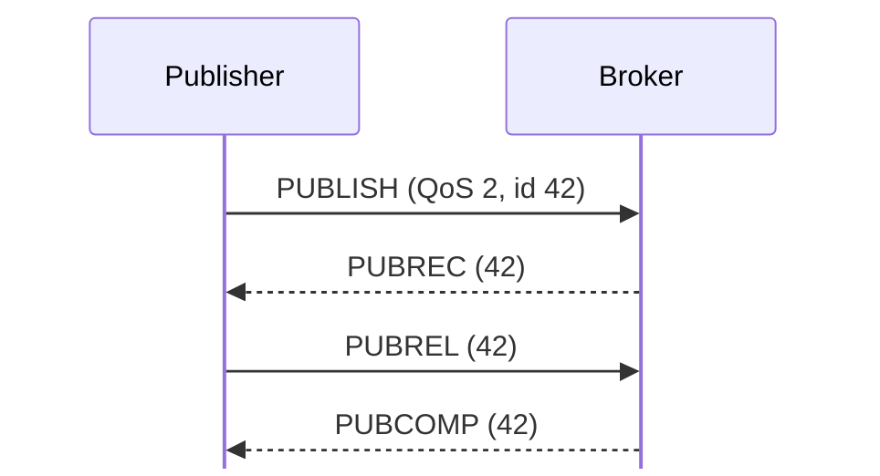

- Four packets, and both sides store state until the handshake finishes
- The receiver records the packet id after `PUBREC`, so a re-sent `PUBLISH` is discarded
- Slowest, heaviest, and **not supported by some cloud brokers** (AWS IoT Core among them)

**Use for:** billing events, irreversible commands — where a duplicate is worse than latency.

---

## Choosing a QoS

| Situation | QoS | Why |
| --- | --- | --- |
| Temperature every 5 s | 0 | the next reading is along shortly |
| Door opened / closed event | 1 | must not be lost; a repeat is harmless |
| "Unlock the door" command | 1 + idempotency key | delivery matters, and so does not repeating it |
| Meter reading for billing | 2 (or 1 + dedupe) | a duplicate costs money |
| Firmware chunk | 1 | verify the whole image by hash afterwards |

Note the QoS of a delivery is `min(publisher QoS, subscriber's granted QoS)`. Publishing at 2 to a subscriber that asked for 0 delivers at 0.

---

## Ordering and In-Flight Messages

- Within one topic and one QoS level, a broker delivers in the order it received
- A redelivery after a reconnect can still land out of order relative to newer messages
- MQTT 5's **Receive Maximum** caps how many unacknowledged messages may be in flight; the 3.1.1 equivalent is broker configuration
- If your logic depends on order, carry a **sequence number or timestamp in the payload**

```json
{"seq": 10482, "ts": "2026-09-19T08:31:02Z", "temp_c": 22.5}
```

---

## Retained Messages

One message per topic can be kept by the broker as the **last known value**.

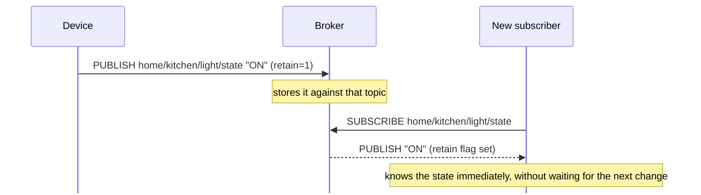

```bash
mosquitto_pub -t home/kitchen/light/state -m 'ON' -r     # set
mosquitto_pub -t home/kitchen/light/state -m '' -r -n    # clear (empty payload)
```

Retain is per topic, not a history: a second retained publish replaces the first.

---

## Retain: the Fine Print

- An **empty payload with retain set deletes** the retained message. That is the only way to clear one
- Retained messages do **not** expire in MQTT 3.1.1. In MQTT 5 a **Message Expiry Interval** applies to them too
- A dashboard restart replays every retained message it subscribes to — that is the feature, but it can be a flood
- MQTT 5 subscription options give the subscriber control:

| Option | Effect |
| --- | --- |
| **Retain Handling = 0** | send retained messages on subscribe (default) |
| **Retain Handling = 1** | send them only if the subscription is new |
| **Retain Handling = 2** | never send retained messages |
| **Retain As Published** | keep the publisher's retain flag when forwarding |
| **No Local** | do not echo my own messages back to me |

---

## Last Will and Testament

The message the broker sends **on your behalf** when your connection dies badly.

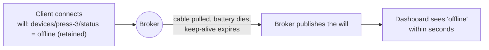

- Registered in `CONNECT`, held by the broker for the whole session
- **Not** sent after a clean `DISCONNECT` — that is how the broker tells "gone politely" from "gone dark"
- MQTT 5 adds a **Will Delay Interval**: wait N seconds first, so a quick reconnect never triggers it

---

## The Birth / Will / Death Pattern

```bash
# on connect: will registered first, then the birth message
mosquitto_sub -t 'devices/press-3/#' \
  --will-topic 'devices/press-3/status' --will-payload 'offline' \
  --will-qos 1 --will-retain &

mosquitto_pub -t 'devices/press-3/status' -m 'online' -q 1 -r
```

| Message | When | Retained |
| --- | --- | --- |
| **Will** ("offline") | registered at connect, published by the broker on an unclean drop | yes |
| **Birth** ("online") | published by the device right after connecting | yes |
| **Death** ("offline") | published by the device before a planned disconnect | yes |

Because both are retained on the same topic, any subscriber learns the device's liveness the moment it subscribes.

---

## Subscribing

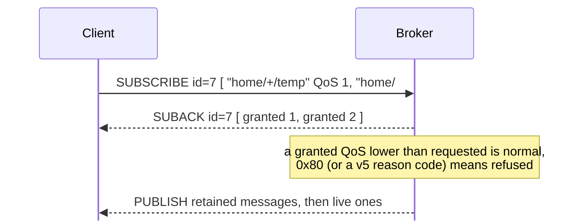

- One `SUBSCRIBE` may carry many filters; the `SUBACK` answers each in order
- Subscribing twice to the same filter **replaces** the first subscription rather than doubling delivery
- Subscriptions live in the session, so a resumed session does not need to re-subscribe

---

## Disconnecting

```text
DISCONNECT   → clean shutdown; the will is discarded
              MQTT 5 adds reason codes in both directions, e.g.
              0x00 normal disconnection
              0x04 disconnect with will message  (client: send my will anyway)
              0x8D keep alive timeout            (broker → client)
              0x97 quota exceeded
              0x9C use another server            (broker → client, with a redirect)
```

- In MQTT 3.1.1 only the client may send `DISCONNECT`, and it carries no explanation: a broker that hangs up leaves you guessing
- In MQTT 5 the broker can explain itself, which turns "the connection just drops" debugging into reading a reason code

---

## What MQTT 5 Added

<div style="display:grid;grid-template-columns:1fr 1fr;gap:14px;margin-top:10px">
<div style="background:var(--surface0);border:1px solid var(--surface1);border-radius:10px;padding:12px 16px"><b>Reason codes everywhere</b><br><small style="color:var(--subtext0)">Every ack can say why. No more silent refusals.</small></div>
<div style="background:var(--surface0);border:1px solid var(--surface1);border-radius:10px;padding:12px 16px"><b>User properties</b><br><small style="color:var(--subtext0)">Arbitrary key/value headers on any packet: trace ids, schema versions.</small></div>
<div style="background:var(--surface0);border:1px solid var(--surface1);border-radius:10px;padding:12px 16px"><b>Request / response</b><br><small style="color:var(--subtext0)">Response Topic + Correlation Data make RPC over pub/sub standard.</small></div>
<div style="background:var(--surface0);border:1px solid var(--surface1);border-radius:10px;padding:12px 16px"><b>Message & session expiry</b><br><small style="color:var(--subtext0)">Stale commands die instead of arriving hours late.</small></div>
<div style="background:var(--surface0);border:1px solid var(--surface1);border-radius:10px;padding:12px 16px"><b>Flow control</b><br><small style="color:var(--subtext0)">Receive Maximum and Maximum Packet Size protect small clients.</small></div>
<div style="background:var(--surface0);border:1px solid var(--surface1);border-radius:10px;padding:12px 16px"><b>Shared subs & aliases</b><br><small style="color:var(--subtext0)">Worker pools and shorter packets, standardised.</small></div>
</div>

---

## Request / Response in MQTT 5

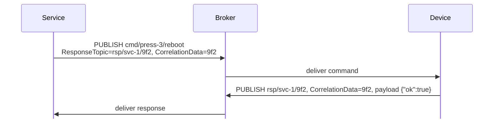

- The requester picks a **response topic** it already subscribes to, and a **correlation id** to match replies to requests
- Before MQTT 5 everyone invented this by hand; now it is a standard pair of properties
- Still asynchronous: set a timeout, and expect a reply that never comes

---

## MQTT 3.1.1 vs MQTT 5

| | 3.1.1 | 5.0 |
| --- | --- | --- |
| Error reporting | connection closed, no reason | reason codes on every ack |
| Session lifetime | broker's choice | explicit session expiry |
| Message lifetime | forever | message expiry interval |
| Headers | none | user properties, content type |
| Request/response | do it yourself | response topic + correlation data |
| Flow control | broker config | receive maximum, max packet size |
| Shared subscriptions | broker extension | standard |
| Topic aliases | no | yes |
| Adoption | everywhere, every client | all major brokers, most clients |

Start new work on 5 if your broker and libraries support it; brokers usually accept both on the same port.

---

## Security: the Layers

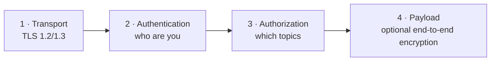

| Layer | Options |
| --- | --- |
| Transport | TLS on 8883 or WSS on 443; verify the server certificate, pin a CA on devices |
| Authentication | username/password, **X.509 client certificates (mutual TLS)**, tokens, MQTT 5 enhanced auth (`AUTH`) |
| Authorization | per-client ACLs: which topics it may publish to and subscribe to |
| Payload | encrypt or sign the body when the broker is not fully trusted |

MQTT itself carries credentials in clear text. Without TLS, a username and password is decoration.

---

## A Sane ACL

```text
# mosquitto ACL file
user press-3
topic write  acme/plant-1/press/press-3/telemetry
topic write  acme/plant-1/press/press-3/state
topic read   acme/plant-1/press/press-3/cmd

# a pattern rule covers the whole fleet, %c = client id, %u = username
pattern write acme/plant-1/+/%c/telemetry
pattern read  acme/plant-1/+/%c/cmd
```

- A device should be able to talk about **itself and nothing else**
- Backend services get broad read access and narrow write access
- `#` subscriptions belong to admin tooling, not to running services

⚠️ A default-allow broker on a public IP is discovered by scanners within hours.

---

## Transports Beyond Plain TCP

<div style="display:grid;grid-template-columns:1fr 1fr;gap:16px">
<div style="background:var(--surface0);border:1px solid var(--surface1);border-radius:10px;padding:14px 18px"><b>MQTT over WebSockets</b><br><small style="color:var(--subtext0)">The same packets inside a WebSocket frame, usually <code>wss://host:443/mqtt</code>. Lets browser dashboards subscribe directly, and slips through firewalls that only allow 443.</small></div>
<div style="background:var(--surface0);border:1px solid var(--surface1);border-radius:10px;padding:14px 18px"><b>MQTT-SN</b><br><small style="color:var(--subtext0)">A sibling protocol for networks without TCP: UDP, Zigbee, BLE. Topics become 2-byte ids, clients may sleep and have messages buffered. A gateway bridges it to a normal broker.</small></div>
</div>

```text
Device (MQTT-SN over 802.15.4) → MQTT-SN gateway → MQTT broker (TCP) → cloud
```

---

## Brokers You Might Use

| Broker | Notes |
| --- | --- |
| **Mosquitto** | Eclipse, tiny C broker. Perfect for edge boxes and learning. Single node |
| **EMQX** | Erlang, clustered, millions of connections, rules engine, MQTT 5 |
| **HiveMQ** | Java, clustered, enterprise tooling and extensions |
| **VerneMQ** | Erlang, clustered, plugin system |
| **NanoMQ** | Ultra-light broker for edge gateways |
| **RabbitMQ** | AMQP broker with an MQTT plugin; useful when you already run it |
| **AWS IoT Core** | Managed broker, no servers, deep AWS integration (Part 6) |
| **Azure Event Grid MQTT** | Managed MQTT 5 broker on Azure |

**Bridging** links brokers (edge → cloud, or site → site). **Clustering** makes several nodes behave as one broker.

---

## Seeing It on the Wire

```bash
sudo tcpdump -i any -X 'port 1883' | head -20
```

```text
CONNECT                           PUBLISH  home/kitchen/temp  "22.5"
10 1a                             30 17
  00 04 4d 51 54 54   "MQTT"        00 11  topic length = 17
  04                  level 4       68 6f 6d 65 2f ... "home/kitchen/temp"
  02                  clean session 32 32 2e 35         "22.5"
  00 3c               keep alive 60
  00 0c "sensor-0001"             ← 2 bytes of header, 2 of length,
                                    17 of topic, 4 of payload = 25 bytes
```

Twenty-five bytes for a reading. The same thing as an HTTP POST with headers is comfortably ten times that.

---

## Recap of Part 3

- Fourteen packet types, a 2-byte fixed header, and a variable-length integer for the rest
- **CONNECT** carries the client id, clean start, keep alive, will and credentials
- **Sessions** hold subscriptions and undelivered messages; MQTT 5 gives them an explicit expiry
- **QoS 0/1/2** trade bandwidth for delivery guarantees; the delivered level is the minimum of both sides
- **Retained** messages give new subscribers the last known value; **wills** announce unexpected death
- **MQTT 5** adds reason codes, properties, request/response, expiry and flow control
- Security is TLS + authentication + per-topic ACLs, and optionally payload encryption

---

# Part 4 · MQTT in IoT

*From one sensor to a fleet*

---

## A Typical IoT Architecture

```mermaid
flowchart LR
  subgraph Field
    S1["sensor"] & S2["actuator"] & G["edge gateway"]
  end
  S1 & S2 --> G
  G -- "MQTT/TLS" --> B(("Broker / cloud IoT service"))
  B --> R["rules & routing"]
  R --> TS[("time series DB")]
  R --> L["stream processing"]
  R --> AL["alerting"]
  B <--> API["backend services<br/>and apps"]
```

The broker is the **only** thing devices talk to. Everything else subscribes downstream, which is what lets you rebuild the backend without touching firmware.

---

## The Life of a Device

```mermaid
flowchart LR
  P["1 · Provision<br/>identity + credentials"] --> C["2 · Connect<br/>TLS, CONNECT, will"]
  C --> B["3 · Birth<br/>retained 'online' + metadata"]
  B --> T["4 · Operate<br/>telemetry out, commands in"]
  T --> U["5 · Update<br/>config and firmware"]
  U --> D["6 · Retire<br/>revoke credentials"]
  T -.-> C
```

Each step has a topic convention behind it. Decide them once, at the start of the project — they outlive every other decision you make.

---

## A Topic Scheme for a Fleet

```text
v1/acme/{site}/{type}/{device-id}/telemetry      device → cloud, QoS 0/1
v1/acme/{site}/{type}/{device-id}/event          device → cloud, QoS 1
v1/acme/{site}/{type}/{device-id}/state          device → cloud, retained
v1/acme/{site}/{type}/{device-id}/status         will + birth, retained
v1/acme/{site}/{type}/{device-id}/cmd            cloud → device, QoS 1
v1/acme/{site}/{type}/{device-id}/cmd/ack        device → cloud, QoS 1
v1/acme/{site}/{type}/{device-id}/cfg            cloud → device, retained
```

| Consumer | Subscribes to |
| --- | --- |
| Ingest pipeline | `$share/ingest/v1/acme/+/+/+/telemetry` |
| Liveness dashboard | `v1/acme/+/+/+/status` |
| Site operator UI | `v1/acme/plant-1/#` |
| Device itself | its own `cmd` and `cfg` only |

---

## What Goes in the Payload

| Format | Size | When |
| --- | --- | --- |
| **JSON** | largest | default. Readable, debuggable, fine over Wi-Fi/Ethernet |
| **CBOR** | ~40–60% of JSON | same shape as JSON, binary. Good on cellular |
| **Protobuf / FlatBuffers** | smallest with a schema | high rate, schema-managed fleets |
| **Raw binary struct** | smallest | tiny MCUs; brittle, version it carefully |
| **Plain value** (`22.5`) | tiny | home automation, one value per topic |

```json
{"ts":"2026-09-19T08:31:02Z","seq":10482,"temp_c":22.5,"rssi":-67,"batt_pct":82}
```

Always carry a **timestamp** and a **sequence number**: the broker preserves neither for you, and retries can duplicate.

---

## Sizing a Payload

A cellular device publishing every 10 seconds, 24/7:

| Payload | Per message | Per day | Per month |
| --- | --- | --- | --- |
| Verbose JSON (180 B) | ~210 B with MQTT + TCP overhead | ~1.8 MB | ~55 MB |
| Compact JSON (60 B) | ~90 B | ~780 KB | ~23 MB |
| CBOR (35 B) | ~65 B | ~560 KB | ~17 MB |
| Same, published every 60 s | ~65 B | ~94 KB | ~2.8 MB |

Two decisions — shorter payloads and a slower cadence — cut the bill by 20×. Publish on **change plus a heartbeat** rather than on a fixed fast timer where you can.

---

## Commands That Devices Can Trust

```mermaid
%%{init: {"sequence": {"mirrorActors": false}}}%%
sequenceDiagram
  participant S as Service
  participant B as Broker
  participant D as Device
  S->>B: cmd  {"id":"7f3","op":"set_speed","rpm":1200,"exp":"08:31:20Z"}
  B->>D: deliver (QoS 1, may be a duplicate)
  Note over D: id seen before? then ack again, do nothing else<br/>past expiry? then reject
  D->>B: cmd/ack {"id":"7f3","status":"applied","rpm":1200}
  B->>S: deliver ack
```

- **Command id** makes the operation idempotent under QoS 1 redelivery
- **Expiry** stops a command queued for an offline device from firing hours later (MQTT 5 can do this at the protocol level)
- **Ack on a separate topic** so the service knows what actually happened

---

## Knowing What Is Online

```mermaid
flowchart LR
  D["Device"] -- "connect: will = offline (retained)" --> B(("Broker"))
  D -- "birth: online (retained)" --> B
  B --> M["Liveness view<br/>subscribes to .../status"]
  D -. "power cut" .-> X["keep-alive expires"] --> W["broker publishes 'offline'"] --> M
```

```json
{"state":"online","ts":"2026-09-19T08:30:00Z","fw":"2.4.1","ip":"10.2.0.17"}
```

- Retained status + will gives you a fleet liveness table with no polling and no extra service
- Tune the keep-alive to how fast you need to notice: detection takes up to 1.5 × keep alive
- For "is it healthy" rather than "is it connected", publish a heartbeat with counters

---

## Constrained Devices

| Constraint | What it means for MQTT |
| --- | --- |
| RAM in tens of KB | TLS buffers dominate. Cut `MQTT_MAX_PACKET_SIZE`, avoid big payloads |
| Battery | Every wake-up costs. Longer keep-alive, publish in batches, sleep between |
| TLS cost | The handshake is the expensive part: **keep the connection open** instead of reconnecting |
| Flash | Ship one CA certificate, not a bundle |
| Clock | TLS needs a roughly correct time. Get it from NTP or the network before connecting |
| Unstable Wi-Fi | Reconnect with exponential backoff and jitter; resume the session rather than clean-starting |

```c
// ESP-IDF: keep it open, let the client handle reconnects
esp_mqtt_client_config_t cfg = {
    .broker.address.uri = "mqtts://broker.example.com:8883",
    .broker.verification.certificate = (const char *)ca_pem_start,
    .credentials.client_id = device_id,
    .session.keepalive = 120,
    .session.last_will = { .topic = will_topic, .msg = "offline", .qos = 1, .retain = 1 },
};
```

---

## The Edge Gateway Pattern

```mermaid
flowchart LR
  subgraph Plant["Factory floor"]
    M1["Modbus PLC"] & M2["BLE sensors"] & M3["MQTT devices"] --> G["Edge gateway<br/>local broker + logic"]
  end
  G -- "store and forward over a flaky WAN" --> C(("Cloud broker"))
  G --> LOCAL["Local control loop<br/>keeps working offline"]
```

- A local broker means machines keep talking when the WAN is down
- The gateway **bridges** selected topics upward, often re-mapping them into the cloud scheme
- It can filter, batch, downsample and compress — the cheapest way to cut cloud costs
- It also isolates legacy protocols (Modbus, CAN, BACnet) behind one modern connection

---

## Sparkplug B

An open specification (Eclipse Sparkplug) that pins down what MQTT deliberately leaves open, for industrial use.

| It defines | How |
| --- | --- |
| Topic structure | `spBv1.0/{group}/{msg-type}/{edge-node}/{device}` |
| Payload | Protobuf with typed metrics, timestamps and aliases |
| State model | `NBIRTH`/`DBIRTH` announce every metric, `NDATA`/`DDATA` send changes only |
| Liveness | A mandatory will (`NDEATH`) plus a broker-side primary-host state topic |
| Discovery | A SCADA system can learn the whole plant without configuration |

Use it when integrating with industrial SCADA/MES tooling. For a greenfield product fleet, a well-designed custom scheme is usually simpler.

---

## Scaling the Broker Side

<div style="display:grid;grid-template-columns:1fr 1fr;gap:14px">
<div style="background:var(--surface0);border:1px solid var(--surface1);border-radius:10px;padding:12px 16px"><b>Connections, not throughput</b><br><small style="color:var(--subtext0)">A million idle devices is a memory and file-descriptor problem before it is a CPU one.</small></div>
<div style="background:var(--surface0);border:1px solid var(--surface1);border-radius:10px;padding:12px 16px"><b>Fan-out is the multiplier</b><br><small style="color:var(--subtext0)">One publish to 10,000 subscribers is 10,000 sends. Watch subscriber counts, not just publish rates.</small></div>
<div style="background:var(--surface0);border:1px solid var(--surface1);border-radius:10px;padding:12px 16px"><b>Shared subscriptions</b><br><small style="color:var(--subtext0)">Scale consumers horizontally without duplicating work.</small></div>
<div style="background:var(--surface0);border:1px solid var(--surface1);border-radius:10px;padding:12px 16px"><b>Queues are memory</b><br><small style="color:var(--subtext0)">Offline sessions with QoS 1/2 store messages. Cap queue length and session expiry, or a fleet outage fills the heap.</small></div>
<div style="background:var(--surface0);border:1px solid var(--surface1);border-radius:10px;padding:12px 16px"><b>Reconnect storms</b><br><small style="color:var(--subtext0)">After an outage every device returns at once. Backoff with jitter on the device is the only real fix.</small></div>
<div style="background:var(--surface0);border:1px solid var(--surface1);border-radius:10px;padding:12px 16px"><b>Clustering</b><br><small style="color:var(--subtext0)">Multiple nodes behind a load balancer share subscription state; sessions must survive a node loss.</small></div>
</div>

---

## Debugging Toolbox

```bash
# see everything, with topics
mosquitto_sub -h broker -t '#' -v

# watch one device, including retained messages
mosquitto_sub -h broker -t 'v1/acme/+/+/press-3/#' -v

# publish a test command
mosquitto_pub -h broker -t 'v1/acme/plant-1/press/press-3/cmd' \
  -m '{"id":"test-1","op":"ping"}' -q 1

# with TLS and a client certificate
mosquitto_sub --cafile ca.pem --cert device.pem --key device.key \
  -h broker.example.com -p 8883 -t 'v1/#' -v
```

| Tool | Use |
| --- | --- |
| **MQTT Explorer** | A tree view of the whole broker, including retained values |
| **MQTTX** | Desktop and CLI client, good for MQTT 5 properties |
| **$SYS topics** | Broker health without extra agents |
| **tcpdump / Wireshark** | It has an MQTT dissector; last resort, but decisive |

---

## Field Mistakes That Cost Real Money

<div style="display:grid;grid-template-columns:1fr 1fr;gap:14px">
<div style="background:var(--surface0);border-left:3px solid var(--red);border-radius:10px;padding:10px 16px"><b>One certificate for the whole fleet</b><br><small style="color:var(--subtext0)">One extracted key compromises every device, and you cannot revoke just one.</small></div>
<div style="background:var(--surface0);border-left:3px solid var(--red);border-radius:10px;padding:10px 16px"><b>Reconnect loop with no backoff</b><br><small style="color:var(--subtext0)">A broker blip becomes a self-inflicted denial of service.</small></div>
<div style="background:var(--surface0);border-left:3px solid var(--red);border-radius:10px;padding:10px 16px"><b>Clean session on every connect</b><br><small style="color:var(--subtext0)">Queued commands vanish, and subscriptions must be rebuilt every time.</small></div>
<div style="background:var(--surface0);border-left:3px solid var(--red);border-radius:10px;padding:10px 16px"><b>Client id = random each boot</b><br><small style="color:var(--subtext0)">Sessions never resume and the broker accumulates ghosts.</small></div>
<div style="background:var(--surface0);border-left:3px solid var(--red);border-radius:10px;padding:10px 16px"><b>Everything at QoS 2</b><br><small style="color:var(--subtext0)">Four packets per reading, for data that is obsolete in a second.</small></div>
<div style="background:var(--surface0);border-left:3px solid var(--red);border-radius:10px;padding:10px 16px"><b>No schema version in the payload</b><br><small style="color:var(--subtext0)">Year three, three firmware generations, and no way to tell them apart.</small></div>
</div>

---

## Recap of Part 4

- Devices talk only to the broker; everything else subscribes downstream
- Give every device the same channel set: telemetry, event, state, status, cmd, cmd/ack, cfg
- Carry a timestamp, sequence number and schema version in every payload
- Commands need an **id** (idempotency) and an **expiry**; acks go on their own topic
- Retained status + will = a fleet liveness view for free
- On constrained devices, hold the connection open: the TLS handshake is the expensive part
- Edge gateways bridge legacy protocols and keep working when the WAN does not

---

# Part 5 · Clients in Python and C++

*From "hello" to a production-shaped client*

---

## The Libraries

```mermaid
flowchart LR
  subgraph PY["Python"]
    p1["paho-mqtt<br/>(Eclipse, sync + async)"]
    p2["aiomqtt<br/>(asyncio wrapper over paho)"]
  end
  subgraph CPP["C / C++"]
    c1["Eclipse Paho C / C++<br/>(async, full featured)"]
    c2["libmosquitto<br/>(small C client)"]
    c3["ESP-IDF esp-mqtt · PubSubClient<br/>(microcontrollers)"]
  end
  PY & CPP --> B[("Broker :8883")]
```

```bash
pip install paho-mqtt            # Python 3, MQTT 3.1.1 and 5
sudo apt install libmosquitto-dev libpaho-mqtt-dev   # C
# C++: vcpkg install paho-mqttpp3   (or build eclipse/paho.mqtt.cpp)
```

---

## Python · Publish

```python
import json, time
import paho.mqtt.client as mqtt

client = mqtt.Client(mqtt.CallbackAPIVersion.VERSION2,
                     client_id="press-3", protocol=mqtt.MQTTv5)
client.username_pw_set("press-3", "s3cret")
client.tls_set(ca_certs="ca.pem")                      # TLS on 8883

# the broker publishes this if we disappear without saying goodbye
client.will_set("v1/acme/plant-1/press/press-3/status",
                json.dumps({"state": "offline"}), qos=1, retain=True)

client.connect("broker.example.com", 8883, keepalive=60)
client.loop_start()                                    # network thread

client.publish("v1/acme/plant-1/press/press-3/status",
               json.dumps({"state": "online"}), qos=1, retain=True)

while True:
    payload = {"ts": time.time(), "temp_c": read_sensor()}
    client.publish("v1/acme/plant-1/press/press-3/telemetry",
                   json.dumps(payload), qos=1)
    time.sleep(10)
```

---

## Python · Subscribe

```python
import paho.mqtt.client as mqtt

def on_connect(client, userdata, flags, reason_code, properties):
    if reason_code != 0:
        print("refused:", reason_code)           # MQTT 5 tells you why
        return
    # re-subscribe here: this also runs after every reconnect
    client.subscribe([("v1/acme/+/+/+/telemetry", 1),
                      ("v1/acme/+/+/+/status", 1)])

def on_message(client, userdata, msg):
    print(msg.topic, msg.payload.decode(), "retained" if msg.retain else "")

def on_disconnect(client, userdata, flags, reason_code, properties):
    print("disconnected:", reason_code)          # paho reconnects for us

client = mqtt.Client(mqtt.CallbackAPIVersion.VERSION2,
                     client_id="ingest-1", protocol=mqtt.MQTTv5)
client.on_connect, client.on_message, client.on_disconnect = (
    on_connect, on_message, on_disconnect)
client.reconnect_delay_set(min_delay=1, max_delay=60)   # backoff
client.connect("broker.example.com", 8883, keepalive=60)
client.loop_forever()
```

---

## Python · Sessions, QoS and Commands

```python
# A persistent session: the broker keeps our subscriptions and queues
# QoS 1 messages while we are away.
client = mqtt.Client(mqtt.CallbackAPIVersion.VERSION2, client_id="press-3",
                     protocol=mqtt.MQTTv5)
props = mqtt.Properties(mqtt.PacketTypes.CONNECT)
props.SessionExpiryInterval = 3600          # remember me for an hour
client.connect("broker.example.com", 8883, keepalive=60,
               clean_start=False, properties=props)
```

```python
seen = set()                                 # idempotency for QoS 1 retries

def on_command(client, userdata, msg):
    cmd = json.loads(msg.payload)
    if cmd["id"] in seen:
        ack(client, cmd, "duplicate"); return
    seen.add(cmd["id"])
    try:
        apply_command(cmd)
        ack(client, cmd, "applied")
    except Exception as e:
        ack(client, cmd, "failed", str(e))

def ack(client, cmd, status, detail=None):
    client.publish("v1/acme/plant-1/press/press-3/cmd/ack",
                   json.dumps({"id": cmd["id"], "status": status,
                               "detail": detail}), qos=1)

client.message_callback_add("v1/acme/plant-1/press/press-3/cmd", on_command)
```

---

## Python · MQTT 5 Properties and asyncio

```python
# Request/response with correlation data
props = mqtt.Properties(mqtt.PacketTypes.PUBLISH)
props.ResponseTopic = "rsp/svc-1/9f2"
props.CorrelationData = b"9f2"
props.MessageExpiryInterval = 30             # drop it if undelivered in 30 s
props.UserProperty = [("schema", "v2"), ("trace", "abc123")]
client.publish("v1/acme/plant-1/press/press-3/cmd",
               json.dumps({"op": "reboot"}), qos=1, properties=props)
```

```python
# aiomqtt: the same protocol with async/await
import asyncio, aiomqtt

async def main():
    async with aiomqtt.Client("broker.example.com", port=8883,
                              tls_params=aiomqtt.TLSParameters(ca_certs="ca.pem")) as c:
        await c.subscribe("v1/acme/#", qos=1)
        async for message in c.messages:
            print(message.topic, message.payload)

asyncio.run(main())
```

---

## C++ · Connect and Publish (Paho C++)

```cpp
#include "mqtt/async_client.h"
#include <iostream>

int main() {
    mqtt::async_client cli("ssl://broker.example.com:8883", "press-3");

    mqtt::ssl_options ssl;
    ssl.set_trust_store("ca.pem");
    ssl.set_verify(true);

    auto opts = mqtt::connect_options_builder()
        .mqtt_version(MQTTVERSION_5)
        .clean_start(false)                       // resume our session
        .keep_alive_interval(std::chrono::seconds(60))
        .automatic_reconnect(std::chrono::seconds(1), std::chrono::seconds(60))
        .ssl(ssl)
        .will(mqtt::message("v1/acme/plant-1/press/press-3/status",
                            R"({"state":"offline"})", 1, true))
        .finalize();

    try {
        cli.connect(opts)->wait();
        cli.publish(mqtt::make_message("v1/acme/plant-1/press/press-3/status",
                                       R"({"state":"online"})", 1, true))->wait();

        auto msg = mqtt::make_message("v1/acme/plant-1/press/press-3/telemetry",
                                      R"({"temp_c":22.5})", 1, false);
        cli.publish(msg)->wait_for(std::chrono::seconds(5));
    } catch (const mqtt::exception& e) {
        std::cerr << "MQTT error: " << e.what() << '\n';
    }
}
```

```bash
g++ -std=c++17 pub.cpp -o pub -lpaho-mqttpp3 -lpaho-mqtt3as
```

---

## C++ · Subscribe, Two Ways

```cpp
// 1. Callbacks
cli.set_message_callback([](mqtt::const_message_ptr m) {
    std::cout << m->get_topic() << " = " << m->to_string()
              << (m->is_retained() ? "  (retained)" : "") << '\n';
});
cli.set_connected_handler([&cli](const std::string&) {
    cli.subscribe("v1/acme/plant-1/press/press-3/cmd", 1);   // also after reconnect
});

// 2. Blocking consume loop — easier to reason about in a worker thread
cli.start_consuming();
cli.connect(opts)->wait();
cli.subscribe("v1/acme/+/+/+/telemetry", 1)->wait();

while (true) {
    auto msg = cli.consume_message();
    if (!msg) break;                       // connection lost and not recovered
    handle(msg->get_topic(), msg->to_string());
}
```

`automatic_reconnect` handles the retry loop, but **subscriptions must be restored** on every reconnect unless the session is persistent.

---

## C · libmosquitto, the Small Option

```c
#include <mosquitto.h>
#include <stdio.h>

static void on_connect(struct mosquitto *m, void *obj, int rc) {
    if (rc) { fprintf(stderr, "connect failed: %s\n", mosquitto_connack_string(rc)); return; }
    mosquitto_subscribe(m, NULL, "v1/acme/plant-1/press/press-3/cmd", 1);
}

static void on_message(struct mosquitto *m, void *obj,
                       const struct mosquitto_message *msg) {
    printf("%s -> %.*s\n", msg->topic, msg->payloadlen, (char *)msg->payload);
}

int main(void) {
    mosquitto_lib_init();
    struct mosquitto *m = mosquitto_new("press-3", false /* persistent session */, NULL);

    mosquitto_tls_set(m, "ca.pem", NULL, NULL, NULL, NULL);
    mosquitto_will_set(m, "v1/acme/plant-1/press/press-3/status",
                       7, "offline", 1, true);
    mosquitto_connect_callback_set(m, on_connect);
    mosquitto_message_callback_set(m, on_message);

    mosquitto_connect(m, "broker.example.com", 8883, 60);
    mosquitto_loop_forever(m, -1, 1);      // reconnects on its own

    mosquitto_destroy(m);
    mosquitto_lib_cleanup();
}
```

```bash
gcc pub.c -o pub -lmosquitto
```

---

## Microcontroller · ESP32

```cpp
// Arduino + PubSubClient. Small, synchronous, widely used.
#include <WiFiClientSecure.h>
#include <PubSubClient.h>

WiFiClientSecure net;
PubSubClient mqtt(net);

void reconnect() {
  while (!mqtt.connected()) {
    if (mqtt.connect("press-3", "user", "pass",
                     "v1/acme/plant-1/press/press-3/status", 1, true, "offline")) {
      mqtt.publish("v1/acme/plant-1/press/press-3/status", "online", true);
      mqtt.subscribe("v1/acme/plant-1/press/press-3/cmd", 1);
    } else {
      delay(backoff_ms());          // exponential backoff with jitter
    }
  }
}

void setup() {
  net.setCACert(root_ca);           // one CA, not a bundle
  mqtt.setServer("broker.example.com", 8883);
  mqtt.setKeepAlive(120);
  mqtt.setBufferSize(1024);         // default is 256 bytes — raise it deliberately
  mqtt.setCallback([](char* t, byte* p, unsigned int n) { handle(t, p, n); });
}

void loop() { if (!mqtt.connected()) reconnect(); mqtt.loop(); }
```

⚠️ `PubSubClient`'s default 256-byte buffer silently drops larger messages. It is the single most common ESP32 MQTT bug.

---

## A Client Checklist for Any Language

- Set a **stable client id** derived from hardware, not a random value per boot
- **TLS on**, server certificate verified, one pinned CA in flash
- Register a **will**, publish a **birth**, publish a **death** before planned shutdowns
- **Resume the session** (`cleanStart=false`) and still re-subscribe on connect — belt and braces
- **Backoff with jitter** on reconnect; never a tight loop
- Handle **duplicates**: QoS 1 means at least once
- Keep a **bounded outbound queue** for when the link is down, and drop oldest rather than newest telemetry
- Log the **reason code**, not just "disconnected"

---

# Part 6 · AWS IoT Core

*A managed MQTT broker with the cloud attached*

---

## What AWS IoT Core Is

A fully managed broker: no servers, no clustering, no certificate infrastructure to run yourself.

```mermaid
flowchart LR
  D["Devices<br/>MQTT 3.1.1 / 5 over TLS"] --> G["Device gateway<br/>(the broker)"]
  G --> R["Rules engine<br/>SQL over messages"]
  G <--> S["Device Shadow"]
  R --> L["Lambda"] & DDB[("DynamoDB")] & TS[("Timestream")] & K["Kinesis / SNS / SQS / S3"]
  G <--> J["Jobs · Fleet provisioning · Device Defender"]
```

You still write MQTT clients exactly as in Part 5. What changes is **who runs the broker**, how identity works, and what you can hang off the messages.

---

## Endpoints and Ports

```bash
aws iot describe-endpoint --endpoint-type iot:Data-ATS
# a1b2c3d4e5f6g7-ats.iot.ap-south-1.amazonaws.com
```

| Port | Protocol | Authentication |
| --- | --- | --- |
| `8883` | MQTT over TLS | X.509 client certificate (mutual TLS) |
| `443` | MQTT over TLS with ALPN `x-amzn-mqtt-ca` | X.509 client certificate |
| `443` | MQTT over WebSockets | SigV4 (IAM / Cognito) or a custom authorizer |

- The **ATS** endpoint is the one to use; each account and region has its own
- Port 443 with ALPN matters in corporate networks where 8883 is blocked
- WebSockets + SigV4 is how a browser dashboard or a Lambda talks to the same broker

---

## The Three Objects You Create

```mermaid
flowchart LR
  T["Thing<br/>press-3"] --- C["Certificate<br/>X.509 keypair"] --- P["Policy<br/>what it may do"]
```

| Object | What it is |
| --- | --- |
| **Thing** | The registry entry: a name, a type, searchable attributes. Optional, but needed for shadows, jobs and thing-scoped policies |
| **Certificate** | The identity. AWS can generate it, or you bring your own CA. Attach to the thing and to a policy |
| **Policy** | An IAM-style JSON document listing permitted `iot:Connect`, `iot:Publish`, `iot:Subscribe`, `iot:Receive` actions on specific resources |

```bash
aws iot create-thing --thing-name press-3
aws iot create-keys-and-certificate --set-as-active \
  --certificate-pem-outfile press-3.pem --private-key-outfile press-3.key
aws iot attach-thing-principal --thing-name press-3 --principal $CERT_ARN
aws iot attach-policy --policy-name DevicePolicy --target $CERT_ARN
```

---

## A Least-Privilege Policy

```json
{
  "Version": "2012-10-17",
  "Statement": [
    { "Effect": "Allow", "Action": "iot:Connect",
      "Resource": "arn:aws:iot:ap-south-1:123456789012:client/${iot:Connection.Thing.ThingName}" },

    { "Effect": "Allow", "Action": "iot:Publish",
      "Resource": [
        "arn:aws:iot:ap-south-1:123456789012:topic/v1/acme/+/+/${iot:Connection.Thing.ThingName}/telemetry",
        "arn:aws:iot:ap-south-1:123456789012:topic/v1/acme/+/+/${iot:Connection.Thing.ThingName}/cmd/ack" ] },

    { "Effect": "Allow", "Action": "iot:Subscribe",
      "Resource": "arn:aws:iot:ap-south-1:123456789012:topicfilter/v1/acme/+/+/${iot:Connection.Thing.ThingName}/cmd" },

    { "Effect": "Allow", "Action": "iot:Receive",
      "Resource": "arn:aws:iot:ap-south-1:123456789012:topic/v1/acme/+/+/${iot:Connection.Thing.ThingName}/cmd" }
  ]
}
```

- `${iot:Connection.Thing.ThingName}` makes **one policy** work for the whole fleet, each device scoped to itself
- `Subscribe` takes a **topicfilter** ARN, `Receive` takes a **topic** ARN. Forgetting `iot:Receive` is the classic "subscribe succeeds, nothing arrives" bug

---

## Connecting a Device

```mermaid
%%{init: {"sequence": {"mirrorActors": false}}}%%
sequenceDiagram
  participant D as Device
  participant G as AWS IoT device gateway
  D->>G: TLS handshake, presents its X.509 certificate
  G->>G: certificate active? attached to a policy?
  D->>G: CONNECT (client id = thing name)
  G-->>D: CONNACK
  D->>G: PUBLISH v1/acme/plant-1/press/press-3/telemetry
  G->>G: policy check on every publish and subscribe
```

Authorization is evaluated **per action**, not just at connect. A policy change takes effect without redeploying anything.

---

## Python on AWS IoT

```python
import json
from awscrt import mqtt
from awsiot import mqtt_connection_builder

conn = mqtt_connection_builder.mtls_from_path(
    endpoint="a1b2c3d4e5f6g7-ats.iot.ap-south-1.amazonaws.com",
    cert_filepath="press-3.pem",
    pri_key_filepath="press-3.key",
    ca_filepath="AmazonRootCA1.pem",
    client_id="press-3",
    clean_session=False,
    keep_alive_secs=30)

conn.connect().result()

conn.publish(topic="v1/acme/plant-1/press/press-3/telemetry",
             payload=json.dumps({"temp_c": 22.5}),
             qos=mqtt.QoS.AT_LEAST_ONCE)

def on_cmd(topic, payload, dup, qos, retain, **kwargs):
    print("command:", topic, payload.decode())

conn.subscribe(topic="v1/acme/plant-1/press/press-3/cmd",
               qos=mqtt.QoS.AT_LEAST_ONCE, callback=on_cmd)[0].result()
```

```bash
pip install awsiotsdk        # or use plain paho with the same certificates
```

---

## C++ on AWS IoT

```cpp
#include <aws/crt/Api.h>
#include <aws/iot/MqttClient.h>

Aws::Crt::ApiHandle apiHandle;

auto builder = Aws::Iot::MqttClientConnectionConfigBuilder(
    "press-3.pem", "press-3.key");
builder.WithCertificateAuthority("AmazonRootCA1.pem");
builder.WithEndpoint("a1b2c3d4e5f6g7-ats.iot.ap-south-1.amazonaws.com");
builder.WithKeepAliveSeconds(30);

Aws::Iot::MqttClient client;
auto connection = client.NewConnection(builder.Build());

connection->OnConnectionCompleted = [](auto&, int errorCode, auto, bool) {
    if (errorCode) fprintf(stderr, "connect failed: %s\n", aws_error_debug_str(errorCode));
};
connection->Connect("press-3", /*cleanSession*/ false, 30);

Aws::Crt::ByteBuf payload = Aws::Crt::ByteBufFromCString(R"({"temp_c":22.5})");
connection->Publish("v1/acme/plant-1/press/press-3/telemetry",
                    AWS_MQTT_QOS_AT_LEAST_ONCE, false, payload,
                    [](auto&, uint16_t, int) {});
```

The plain Paho and Mosquitto clients from Part 5 work too — point them at the ATS endpoint on 8883 with the device certificate and Amazon's root CA.

---

## The Rules Engine

SQL over the message stream, evaluated inside AWS IoT Core.

```sql
SELECT
  topic(5)            AS device_id,
  temp_c              AS temperature,
  timestamp()         AS ingested_at,
  clientid()          AS client
FROM 'v1/acme/+/+/+/telemetry'
WHERE temp_c > 60
```

| Action | Sends the result to |
| --- | --- |
| `lambda` | a function, for custom logic |
| `dynamoDBv2` / `timestream` | a table, for state or time series |
| `kinesis` / `firehose` / `s3` | a stream or a lake |
| `sns` / `sqs` | notifications or a queue |
| `republish` | another MQTT topic, with a different QoS |
| `iotEvents` / `iotSiteWise` | detector models, industrial asset models |
| `cloudwatchAlarm` / `cloudwatchMetric` | metrics and alarms |

One message can trigger several rules, and each rule can carry several actions plus an **error action**.

---

## Basic Ingest

Rules normally sit next to the broker's own pub/sub, so a message pays for both.

```text
Normal:        PUBLISH v1/acme/plant-1/press/press-3/telemetry
               → broker delivers to subscribers, and rules also match

Basic Ingest:  PUBLISH $aws/rules/TelemetryToTimestream/v1/acme/plant-1/...
               → goes straight into that rule, no pub/sub delivery, no messaging charge
```

Use Basic Ingest for pure ingestion paths where **no other client subscribes** to that topic. Keep normal topics where devices or apps must also see the traffic.

---

## Device Shadow

A JSON document per device, holding **desired** and **reported** state, so the cloud and the device can disagree politely while the device is offline.

```json
{
  "state": {
    "desired":  { "target_rpm": 1200 },
    "reported": { "target_rpm": 900, "fw": "2.4.1" },
    "delta":    { "target_rpm": 1200 }
  },
  "version": 42,
  "timestamp": 1789012345
}
```

```mermaid
flowchart LR
  A["App writes desired"] --> S["Shadow"]
  S -- "publishes /update/delta" --> D["Device (when online)"]
  D -- "applies, writes reported" --> S
  S -- "/update/accepted" --> A
```

The shadow is the answer to "set it even though the device is asleep".

---

## Shadow Topics

```text
$aws/things/press-3/shadow/update              write desired or reported
$aws/things/press-3/shadow/update/accepted     it worked
$aws/things/press-3/shadow/update/rejected     with a reason and the current version
$aws/things/press-3/shadow/update/delta        what still differs (device subscribes here)
$aws/things/press-3/shadow/update/documents    previous and current, for auditing
$aws/things/press-3/shadow/get                 empty publish…
$aws/things/press-3/shadow/get/accepted        …then the full document arrives here
$aws/things/press-3/shadow/delete
```

**Named shadows** split state by concern, which keeps documents small:

```text
$aws/things/press-3/shadow/name/network/update
$aws/things/press-3/shadow/name/firmware/update
```

The `version` field gives optimistic concurrency: send the version you saw, and a stale write is rejected rather than silently overwriting.

---

## Jobs, Provisioning and Fleet Services

<div style="display:grid;grid-template-columns:1fr 1fr;gap:14px;margin-top:8px">
<div style="background:var(--surface0);border:1px solid var(--surface1);border-radius:10px;padding:12px 16px"><b>Jobs</b><br><small style="color:var(--subtext0)">Remote operations across a fleet — firmware updates, reboots, config pushes — with rollout rate limits, abort criteria and per-device status, all over reserved <code>$aws/things/+/jobs/…</code> topics.</small></div>
<div style="background:var(--surface0);border:1px solid var(--surface1);border-radius:10px;padding:12px 16px"><b>Fleet provisioning</b><br><small style="color:var(--subtext0)">Devices ship with a claim certificate and exchange it for a unique one on first boot, via a provisioning template and an optional Lambda hook.</small></div>
<div style="background:var(--surface0);border:1px solid var(--surface1);border-radius:10px;padding:12px 16px"><b>Device Defender</b><br><small style="color:var(--subtext0)">Audits accounts for weak policies and shared certificates, and detects behaviour anomalies such as unusual message volume or new destination IPs.</small></div>
<div style="background:var(--surface0);border:1px solid var(--surface1);border-radius:10px;padding:12px 16px"><b>Greengrass</b><br><small style="color:var(--subtext0)">Runs at the edge: a local MQTT broker, local Lambda-style components and store-and-forward to the cloud when the WAN returns.</small></div>
</div>

---

## Limits Worth Knowing

| Limit | Value |
| --- | --- |
| Maximum MQTT payload | **128 KB** per message |
| QoS levels | **0 and 1 only** — QoS 2 is not supported |
| Protocol versions | MQTT 3.1.1 and MQTT 5.0 |
| Keep alive | 30–1200 seconds (0 is treated as no keep alive) |
| Client ID | up to 128 bytes |
| Topic | up to **7 levels** and 256 bytes (the `$aws` prefix does not count) |
| Retained messages | supported, same 128 KB limit |
| Throughput | per-account and per-connection quotas, adjustable through Service Quotas |

⚠️ Two of these bite hardest in practice: **no QoS 2**, so design for at-least-once; and **7 topic levels**, which a deep hierarchy blows through quickly.

<!-- notes: Limits taken from the AWS IoT Core endpoints and quotas page. Quotas change; check the current documentation before designing around a number. -->

---

## What It Costs, Roughly

| Charged for | Driven by |
| --- | --- |
| **Connectivity** | connected device-minutes |
| **Messaging** | messages in and out, counted in 5 KB blocks |
| **Rules engine** | rules triggered and actions executed |
| **Device Shadow & Registry** | shadow and registry operations |
| **Jobs, Defender, Greengrass** | per device or per operation |

Practical levers, in order of impact: publish less often, make payloads smaller, use **Basic Ingest** for pure ingestion, avoid chatty shadow updates, and batch at an edge gateway.

---

## Managed or Self-Hosted?

| | AWS IoT Core | Self-hosted broker (EMQX, HiveMQ, Mosquitto) |
| --- | --- | --- |
| Operations | none | you run, patch, scale, monitor it |
| Identity | X.509 + IAM-style policies, built in | your own PKI and ACLs |
| QoS 2 | no | yes |
| Rules / routing | built-in SQL engine | bridge, plugin or your own consumers |
| Cloud integration | deep with AWS | whatever you build |
| Cost shape | per message and per minute | per instance |
| Portability | AWS-specific extras (shadow, jobs) | plain MQTT everywhere |
| Latency | regional endpoint | wherever you put it, including on-premises |

A common middle path: plain MQTT on the device, an edge or regional broker in front, and AWS IoT Core as the cloud entry point.

---

## Recap of Part 6

- AWS IoT Core is a managed MQTT 3.1.1 / 5 broker: devices use ordinary MQTT clients
- Identity is a **Thing + X.509 certificate + policy**; use `${iot:Connection.Thing.ThingName}` for one fleet-wide policy
- Authorization is checked per publish and subscribe; remember `iot:Receive` alongside `iot:Subscribe`
- The **rules engine** routes messages into Lambda, DynamoDB, Timestream, Kinesis, S3 and more
- **Device Shadow** bridges offline devices and impatient apps; **Jobs** ships firmware; **fleet provisioning** issues per-device credentials
- Design around **no QoS 2**, 128 KB payloads and 7 topic levels

---

# Part 7 · TVs, Voice Assistants and Matter

*What actually speaks MQTT in a living room*

---

## The Honest Map

```mermaid
flowchart LR
  subgraph Local["Inside the home"]
    TV["Smart TV"] -- "vendor protocol<br/>over WebSocket/HTTP" --- PH["Phone app"]
    M["Matter devices"] -- "IPv6 over Wi-Fi/Thread" --- H["Hub / controller"]
    Z["Zigbee / Z-Wave"] --- BR["Bridge"]
  end
  subgraph Cloud
    VC(("Vendor cloud<br/>often MQTT"))
    AS["Voice assistant<br/>cloud"]
  end
  BR -- MQTT --> LB(("Local broker"))
  H -- "bridge software" --> LB
  TV --> VC
  M --> H
  VC <-- "HTTPS APIs" --> AS
```

MQTT is mostly a **cloud-facing and integration** protocol here. The local device-to-device layer is usually something else.

---

## Smart TVs

| Platform | How an app or remote talks to it | MQTT? |
| --- | --- | --- |
| LG webOS | SSAP over a WebSocket on the TV | no |
| Samsung Tizen | a WebSocket remote-control API | no |
| Roku | ECP, a small HTTP API | no |
| Chromecast / Android TV | Google's Cast protocol over TLS | no |
| Fire TV | Amazon's own app/ADB-style interfaces | no |

Where MQTT **does** show up around TVs:

- **Vendor back-ends:** telemetry, usage analytics and OTA fleets frequently ride MQTT, though vendors rarely publish the details
- **Home automation bridges:** Home Assistant talks the TV's native protocol and re-publishes state and commands as MQTT topics, so the TV joins your automation bus

⚠️ Treat "my TV uses MQTT" as unproven unless the vendor documents it. Sniffing your own TV is the only way to know.

---

## Amazon Alexa

```mermaid
flowchart LR
  U["Voice"] --> E["Echo device"] --> AC["Alexa cloud"]
  AC -- "Smart Home Skill<br/>HTTPS to a Lambda" --> V["Vendor cloud"]
  V -- "MQTT, if the vendor chose it" --> D["Your device"]
  AC -- "Alexa Connect Kit<br/>managed service in AWS" --> D2["ACK module device"]
  E -. "local control:<br/>Matter / Zigbee / BLE" .-> D3["Local device"]
```

- **Smart home skills** are HTTPS: Alexa calls a Lambda or an HTTPS endpoint with directives; MQTT, if used, is between the **vendor's cloud and its devices**
- **Alexa Connect Kit** hands that cloud to Amazon: the module connects to Amazon-managed services running on AWS. Amazon does not publish the wire protocol, so do not assume MQTT
- Many Alexa-compatible products are simply **AWS IoT Core devices**: MQTT up to the vendor's AWS account, an HTTPS skill on top
- Echo devices also speak Matter, Zigbee and Thread locally, none of which is MQTT

---

## Google Home and the Assistant

```mermaid
flowchart LR
  U["Voice"] --> N["Nest speaker"] --> G["Google Home cloud"]
  G -- "Smart Home Action<br/>HTTPS + Home Graph API" --> V["Vendor cloud"]
  V -- "MQTT, vendor's choice" --> D["Device"]
  N -. "local fulfilment on the LAN" .-> D
  N -. "Matter / Thread" .-> D2["Matter device"]
```

- Smart Home Actions use **HTTPS and the Home Graph API**, not MQTT
- **Local fulfilment** lets the speaker reach a device directly on the LAN over UDP/TCP, cutting the cloud round trip
- **Google Cloud IoT Core, the managed MQTT service, was retired in August 2023.** Teams moved to partner brokers (EMQX, HiveMQ, ClearBlade) or to other clouds — worth knowing when you read older tutorials

---

## Matter: the Other Half of the Story

**Matter** is an application-layer standard for local smart-home interoperability, from the Connectivity Standards Alliance.

| | Matter | MQTT |
| --- | --- | --- |
| Scope | device ↔ device ↔ hub, in one home | any device ↔ any service, anywhere |
| Transport | IPv6 over Wi-Fi, Ethernet or Thread; BLE for commissioning | TCP, usually with TLS |
| Data model | fixed: clusters, attributes, commands (a "light" is the same everywhere) | none — you invent topics and payloads |
| Discovery | mDNS, with a QR/numeric commissioning code | none |
| Security | per-fabric certificates, CASE/PASE sessions | TLS + broker authentication |
| Cloud | not its job | its whole job |

**Matter does not use MQTT anywhere.** They solve different problems, and a serious product often uses both: Matter for local control, MQTT for the vendor's cloud.

---

## How Matter Devices Reach a Cloud

```mermaid
flowchart LR
  MD["Matter device<br/>(Wi-Fi or Thread)"] --> TB["Thread border router<br/>(if Thread)"]
  TB --> C["Controller / hub<br/>Apple, Google, Amazon, Home Assistant"]
  C -- "vendor's own cloud link" --> V(("Vendor cloud"))
  C -- "bridge software" --> B(("MQTT broker"))
  B --> AUTO["Automations, dashboards, storage"]
```

- Matter itself stays **inside the home**; there is no Matter-to-cloud protocol
- A hub that speaks both worlds is what puts Matter state onto MQTT
- Home Assistant, for example, controls Matter devices natively and can publish their state to MQTT through its `mqtt_statestream` integration

---

## Home Assistant: MQTT as the House Bus

```text
homeassistant/sensor/press3/temp/config    ← discovery: describes the entity
v1/home/press3/temp/state                  ← the value itself
```

```json
{
  "name": "Press 3 temperature",
  "state_topic": "v1/home/press3/temp/state",
  "unit_of_measurement": "°C",
  "value_template": "{{ value_json.temp_c }}",
  "device_class": "temperature",
  "unique_id": "press3_temp",
  "availability_topic": "v1/home/press3/status",
  "device": { "identifiers": ["press3"], "name": "Press 3", "manufacturer": "ACME" }
}
```

Publish that **retained** to the discovery topic and the entity appears by itself — no YAML. This convention is why so much of the DIY smart-home world speaks MQTT.

---

## The MQTT-Speaking Corner of the Smart Home

| Project | What it does |
| --- | --- |
| **Zigbee2MQTT** | Turns a Zigbee dongle into MQTT topics for hundreds of devices, with Home Assistant discovery |
| **Zwave-JS-UI** | The same idea for Z-Wave |
| **Tasmota** | Replacement firmware for ESP8266/ESP32 plugs and switches; MQTT is its native language |
| **ESPHome** | Firmware from YAML; speaks its own API to Home Assistant, with MQTT as an option |
| **Shelly** | Commercial relays and plugs with MQTT built into the stock firmware |
| **OpenMQTTGateway** | Bridges BLE, 433 MHz, infrared and more onto MQTT |
| **Node-RED** | Flow-based automation; MQTT in and out is its most used node pair |

A useful rule: **if a smart-home product can work without its vendor's cloud, it usually offers MQTT.**

---

## Reading the Living Room, Protocol by Protocol

| Thing on your shelf | Local protocol | Cloud protocol |
| --- | --- | --- |
| Zigbee bulb | Zigbee (802.15.4) | none, unless a hub bridges it |
| Matter plug | Matter over Wi-Fi/Thread | none by itself |
| Wi-Fi plug (Tasmota/Shelly) | **MQTT on your LAN** | optional vendor cloud |
| Cheap cloud plug | vendor protocol | often **MQTT** to the vendor's broker |
| Echo / Nest speaker | Matter, Zigbee, Thread, LAN | HTTPS to the assistant cloud |
| Smart TV | WebSocket / HTTP APIs | vendor telemetry, sometimes MQTT |
| DIY ESP32 sensor | **MQTT** | **MQTT** |

---

## Privacy and Security at Home

- A LAN broker with no authentication is readable by **every device on the Wi-Fi**, including the guest's phone and the TV
- Turn on authentication and TLS even at home; Mosquitto needs a few lines and a certificate
- Keep automation traffic on a broker you control, and bridge **only** what needs to leave the house
- Retained topics are a history of your home: `home/+/presence` tells anyone with access when the house is empty
- Vendor clouds see everything their devices publish. Local-first devices (Tasmota, ESPHome, Matter, Zigbee) are how you shrink that surface

---

## Recap of Part 7

- MQTT is the **cloud and integration** protocol of the smart home, not the local device-to-device one
- TVs use vendor WebSocket/HTTP protocols; MQTT appears in their back-ends and in automation bridges
- Alexa and Google smart-home integrations are **HTTPS**; the vendor's own devices often use MQTT behind them
- Google's managed MQTT service (Cloud IoT Core) was retired in 2023
- **Matter never uses MQTT**: it is local, IPv6-based, with a fixed data model. A hub is what puts Matter state on MQTT
- Zigbee2MQTT, Tasmota, ESPHome, Shelly, Node-RED and Home Assistant discovery are why MQTT owns the DIY smart home

---

# Part 8 · Production and Wrap-Up

*Running it safely, and what to learn next*

---

## Broker Hardening Checklist

```text
# mosquitto.conf essentials
listener 8883
cafile   /etc/mosquitto/certs/ca.pem
certfile /etc/mosquitto/certs/server.pem
keyfile  /etc/mosquitto/certs/server.key
require_certificate true          # mutual TLS: devices present their own cert
use_identity_as_username true     # certificate CN becomes the username for ACLs

allow_anonymous false
password_file /etc/mosquitto/passwd
acl_file      /etc/mosquitto/acl

max_connections 10000
max_queued_messages 1000          # per client; bounds an offline device's queue
message_size_limit 262144         # reject oversized payloads
persistence true
persistence_location /var/lib/mosquitto/
```

- Never expose port 1883 to the internet; if you must debug remotely, tunnel it
- One credential or certificate **per device**, so a single compromise is revocable
- Cap queues and payload sizes before someone else finds the limit for you

---

## What to Monitor

| Signal | Why it matters |
| --- | --- |
| Connected clients, vs expected fleet size | silent fleet-wide drop-outs |
| Connection and disconnection **rate** | reconnect storms, flapping devices |
| Messages in / out per second | capacity, and sudden silence |
| Dropped messages, queue depth per client | slow consumers, offline device backlog |
| Bytes per message | payload creep after a firmware release |
| Retained message count | unbounded growth from a bad topic scheme |
| Broker CPU, memory, file descriptors | the usual ceilings |
| TLS handshake failures | expiring certificates, clock drift on devices |

Certificate expiry is the classic 3 a.m. outage: alert at 30 days, not on the day.

---

## Failure Modes and What They Look Like

| Symptom | Likely cause |
| --- | --- |
| Device connects, then drops every few minutes | two devices sharing a client ID |
| Subscribe succeeds, nothing arrives | ACL allows subscribe but not receive; or the publisher's topic differs |
| Commands arrive hours late | queued in a persistent session; add message expiry |
| Duplicate actions | QoS 1 redelivery without idempotency |
| Dashboard shows a device online that is off | no will registered, or keep-alive far too long |
| Broker memory climbs steadily | offline sessions with unbounded queues, or retained-topic sprawl |
| Works locally, fails in the field | payload above a client buffer limit (the 256-byte ESP32 default) |
| Random TLS failures on boot | clock not set before the handshake |

---

## Design Rules Worth Keeping

- **Topics are an API.** Version them, document them, and change them like an API
- **Payloads carry their own context:** timestamp, sequence, schema version
- **QoS 1 plus idempotency** covers almost everything; reach for 2 rarely, for 0 freely
- **Retained state, not polling:** a retained `state` topic answers "what is it doing now"
- **Will plus birth** answers "is it alive"
- **Scope every credential** to the device's own topics
- **Hold the connection**; reconnect with backoff and jitter
- **Bound everything:** queue length, session expiry, message size, retained topics

---

## Test Yourself (1/2)

- **1.** Why can a publisher not use `+` or `#`?
  - *Wildcards are subscription filters. A published message goes to exactly one topic.* {reveal}
- **2.** A subscriber asks for QoS 2, the publisher sends at QoS 0. What is delivered?
  - *QoS 0 — the delivery is the minimum of the two.* {reveal}
- **3.** What is the difference between a will and a retained message?
  - *A will is published by the broker when a client dies unexpectedly; retain keeps the last value of a topic for new subscribers. A will is often also retained.* {reveal}

---

## Test Yourself (2/2)

- **4.** How do you delete a retained message?
  - *Publish an empty payload to the same topic with the retain flag set.* {reveal}
- **5.** Your AWS IoT device subscribes successfully but receives nothing. First thing to check?
  - *The policy: `iot:Subscribe` on the topicfilter is not enough, it also needs `iot:Receive` on the topic.* {reveal}
- **6.** Does a Matter light bulb speak MQTT?
  - *No. Matter is local IPv6 with its own data model; a hub or bridge is what publishes its state to MQTT.* {reveal}

---

## Glossary

| Term | Meaning |
| --- | --- |
| **Broker** | The server that routes messages between clients |
| **Client ID** | Unique name per connection; the key for session state |
| **Clean start / session** | Whether to discard stored session state on connect |
| **Keep alive** | Heartbeat interval; the broker gives up after 1.5× |
| **QoS** | Delivery guarantee: 0 at most once, 1 at least once, 2 exactly once |
| **Retained** | The broker keeps the last message on a topic for new subscribers |
| **Will (LWT)** | Message the broker publishes if a client disappears |
| **Shared subscription** | `$share/group/filter`, load-balanced across a group |
| **Topic alias** | MQTT 5 short id standing in for a long topic name |
| **Shadow** | AWS IoT's desired/reported state document per device |
| **Sparkplug B** | Industrial profile: fixed topics, protobuf payloads, birth/death |
| **MQTT-SN** | MQTT for non-TCP networks, via a gateway |

---

## Your Learning Path

```mermaid
flowchart LR
  A["1 · Run Mosquitto<br/>pub and sub by hand"] --> B["2 · Build a Python<br/>publisher and subscriber"]
  B --> C["3 · Add will, birth,<br/>retained state, QoS 1"]
  C --> D["4 · Put a real sensor<br/>on an ESP32"]
  D --> E["5 · Turn on TLS and<br/>per-device certificates"]
  E --> F["6 · Move it to<br/>AWS IoT Core + a rule"]
  F --> G["7 · Add a shadow<br/>and a firmware job"]
  G --> H["8 · Bridge it into<br/>Home Assistant"]
```

**Reading:** the OASIS MQTT 5.0 specification (surprisingly readable) · the Eclipse Mosquitto man pages · HiveMQ's MQTT Essentials series · the AWS IoT Core developer guide · the Eclipse Sparkplug specification · the Matter specification from the CSA

---

## The Whole Story in One Picture

<div style="display:grid;grid-template-columns:repeat(4,1fr);gap:16px;margin-top:16px">
<div><div style="font-family:var(--font-mono);font-size:0.72em;letter-spacing:.09em;text-transform:uppercase;color:var(--overlay1);margin-bottom:8px">Basics</div><div style="background:var(--surface0);border:1px solid var(--surface1);border-radius:8px;padding:8px 12px;margin-bottom:8px">pub/sub through a broker</div><div style="background:var(--surface0);border:1px solid var(--surface1);border-radius:8px;padding:8px 12px;margin-bottom:8px">topics and wildcards</div></div>
<div><div style="font-family:var(--font-mono);font-size:0.72em;letter-spacing:.09em;text-transform:uppercase;color:var(--overlay1);margin-bottom:8px">Internals</div><div style="background:var(--surface0);border:1px solid var(--surface1);border-radius:8px;padding:8px 12px;margin-bottom:8px">14 packet types, 2-byte header</div><div style="background:var(--surface0);border:1px solid var(--surface1);border-radius:8px;padding:8px 12px;margin-bottom:8px">sessions and keep alive</div><div style="background:var(--surface0);border:1px solid var(--surface1);border-radius:8px;padding:8px 12px;margin-bottom:8px">QoS, retain, will, MQTT 5</div></div>
<div><div style="font-family:var(--font-mono);font-size:0.72em;letter-spacing:.09em;text-transform:uppercase;color:var(--overlay1);margin-bottom:8px">Practice</div><div style="background:var(--surface0);border:1px solid var(--surface1);border-radius:8px;padding:8px 12px;margin-bottom:8px">one topic scheme per fleet</div><div style="background:var(--surface0);border:1px solid var(--surface1);border-radius:8px;padding:8px 12px;margin-bottom:8px">payloads, commands, acks</div><div style="background:var(--surface0);border:1px solid var(--surface1);border-radius:8px;padding:8px 12px;margin-bottom:8px">Python, C++, ESP32</div></div>
<div><div style="font-family:var(--font-mono);font-size:0.72em;letter-spacing:.09em;text-transform:uppercase;color:var(--overlay1);margin-bottom:8px">Cloud and home</div><div style="background:var(--surface0);border:1px solid var(--surface1);border-radius:8px;padding:8px 12px;margin-bottom:8px">AWS IoT Core: policies, rules, shadows</div><div style="background:var(--surface0);border:1px solid var(--surface1);border-radius:8px;padding:8px 12px;margin-bottom:8px">assistants, Matter, bridges</div></div>
</div>

Left to right is also the order to learn them in.

---

# Thank You

### Now go run `mosquitto_sub -t '#' -v` and watch something talk.

```text
$ mosquitto_pub -t learning/mqtt -m 'done' -q 1 -r
```

Questions?
