<!-- deckrun: theme=midnight template=classic transition=slide -->

<style>
.mermaid svg p, .mermaid svg span, .mermaid svg div, .mermaid svg foreignObject * {
  font-size: 16px !important; line-height: 1.5 !important; margin: 0 !important; padding: 0 !important;
  font-family: "trebuchet ms", verdana, arial, sans-serif !important; letter-spacing: normal !important; text-transform: none !important;
}
.mermaid svg .node rect, .mermaid svg .node polygon, .mermaid svg .node circle, .mermaid svg .node path.basic {fill: var(--surface0) !important; stroke: var(--accent) !important; }
.mermaid svg .cluster rect {fill: var(--mantle) !important; stroke: var(--surface2) !important; }
.mermaid svg .edgeLabel, .mermaid svg .edgeLabel p, .mermaid svg .labelBkg {background: var(--base) !important; background-color: var(--base) !important; }
.mermaid svg .nodeLabel, .mermaid svg .nodeLabel p {color: var(--text) !important; }
.pet {display: none !important; }
</style>

# Redis

### An in-memory data structure server

<p style="color:var(--subtext0);max-width:62ch;margin-top:24px">Nine parts, from what a database is to cluster internals: the data types, how the
server works inside, caching, real-world patterns, code in Python and C++, scaling,
and how Redis compares with Google's LevelDB.</p>

<!-- notes: This deck starts from "what is a database" and ends at clustering, persistence internals and LevelDB's LSM tree. Each part builds on the previous one. -->

---

## How This Deck Is Organised

Difficulty rises as you go. Each part builds on the one before it.

<div style="display:grid;grid-template-columns:repeat(3,1fr);gap:12px;margin-top:16px">
<div style="background:var(--surface0);border:1px solid var(--surface1);border-radius:10px;padding:12px 16px"><div style="font-family:var(--font-mono);font-size:0.7em;letter-spacing:.09em;text-transform:uppercase;color:var(--overlay1)">Part 1 · basics</div><b>What is Redis?</b><br><small style="color:var(--subtext0)">databases, RAM vs disk, first commands</small></div>
<div style="background:var(--surface0);border:1px solid var(--surface1);border-radius:10px;padding:12px 16px"><div style="font-family:var(--font-mono);font-size:0.7em;letter-spacing:.09em;text-transform:uppercase;color:var(--overlay1)">Part 2 · basics</div><b>Data types</b><br><small style="color:var(--subtext0)">strings, lists, hashes, sets, sorted sets, streams</small></div>
<div style="background:var(--surface0);border:1px solid var(--surface1);border-radius:10px;padding:12px 16px"><div style="font-family:var(--font-mono);font-size:0.7em;letter-spacing:.09em;text-transform:uppercase;color:var(--overlay1)">Part 3 · internals</div><b>How it works</b><br><small style="color:var(--subtext0)">protocol, event loop, encodings, expiry, persistence</small></div>
<div style="background:var(--surface0);border:1px solid var(--surface1);border-radius:10px;padding:12px 16px"><div style="font-family:var(--font-mono);font-size:0.7em;letter-spacing:.09em;text-transform:uppercase;color:var(--overlay1)">Part 4 · internals</div><b>Redis as a cache</b><br><small style="color:var(--subtext0)">patterns, TTLs, stampede, penetration, avalanche</small></div>
<div style="background:var(--surface0);border:1px solid var(--surface1);border-radius:10px;padding:12px 16px"><div style="font-family:var(--font-mono);font-size:0.7em;letter-spacing:.09em;text-transform:uppercase;color:var(--overlay1)">Part 5 · practice</div><b>Use cases</b><br><small style="color:var(--subtext0)">sessions, rate limits, leaderboards, locks, queues</small></div>
<div style="background:var(--surface0);border:1px solid var(--surface1);border-radius:10px;padding:12px 16px"><div style="font-family:var(--font-mono);font-size:0.7em;letter-spacing:.09em;text-transform:uppercase;color:var(--overlay1)">Part 6 · practice</div><b>Python & C++</b><br><small style="color:var(--subtext0)">redis-py, hiredis, redis-plus-plus</small></div>
<div style="background:var(--surface0);border:1px solid var(--surface1);border-radius:10px;padding:12px 16px"><div style="font-family:var(--font-mono);font-size:0.7em;letter-spacing:.09em;text-transform:uppercase;color:var(--overlay1)">Part 7 · advanced</div><b>Scaling & HA</b><br><small style="color:var(--subtext0)">replication, Sentinel, Cluster</small></div>
<div style="background:var(--surface0);border:1px solid var(--surface1);border-radius:10px;padding:12px 16px"><div style="font-family:var(--font-mono);font-size:0.7em;letter-spacing:.09em;text-transform:uppercase;color:var(--overlay1)">Part 8 · advanced</div><b>Redis vs LevelDB</b><br><small style="color:var(--subtext0)">LSM trees, SSTables, compaction, trade-offs</small></div>
<div style="background:var(--surface0);border:1px solid var(--surface1);border-radius:10px;padding:12px 16px"><div style="font-family:var(--font-mono);font-size:0.7em;letter-spacing:.09em;text-transform:uppercase;color:var(--overlay1)">Part 9 · advanced</div><b>Production</b><br><small style="color:var(--subtext0)">config, monitoring, cheat sheet, learning path</small></div>
</div>

<small style="color:var(--overlay1)">basics → internals → practice → advanced</small>

---

# Part 1 · What Is Redis?

*Starting from absolute zero*

---

## First, What Is a Database?

A **database** is a program whose whole job is to **store data** and **give it back fast** when asked.

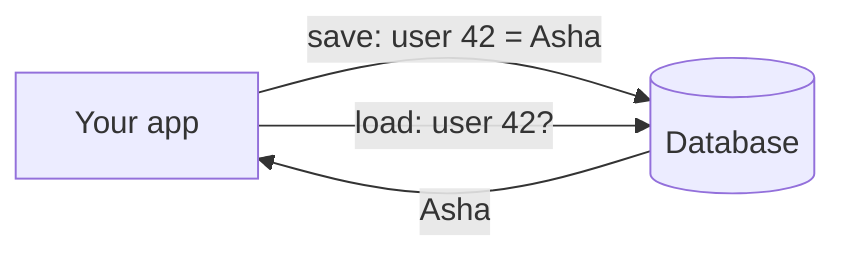

- Your app could keep data in variables, but variables vanish when the app restarts
- A database keeps data **safe**, **shared** between many app servers, and **searchable**
- Examples: MySQL, PostgreSQL, MongoDB, SQLite… and **Redis**

---

## Why Speed Depends on *Where* Data Lives

A computer has a memory hierarchy. The closer to the CPU, the faster and the smaller.

| Where the data is | Typical read time | If 1 ns were 1 second… |
| --- | --- | --- |
| CPU cache (L1) | ~1 ns | 1 second |
| **RAM (main memory)** | **~100 ns** | **~2 minutes** |
| SSD (random read) | ~100 µs | ~1 day |
| Spinning disk (seek) | ~5–10 ms | ~2–4 months |
| Network round trip across the world | ~150 ms | ~5 years |

**Key idea:** reading from RAM is roughly **1,000× faster** than reading from an SSD.

<!-- notes: These are the classic "latency numbers every programmer should know", rounded. The exact numbers vary by hardware; the ratios are what matter. -->

---

## Traditional Databases Live on Disk

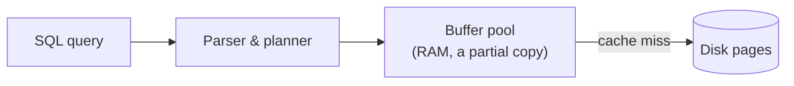

- MySQL/PostgreSQL keep the **truth on disk** and use RAM as a helper
- Great for large data, complex queries (JOINs) and strong durability
- But every miss means disk I/O, query planning and locking: typically **milliseconds**

**What if we kept *all* the data in RAM and made operations dead simple?**

---

## Enter Redis

**Redis** = **RE**mote **DI**ctionary **S**erver

<div style="display:grid;grid-template-columns:repeat(3,1fr);gap:18px;margin-top:18px">
<div style="background:var(--surface0);border:1px solid var(--surface1);border-radius:14px;padding:16px 20px"><b>In-memory</b><br>All data lives in RAM, so reads and writes take well under a millisecond.</div>
<div style="background:var(--surface0);border:1px solid var(--surface1);border-radius:14px;padding:16px 20px"><b>Key → value</b><br>Every piece of data is found by a unique key, like a giant dictionary.</div>
<div style="background:var(--surface0);border:1px solid var(--surface1);border-radius:14px;padding:16px 20px"><b>Rich values</b><br>Values can be lists, sets, hashes, sorted sets, streams and more.</div>
<div style="background:var(--surface0);border:1px solid var(--surface1);border-radius:14px;padding:16px 20px"><b>Server</b><br>A separate process your apps talk to over TCP. Many apps can share it.</div>
<div style="background:var(--surface0);border:1px solid var(--surface1);border-radius:14px;padding:16px 20px"><b>Optional persistence</b><br>Can snapshot to disk or log every write, so data survives restarts.</div>
<div style="background:var(--surface0);border:1px solid var(--surface1);border-radius:14px;padding:16px 20px"><b>Scales out</b><br>Replication for copies, Cluster for splitting data across machines.</div>
</div>

---

## The Mental Model: One Giant Dictionary

If you know a Python `dict` or a C++ `std::unordered_map`, you already know the core of Redis.

```python
# A Python dict lives inside ONE program and dies with it
cache = {}
cache["user:42:name"] = "Asha"
print(cache["user:42:name"])   # Asha
```

```text
redis> SET user:42:name "Asha"      # lives in the Redis server
OK
redis> GET user:42:name             # any app, any language can read it
"Asha"
```

Redis is that dictionary, but **shared over the network**, **very fast**, **optionally persistent**, and with **smart value types**.

---

## A Short History

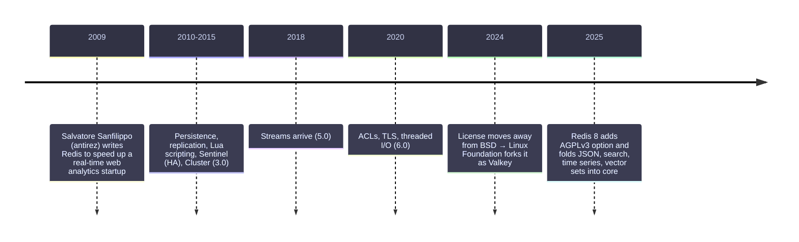

- Written in **C**, famous for small, readable source code
- Consistently among the most popular key-value stores and one of the most used databases overall

<!-- notes: Licensing: in March 2024 Redis moved from BSD to RSALv2/SSPLv1; Valkey was forked from 7.2.4. In 2025 Redis 8 added AGPLv3 as an option. -->

---

## Who Uses Redis, and For What?

<div style="display:grid;grid-template-columns:repeat(4,1fr);gap:12px;margin-top:16px">
<div style="background:var(--surface0);border:1px solid var(--surface1);border-radius:10px;padding:14px 16px"><b>Caching</b><br><small style="color:var(--subtext0)">speed up slow databases and APIs</small></div>
<div style="background:var(--surface0);border:1px solid var(--surface1);border-radius:10px;padding:14px 16px"><b>Sessions</b><br><small style="color:var(--subtext0)">login state for web apps</small></div>
<div style="background:var(--surface0);border:1px solid var(--surface1);border-radius:10px;padding:14px 16px"><b>Leaderboards</b><br><small style="color:var(--subtext0)">ranked scores in real time</small></div>
<div style="background:var(--surface0);border:1px solid var(--surface1);border-radius:10px;padding:14px 16px"><b>Rate limiting</b><br><small style="color:var(--subtext0)">stop API abuse</small></div>
<div style="background:var(--surface0);border:1px solid var(--surface1);border-radius:10px;padding:14px 16px"><b>Queues</b><br><small style="color:var(--subtext0)">background jobs</small></div>
<div style="background:var(--surface0);border:1px solid var(--surface1);border-radius:10px;padding:14px 16px"><b>Pub/Sub</b><br><small style="color:var(--subtext0)">chat, live notifications</small></div>
<div style="background:var(--surface0);border:1px solid var(--surface1);border-radius:10px;padding:14px 16px"><b>Geo</b><br><small style="color:var(--subtext0)">"drivers near me"</small></div>
<div style="background:var(--surface0);border:1px solid var(--surface1);border-radius:10px;padding:14px 16px"><b>AI</b><br><small style="color:var(--subtext0)">vector search, LLM caches</small></div>
</div>

We'll build every one of these later in the deck.

---

## Getting Redis Running

```bash
# Docker (any OS) – easiest
docker run -d --name redis -p 6379:6379 redis:latest

# macOS
brew install redis && brew services start redis

# Ubuntu / Debian
sudo apt install redis-server && sudo systemctl start redis-server
```

Then open the command-line client:

```bash
redis-cli            # connects to 127.0.0.1:6379 by default
127.0.0.1:6379> PING
PONG
```

**6379** is Redis's default port.

---

## Your First Commands

```text
127.0.0.1:6379> SET greeting "hello world"
OK
127.0.0.1:6379> GET greeting
"hello world"
127.0.0.1:6379> EXISTS greeting
(integer) 1
127.0.0.1:6379> DEL greeting
(integer) 1
127.0.0.1:6379> GET greeting
(nil)
```

- `SET key value` stores, `GET key` reads
- `(nil)` means "no such key"
- Commands are **case-insensitive**; keys and values are **case-sensitive**

---

## Counters Are Built In

```text
127.0.0.1:6379> SET page:home:views 0
OK
127.0.0.1:6379> INCR page:home:views
(integer) 1
127.0.0.1:6379> INCRBY page:home:views 10
(integer) 11
127.0.0.1:6379> DECR page:home:views
(integer) 10
```

**Why not just `GET`, add 1, then `SET`?** Two app servers could race:

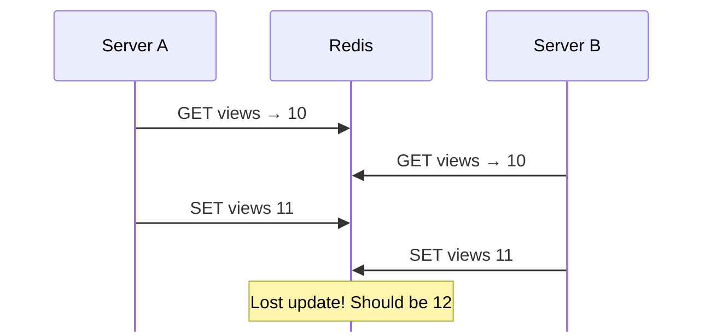

`INCR` is **atomic**: Redis does read + add + write as one indivisible step.

---

## Keys That Expire Automatically

Every key can have a **time-to-live (TTL)**. When it runs out, Redis deletes the key for you.

```text
127.0.0.1:6379> SET otp:9876543210 "482913" EX 300    # expires in 300 s
OK
127.0.0.1:6379> TTL otp:9876543210
(integer) 297
127.0.0.1:6379> PERSIST otp:9876543210                # remove the timer
(integer) 1
127.0.0.1:6379> EXPIRE otp:9876543210 60              # set a new timer
(integer) 1
```

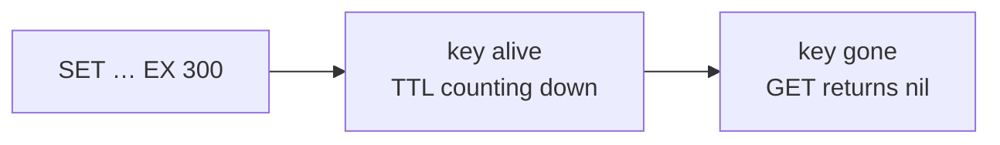

This one feature is what makes Redis a natural **cache** and **session store**.

---

## Naming Keys Well

Redis has no tables. Structure lives in your **key names**. The common convention is `object-type:id:field` with colons.

| Good key | What it holds |
| --- | --- |
| `user:42` | hash with user 42's profile |
| `user:42:followers` | set of follower ids |
| `session:8f3a…` | session data |
| `rate:api:203.0.113.9` | request counter for an IP |
| `leaderboard:2026-09` | sorted set of scores this month |

- Keep keys readable but not huge (they cost memory)
- Keys can be any binary string up to 512 MB, but please don't do that
- Redis has 16 numbered databases (`SELECT 0..15`); prefer **key prefixes** instead

---

## Recap of Part 1

- Redis is an **in-memory key-value data structure server**
- RAM is ~1000× faster than SSD, so Redis answers in **microseconds**
- `SET`, `GET`, `DEL`, `EXISTS`, `INCR`, `EXPIRE`, `TTL` are your first tools
- Atomic commands avoid race conditions
- TTLs make keys disappear automatically

**Next:** the "smart values" that make Redis more than a dictionary.

---

# Part 2 · Data Types

*Redis values are data structures, not just strings*

---

## The Data Type Family

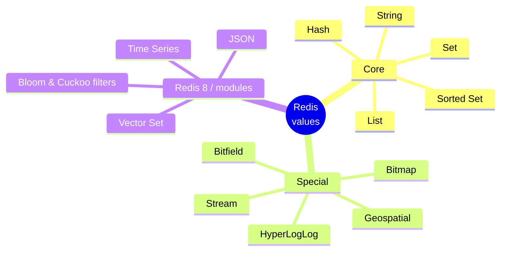

Pick the right structure and Redis does the hard work (sorting, uniqueness, ranking) **on the server**.

---

## 1 · Strings

The simplest type: a key maps to a **binary-safe** blob up to **512 MB**. Text, numbers, JSON, even JPEG bytes.

<div style="display:flex;align-items:center;gap:16px;margin:14px 0">
<div style="background:var(--surface1);border-radius:10px;padding:10px 18px;font-family:var(--font-mono)">user:42:name</div><div style="font-size:1.3em;color:var(--overlay1)">→</div>
<div style="background:var(--surface0);border:1px solid var(--surface2);border-radius:10px;padding:10px 18px;font-family:var(--font-mono)">"Asha"</div>
</div>

```text
SET  user:42:name "Asha"
GET  user:42:name
MSET a 1 b 2 c 3          # set many at once
MGET a b c                # read many at once → 1, 2, 3
APPEND log "line\n"       # add to the end
SETNX lock:job1 "me"      # set only if Not eXists → 1 or 0
INCRBYFLOAT price 2.5     # floating point math
GETRANGE big 0 99         # first 100 bytes
```

**Use for:** cached HTML/JSON, counters, flags, simple locks.

---

## 2 · Lists

An **ordered sequence** of strings. Push and pop at **both ends** in O(1).

<div style="display:flex;align-items:center;gap:8px;margin:14px 0;font-family:var(--font-mono)">
<span>LPUSH →</span>
<span style="background:var(--surface0);border:1px solid var(--surface2);border-radius:8px;padding:8px 14px">"c"</span>
<span style="background:var(--surface0);border:1px solid var(--surface2);border-radius:8px;padding:8px 14px">"b"</span>
<span style="background:var(--surface0);border:1px solid var(--surface2);border-radius:8px;padding:8px 14px">"a"</span>
<span>← RPUSH</span>
<span style="margin-left:18px;color:var(--subtext0)">index 0 · 1 · 2 (or -3 · -2 · -1)</span>
</div>

```text
RPUSH tasks "email" "resize" "backup"   # → [email, resize, backup]
LPOP  tasks                             # "email"
LRANGE tasks 0 -1                       # everything: resize, backup
LLEN  tasks                             # 2
LTRIM feed:42 0 99                      # keep only newest 100 items
BRPOP tasks 5                           # Blocking pop: wait up to 5 s
```

**Use for:** job queues, activity feeds, "last N items" lists.
**Careful:** reaching the middle (`LINDEX`, `LINSERT`) is O(N).

---

## 3 · Hashes

A key that holds a **small map of field → value**. Perfect for objects.

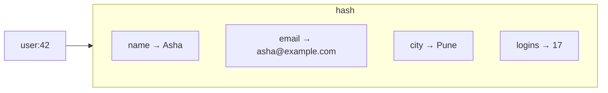

```text
HSET    user:42 name "Asha" email "asha@example.com" city "Pune"
HGET    user:42 city                 # "Pune"
HMGET   user:42 name email
HINCRBY user:42 logins 1
HGETALL user:42                      # all fields and values
HDEL    user:42 city
HEXPIRE user:42 60 FIELDS 1 otp      # per-field TTL (Redis 7.4+)
```

**Why not one JSON string?** With a hash you can read or update **one field** without rewriting the whole object.

---

## 4 · Sets

An **unordered collection of unique strings**. Adding a duplicate does nothing.

<div style="display:flex;align-items:center;gap:22px;margin:12px 0;flex-wrap:wrap">
<div style="border:2px dashed var(--blue);border-radius:18px;padding:10px 16px"><small>tags:post:1</small><br><span style="background:var(--surface0);border:1px solid var(--surface2);border-radius:999px;padding:6px 14px">redis</span> <span style="background:var(--surface0);border:1px solid var(--surface2);border-radius:999px;padding:6px 14px">cache</span> <span style="background:var(--surface0);border:1px solid var(--surface2);border-radius:999px;padding:6px 14px">nosql</span></div>
<div style="font-size:1.3em;color:var(--overlay1)">∩</div>
<div style="border:2px dashed var(--mauve);border-radius:18px;padding:10px 16px"><small>tags:post:2</small><br><span style="background:var(--surface0);border:2px solid var(--mauve);border-radius:999px;padding:6px 14px">redis</span> <span style="background:var(--surface0);border:2px solid var(--mauve);border-radius:999px;padding:6px 14px">python</span></div>
<div style="font-size:1.3em;color:var(--overlay1)">=</div>
<div style="border:1px solid var(--surface2);border-radius:18px;padding:10px 16px"><small>SINTER</small><br><span style="background:var(--surface0);border:1px solid var(--surface2);border-radius:999px;padding:6px 14px">redis</span></div>
</div>

```text
SADD      online:users 42 7 99 42   # returns 3 (42 counted once)
SISMEMBER online:users 7            # 1 = yes, O(1)
SCARD     online:users              # size → 3
SMEMBERS  online:users              # all members (careful when huge)
SINTER    follows:asha follows:ravi # mutual follows
SUNION    a b    SDIFF a b          # union / difference
SRANDMEMBER prizes 3                # random picks
```

**Use for:** tags, unique visitors (small scale), "who liked this", friend graphs.

---

## 5 · Sorted Sets (ZSETs)

Like a set, but every member has a **score**. Members are always kept **sorted by score**.

| Rank | Member | Score |
| --- | --- | --- |
| 0 | `priya` | 9820 |
| 1 | `arjun` | 9410 |
| 2 | `meera` | 8875 |
| 3 | `kabir` | 7002 |

```text
ZADD    game:lb 9820 priya 9410 arjun 8875 meera 7002 kabir
ZINCRBY game:lb 50 kabir                 # kabir scores 50 more
ZREVRANGE game:lb 0 2 WITHSCORES         # top 3
ZREVRANK  game:lb meera                  # meera's rank → 2
ZRANGEBYSCORE game:lb 8000 +inf          # everyone ≥ 8000
ZREMRANGEBYSCORE window 0 1726500000     # drop old entries
```

Add, remove and rank are **O(log N)**. This single type powers leaderboards, priority queues, sliding-window rate limiters and time indexes.

---

## 6 · Streams

An **append-only log** of entries, each with an auto-generated, time-based ID. Think "Kafka-lite inside Redis".

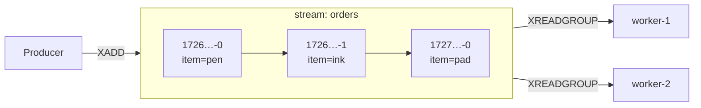

```text
XADD orders * item pen qty 2              # * = auto ID (ms-seq)
XRANGE orders - +                         # read all
XGROUP CREATE orders billing $ MKSTREAM   # a consumer group
XREADGROUP GROUP billing w1 COUNT 10 BLOCK 2000 STREAMS orders >
XACK orders billing 1726500000000-0       # mark as processed
```

Consumer groups give **load balancing**, **acknowledgements** and **replay**, which plain lists can't.

---

## 7 · Bitmaps & Bitfields

A string treated as an **array of bits**. One bit per user = tiny memory.

<div style="display:flex;gap:4px;margin:14px 0;font-family:var(--font-mono)">
<span style="padding:6px 10px;background:var(--green);color:var(--crust);border-radius:4px">1</span>
<span style="padding:6px 10px;background:var(--surface1);border-radius:4px">0</span>
<span style="padding:6px 10px;background:var(--green);color:var(--crust);border-radius:4px">1</span>
<span style="padding:6px 10px;background:var(--green);color:var(--crust);border-radius:4px">1</span>
<span style="padding:6px 10px;background:var(--surface1);border-radius:4px">0</span>
<span style="padding:6px 10px;background:var(--surface1);border-radius:4px">0</span>
<span style="padding:6px 10px;background:var(--green);color:var(--crust);border-radius:4px">1</span>
<span style="margin-left:14px;color:var(--subtext0)">← bit N = "did user N log in today?"</span>
</div>

```text
SETBIT  login:2026-09-17 42 1        # user 42 logged in
GETBIT  login:2026-09-17 42          # 1
BITCOUNT login:2026-09-17            # daily active users
BITOP AND streak login:2026-09-16 login:2026-09-17   # both days
```

**100 million users ≈ 12 MB** per day. `BITFIELD` packs small integers (e.g. `u8` counters) the same way.

---

## 8 · HyperLogLog

Counts **unique items approximately** using at most **12 KB**, no matter if you add 1 thousand or 1 billion items.

```text
PFADD   visitors:2026-09-17 "ip1" "ip2" "ip1" "ip3"
PFCOUNT visitors:2026-09-17          # ≈ 3
PFMERGE visitors:week visitors:2026-09-11 … visitors:2026-09-17
```

| Approach | Memory for 100M unique IDs | Error |
| --- | --- | --- |
| Set of IDs | several GB | exact |
| HyperLogLog | **12 KB** | **~0.81 %** |

The trick: hash each item and remember only the **longest run of leading zeros** seen per bucket. Rare long runs imply many distinct items.

---

## 9 · Geospatial

Store points by longitude/latitude, then search by radius or box. Internally it's a **sorted set** whose score is a 52-bit **geohash**.

```text
GEOADD drivers 72.8777 19.0760 "d1" 72.8311 18.9220 "d2" 73.8567 18.5204 "d3"
GEODIST drivers d1 d2 km                         # ≈ 17.7
GEOSEARCH drivers FROMLONLAT 72.87 19.07 BYRADIUS 20 km ASC WITHDIST
```

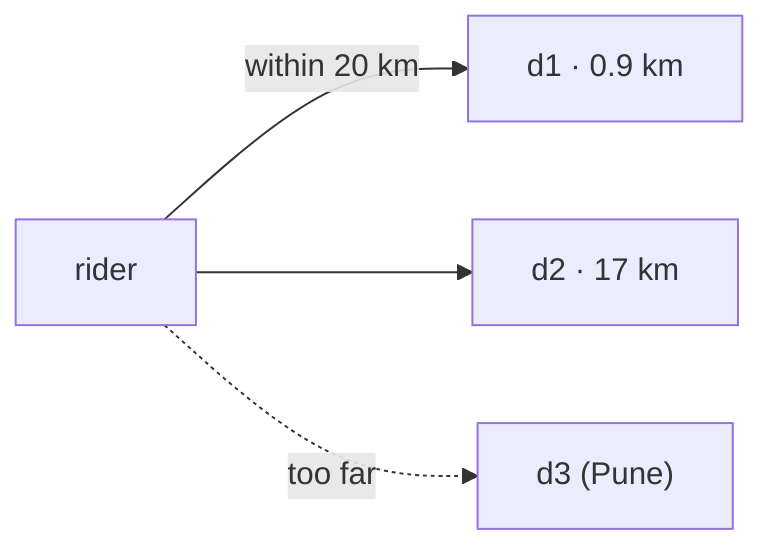

**Use for:** nearby drivers, stores, friends.

---

## 10 · JSON & Vector Sets (Redis 8)

**JSON:** store nested documents and update paths in place.

```text
JSON.SET  product:1 $ '{"name":"Pen","price":20,"tags":["blue"]}'
JSON.NUMINCRBY product:1 $.price 5
JSON.GET  product:1 $.name
```

**Vector sets:** store embeddings and find the most **similar** items (semantic search, recommendations, RAG for LLMs).

```text
VADD  docs VALUES 3 0.12 0.80 0.33 "doc:1"
VSIM  docs VALUES 3 0.10 0.79 0.30 COUNT 5     # 5 nearest neighbours
```

With the **Redis Query Engine** (`FT.CREATE`, `FT.SEARCH`) you can also index hashes/JSON for full-text, numeric, tag and vector queries.

---

## Choosing the Right Type

**"What do I need?"** → pick the structure.

<div style="display:grid;grid-template-columns:repeat(3,1fr);gap:14px;margin-top:14px">
<div style="background:var(--surface0);border-left:3px solid var(--surface2);border-radius:12px;padding:12px 18px">A value or counter<br><b style="color:var(--accent-2, var(--blue))">→ String</b></div>
<div style="background:var(--surface0);border-left:3px solid var(--surface2);border-radius:12px;padding:12px 18px">An object with fields<br><b style="color:var(--accent-2, var(--blue))">→ Hash / JSON</b></div>
<div style="background:var(--surface0);border-left:3px solid var(--surface2);border-radius:12px;padding:12px 18px">Arrival order, a queue<br><b style="color:var(--accent-2, var(--blue))">→ List · Stream</b></div>
<div style="background:var(--surface0);border-left:3px solid var(--surface2);border-radius:12px;padding:12px 18px">Uniqueness, membership<br><b style="color:var(--accent-2, var(--blue))">→ Set</b></div>
<div style="background:var(--surface0);border-left:3px solid var(--surface2);border-radius:12px;padding:12px 18px">Ranking, by score or time<br><b style="color:var(--accent-2, var(--blue))">→ Sorted Set</b></div>
<div style="background:var(--surface0);border-left:3px solid var(--surface2);border-radius:12px;padding:12px 18px">Count uniques cheaply<br><b style="color:var(--accent-2, var(--blue))">→ HyperLogLog</b></div>
<div style="background:var(--surface0);border-left:3px solid var(--surface2);border-radius:12px;padding:12px 18px">Yes/no per id<br><b style="color:var(--accent-2, var(--blue))">→ Bitmap</b></div>
<div style="background:var(--surface0);border-left:3px solid var(--surface2);border-radius:12px;padding:12px 18px">Nearby things<br><b style="color:var(--accent-2, var(--blue))">→ Geo</b></div>
<div style="background:var(--surface0);border-left:3px solid var(--surface2);border-radius:12px;padding:12px 18px">Similar things<br><b style="color:var(--accent-2, var(--blue))">→ Vector Set</b></div>
</div>

---

## Commands That Work on Any Key

```text
TYPE user:42                 # hash
DEL k1 k2                    # delete (blocking free of memory)
UNLINK bigkey                # delete, free memory in background
RENAME old new
EXPIRE k 60   PEXPIRE k 500  # seconds / milliseconds
TTL k         PTTL k         # -1 = no expiry, -2 = no key
SCAN 0 MATCH user:* COUNT 100   # iterate keys safely
OBJECT ENCODING user:42      # listpack / hashtable …
MEMORY USAGE user:42         # bytes used
```

⚠️ **Never run `KEYS *` in production.** It walks every key in one go and freezes the server. Use `SCAN`.

---

## Recap of Part 2

| Type | Think of it as | Signature commands |
| --- | --- | --- |
| String | a variable | `SET` `GET` `INCR` |
| List | a deque | `LPUSH` `RPOP` `BRPOP` |
| Hash | an object / struct | `HSET` `HGET` `HINCRBY` |
| Set | a bag of unique things | `SADD` `SISMEMBER` `SINTER` |
| Sorted set | a ranked list | `ZADD` `ZRANGE` `ZRANK` |
| Stream | an event log | `XADD` `XREADGROUP` `XACK` |
| Bitmap / HLL | compact counters | `SETBIT` `PFADD` `PFCOUNT` |
| Geo / Vector | location / similarity search | `GEOSEARCH` `VSIM` |

---

# Part 3 · How Redis Works

*Under the hood: protocol, threads, memory, expiry, persistence*

---

## The Big Picture

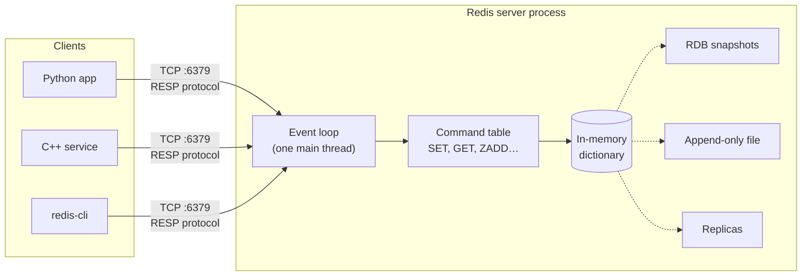

We'll zoom into each box, one at a time.

---

## Step 1 · Talking to Redis: RESP

Clients and server speak **RESP** (REdis Serialization Protocol), a simple text-based format.

The command `SET name Asha` is sent over TCP as:

```text
*3\r\n          ← an array of 3 elements
$3\r\nSET\r\n   ← bulk string, 3 bytes
$4\r\nname\r\n  ← bulk string, 4 bytes
$4\r\nAsha\r\n  ← bulk string, 4 bytes
```

Replies use a first-byte type marker:

| Prefix | Meaning | Example |
| --- | --- | --- |
| `+` | simple string | `+OK` |
| `-` | error | `-ERR unknown command` |
| `:` | integer | `:42` |
| `$` | bulk string | `$4\r\nAsha` · `$-1` = nil |
| `*` | array | `*2 …` |

RESP3 (Redis 6+) adds maps, sets, doubles and push messages. Easy to parse → fast.

---

## Step 2 · One Thread, One Loop

Redis executes commands on **a single main thread**, one command at a time.

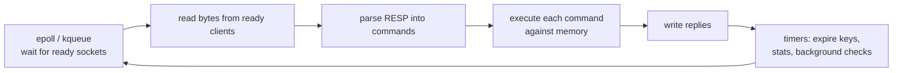

This is the **reactor pattern**: a single thread watches thousands of sockets with **I/O multiplexing** (`epoll` on Linux, `kqueue` on macOS).

---

## Why Is Single-Threaded So Fast?

<div style="display:grid;grid-template-columns:1fr 1fr;gap:18px">
<div style="background:var(--surface0);border-left:3px solid var(--surface2);border-radius:12px;padding:14px 20px"><b>No locks</b><br>Only one thread touches the data, so no mutexes, no deadlocks, no contention.</div>
<div style="background:var(--surface0);border-left:3px solid var(--surface2);border-radius:12px;padding:14px 20px"><b>No context switches</b><br>The CPU stays hot on one core with warm caches.</div>
<div style="background:var(--surface0);border-left:3px solid var(--surface2);border-radius:12px;padding:14px 20px"><b>Memory is the bottleneck, not CPU</b><br>Most commands take microseconds of CPU; network I/O dominates.</div>
<div style="background:var(--surface0);border-left:3px solid var(--surface2);border-radius:12px;padding:14px 20px"><b>Atomic for free</b><br>Every command runs start to finish with nobody else interleaving.</div>
</div>

A single instance commonly serves **100k+ simple operations per second**, and far more with pipelining.

**The catch ⚠️** One slow command (`KEYS *`, `SMEMBERS` on 10M items, a long Lua script) **blocks everyone**.

---

## Threads Redis *Does* Use

Single-threaded **command execution** does not mean a single-threaded **process**.

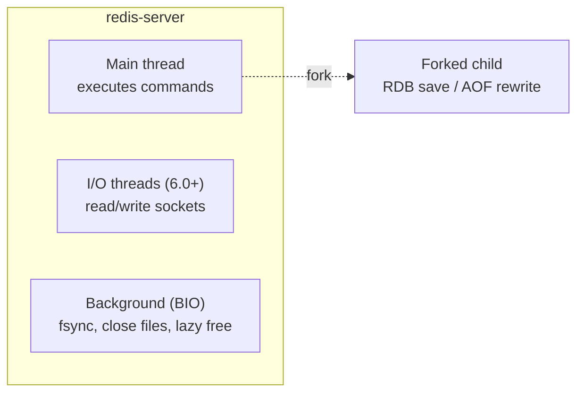

- `io-threads 4` offloads socket reads/writes, helpful when network is the bottleneck
- `UNLINK`, `FLUSHALL ASYNC` free big values in a background thread
- Persistence work happens in a **forked child process**

---

## Step 3 · How Keys Are Stored

The keyspace is a **hash table**: hash the key, jump to a bucket, done. Average **O(1)**.

<div style="display:flex;align-items:center;gap:14px;margin:12px 0">
<div style="background:var(--surface1);border-radius:8px;padding:8px 14px;font-family:var(--font-mono)">"user:42"</div><div>→ hash() mod 8 = <b>5</b> →</div>
<div style="display:grid;grid-template-columns:repeat(8,auto);gap:6px"><div style="background:var(--surface0);border:2px solid var(--surface2);border-radius:8px;padding:8px 10px;text-align:center;font-family:var(--font-mono)">0</div><div style="background:var(--surface0);border:2px solid var(--surface2);border-radius:8px;padding:8px 10px;text-align:center;font-family:var(--font-mono)">1</div><div style="background:var(--surface0);border:2px solid var(--surface2);border-radius:8px;padding:8px 10px;text-align:center;font-family:var(--font-mono)">2</div><div style="background:var(--surface0);border:2px solid var(--surface2);border-radius:8px;padding:8px 10px;text-align:center;font-family:var(--font-mono)">3</div><div style="background:var(--surface0);border:2px solid var(--surface2);border-radius:8px;padding:8px 10px;text-align:center;font-family:var(--font-mono)">4</div><div style="background:var(--surface0);border:1px solid var(--surface2);border-radius:8px;padding:8px 10px;text-align:center;font-family:var(--font-mono)">5<br><small>user:42 → user:7</small></div><div style="background:var(--surface0);border:2px solid var(--surface2);border-radius:8px;padding:8px 10px;text-align:center;font-family:var(--font-mono)">6</div><div style="background:var(--surface0);border:2px solid var(--surface2);border-radius:8px;padding:8px 10px;text-align:center;font-family:var(--font-mono)">7</div></div>
</div>

**Incremental rehashing:** when the table fills up, Redis allocates a table twice as large and moves buckets **a few at a time** on each operation, so there's never a long pause.

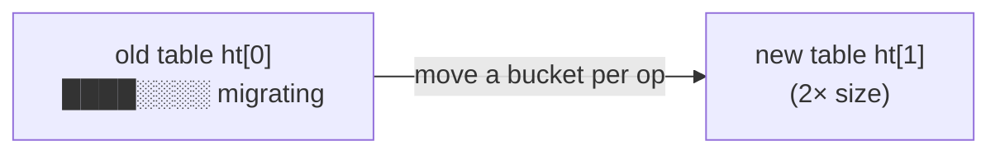

---

## Strings Inside: SDS

Redis doesn't use raw C strings. It uses **SDS** (Simple Dynamic String):

```text
┌────────┬────────┬───────┬──────────────────────┬────┐
│  len   │ alloc  │ flags │  buf: "Asha"         │ \0 │
└────────┴────────┴───────┴──────────────────────┴────┘
```

- **O(1) length** (stored, not counted)
- **Binary safe**: can contain `\0` bytes (images, protobufs)
- **Pre-allocates** spare room so repeated `APPEND` is cheap

Small strings use compact encodings too:

| Encoding | When |
| --- | --- |
| `int` | value looks like a 64-bit integer |
| `embstr` | ≤ 44 bytes, stored in the same allocation as the object |
| `raw` | anything larger |

---

## Two Encodings Per Type

Each type switches between a **compact** encoding (small data) and a **fast** one (big data), automatically.

| Type | Small → compact | Large → fast | Default switch point |
| --- | --- | --- | --- |
| Hash | listpack | hashtable | > 128 fields or value > 64 bytes |
| Set | intset / listpack | hashtable | > 512 ints / > 128 items |
| Sorted set | listpack | **skiplist + hashtable** | > 128 items or > 64 bytes |
| List | listpack | quicklist (linked listpacks) | > 8 KB node |

```text
redis> HSET small a 1
redis> OBJECT ENCODING small     → "listpack"
```

A **listpack** is one contiguous memory block: cache-friendly and tiny, but O(N) to search. Fine when N ≤ 128.

---

## The Skip List (behind Sorted Sets)

A sorted linked list with **express lanes**. Searching skips ahead, giving **O(log N)** on average.

```text
Level 3:  HEAD ─────────────────────────────▶ 70 ──────────────▶ NIL
Level 2:  HEAD ──────────▶ 30 ──────────────▶ 70 ──────▶ 90 ───▶ NIL
Level 1:  HEAD ──▶ 10 ──▶ 30 ──▶ 50 ──▶ 60 ──▶ 70 ──▶ 80 ──▶ 90 ──▶ NIL
```

To find **60**: ride level 3 to 70 (too far) → drop to level 2: 30 → drop to level 1: 50 → 60

- Each node gets a random height (coin flips), so no complex rebalancing like trees
- Nodes store **span** counts, so `ZRANK` is also O(log N)
- A **hash table** alongside maps member → score for O(1) `ZSCORE`

---

## Step 4 · Expiration: Lazy + Active

How does Redis delete millions of expiring keys without scanning all of them?

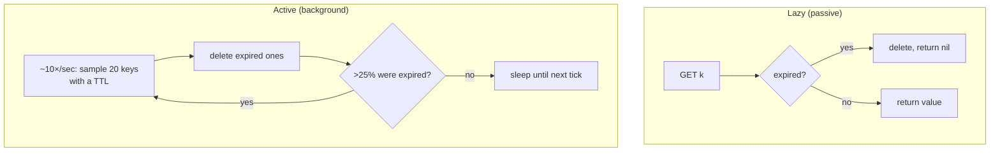

- Lazy alone would leak memory for keys nobody reads
- Active sampling keeps expired garbage **below ~25%** with bounded CPU
- Replicas don't expire keys themselves; the primary sends them `DEL`

---

## Step 5 · Running Out of Memory

Set a limit with `maxmemory 2gb`. When it's reached, `maxmemory-policy` decides what happens:

| Policy | Evicts | Good for |
| --- | --- | --- |
| `noeviction` (default) | nothing, writes get errors | primary data store |
| `allkeys-lru` | least **recently** used key | **general cache** |
| `allkeys-lfu` | least **frequently** used key | caches with stable "hot" keys |
| `volatile-lru` / `volatile-lfu` | same, but only keys with a TTL | mixed cache + data |
| `volatile-ttl` | key closest to expiring | short-lived data |
| `allkeys-random` / `volatile-random` | random key | uniform access |

Redis's LRU/LFU is **approximate**: it samples a few keys (`maxmemory-samples 5`) and evicts the best candidate from a small pool. Nearly as good as exact LRU, with no linked list overhead.

---

## LFU in a Nutshell

Each key has 24 bits of metadata: a **last-access time** and an 8-bit **logarithmic counter**.

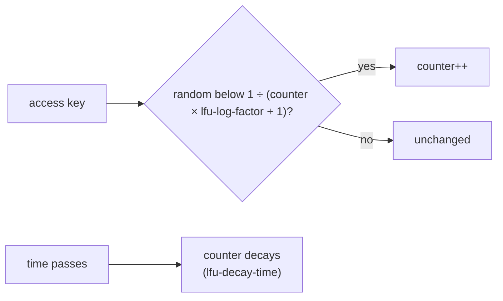

- Counter saturates at 255, but thanks to the probability it takes ~1M hits to get there
- Decay means yesterday's viral key doesn't stay "hot" forever
- `OBJECT FREQ key` shows the counter (with an LFU policy)

---

## Step 6 · Persistence: Why Bother?

RAM is **volatile**: power loss or restart = empty Redis. Two ways to survive that:

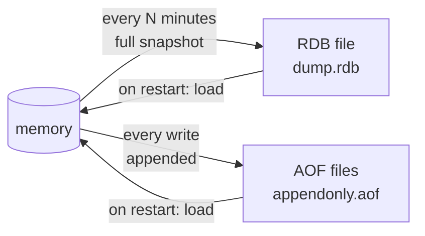

| | RDB snapshot | AOF log |
| --- | --- | --- |
| What's saved | point-in-time copy | every write command |
| File size | compact binary | larger, rewritten periodically |
| Restart speed | fast | slower (replay) |
| Data loss on crash | since last snapshot (minutes) | ~1 s (with `everysec`) |

---

## RDB: Snapshots with fork() + Copy-on-Write

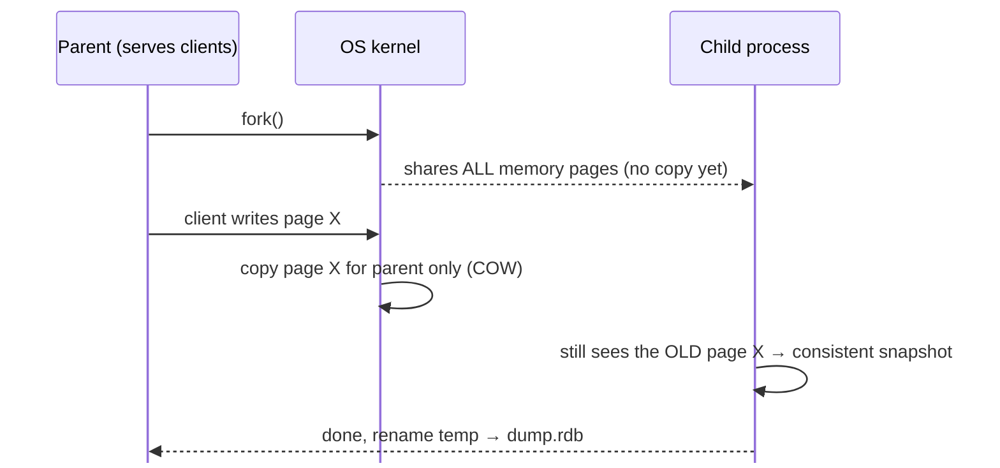

Config: `save 3600 1 300 100 60 10000` (snapshot after 1 change/1 h, 100/5 min or 10k/1 min) · manual: `BGSAVE`

⚠️ Write-heavy workloads can **double memory** during a save as pages get copied. Leave headroom.

---

## AOF: Log Every Write

```text
appendonly yes
appendfsync everysec     # always | everysec | no
```

| `appendfsync` | Durability | Speed |
| --- | --- | --- |
| `always` | lose at most one write | slowest |
| `everysec` | lose ~1 second | fast |
| `no` | OS decides (~30 s) | fastest |

**AOF rewrite:** the log keeps growing (`INCR` × 1,000,000). A forked child writes the **minimal** set of commands that rebuilds current state (`SET counter 1000000`).

Since Redis 7, AOF is **multi-part**: a base file (often RDB format) + incremental files + a manifest. Using an RDB base is the **hybrid** mode (`aof-use-rdb-preamble yes`).

---

## Which Persistence Should I Use?

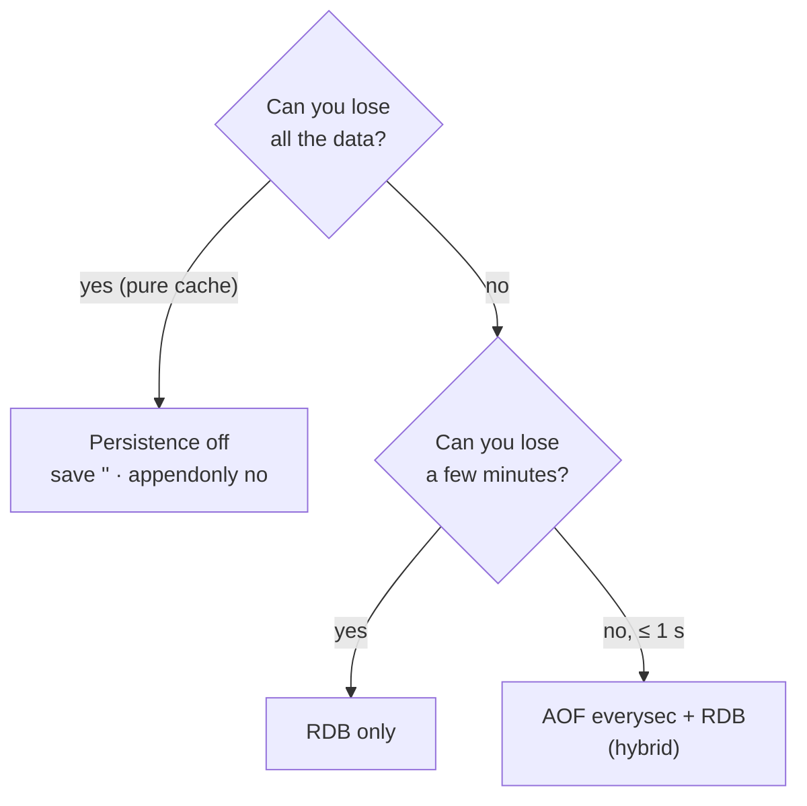

Remember: even with AOF, Redis is **not** a replacement for a transactional SQL database when every single write must be durable and queryable in complex ways.

---

## Step 7 · Doing Several Things at Once

**Pipelining:** send many commands without waiting for each reply. Cuts round trips.

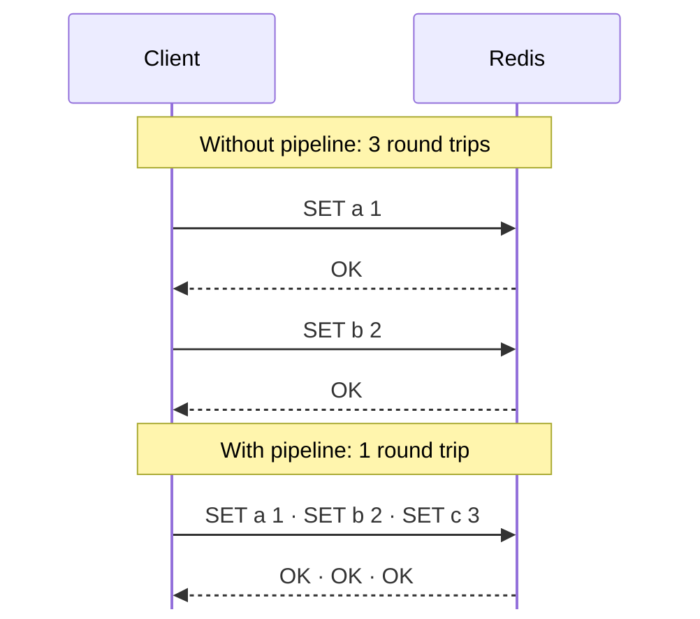

If one round trip costs 1 ms, 1,000 commands take **1 s** unpipelined vs **a few ms** pipelined.

---

## Transactions: MULTI / EXEC / WATCH

```text
MULTI                      # start queueing
DECRBY acct:asha 500
INCRBY acct:ravi 500
EXEC                       # run both, back to back, nothing in between
```

- Commands are queued, then executed **together, in order, without interleaving**
- **No rollback:** if one command fails at runtime, the others still apply
- `WATCH` adds **optimistic locking**:

```text
WATCH acct:asha
balance = GET acct:asha          # check in your app: enough money?
MULTI
DECRBY acct:asha 500
EXEC                             # → nil if acct:asha changed after WATCH; retry
```

---

## Server-Side Logic: Lua & Functions

Run a script **atomically inside Redis**: read, decide and write with no round trips and no races.

```lua
-- compare-and-delete: release a lock only if we own it
if redis.call("GET", KEYS[1]) == ARGV[1] then
  return redis.call("DEL", KEYS[1])
else
  return 0
end
```

```text
EVAL "<script above>"1 lock:order:7 "token-abc"
EVALSHA <sha1> 1 lock:order:7 "token-abc"    # run a cached script by hash
```

**Redis Functions** (7.0+) are the managed version: libraries loaded with `FUNCTION LOAD`, stored with the data and replicated, called with `FCALL`.

⚠️ Scripts block the server while they run. Keep them short.

---

## Pub/Sub: Fire-and-Forget Messaging

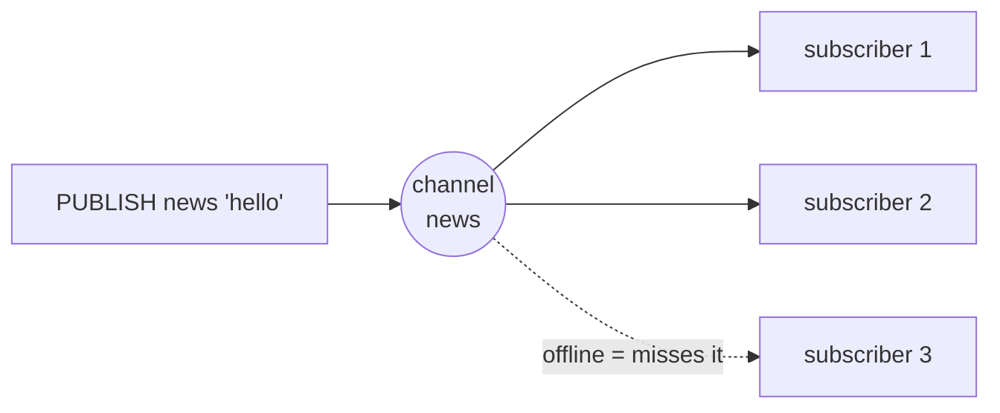

```text
SUBSCRIBE news            # listen on a channel
PSUBSCRIBE news.*         # pattern subscription
PUBLISH news "hello"      # → number of receivers
SSUBSCRIBE / SPUBLISH     # sharded pub/sub for Cluster (7.0+)
```

- **At-most-once:** no storage, no replay. Offline subscribers miss messages
- Need durability or replay? Use **Streams** instead

---

## Keyspace Notifications & Client-Side Caching

**Keyspace notifications** publish events when keys change or expire:

```text
CONFIG SET notify-keyspace-events Ex        # E = keyevent, x = expired
SUBSCRIBE __keyevent@0__:expired            # "session:abc expired!"
```

**Client-side caching (tracking)** lets a client keep a local copy and get told when it goes stale:

```mermaid
%%{init: {"sequence": {"mirrorActors": false}}}%%
sequenceDiagram
  participant App as App (local cache)
  participant R as Redis
  App->>R: CLIENT TRACKING ON
  App->>R: GET user:42
  R-->>App: "Asha"(App caches it locally)
  Note over R: another client: SET user:42 "Asha K"
  R-->>App: invalidate user:42
  App->>App: drop local copy
```

---

## Recap of Part 3

- Clients speak **RESP** over TCP
- **One main thread** + event loop → no locks, atomic commands; slow commands block all
- Keyspace is a **hash table** with incremental rehashing
- Types auto-switch between **compact** (listpack/intset) and **fast** (hashtable/skiplist) encodings
- Expiry = **lazy + active sampling**; memory limits → **eviction policies** (LRU/LFU)
- Persistence = **RDB** (fork + COW snapshot) and/or **AOF** (write log, `everysec`)
- Pipelines, transactions, Lua/Functions, Pub/Sub, tracking

---

# Part 4 · Redis as a Cache

*The #1 reason people meet Redis*

---

## What Is a Cache?

A **cache** is a small, fast store that keeps copies of data that is **expensive** to get.

```mermaid
flowchart LR
  U["User"] --> A["App"]
  A -- "1 · check (≈0.3 ms)" --> R[("Redis")]
  A -- "2 · on miss (≈30 ms+)" --> DB[("Database / API")]
```

Like keeping your most-used books **on your desk** instead of walking to the library each time.

- **Hit** = found in the cache · **Miss** = not found, fetch from the source
- **Hit ratio** = hits ÷ (hits + misses). Aim high (often 90%+)

---

## Why Caching Pays Off

Suppose the DB takes **50 ms**, Redis takes **0.5 ms**, and the hit ratio is **95%**:

$$
\text{avg latency} = 0.95 \times 0.5 + 0.05 \times (0.5 + 50) \approx 3 \text{ms}
$$

<div style="display:grid;grid-template-columns:repeat(3,1fr);gap:18px;margin-top:18px;text-align:center">
<div style="background:var(--surface0);border-radius:14px;padding:16px"><div style="font-size:2em;color:var(--green)"><b>~16×</b></div>faster on average</div>
<div style="background:var(--surface0);border-radius:14px;padding:16px"><div style="font-size:2em;color:var(--peach)"><b>20×</b></div>fewer DB queries</div>
<div style="background:var(--surface0);border-radius:14px;padding:16px"><div style="font-size:2em;color:var(--blue)"><b></b></div>smaller DB bill, spikes absorbed</div>
</div>

What to cache: DB query results, rendered pages, API responses, computed recommendations, auth tokens, ML model outputs.

---

## Pattern 1 · Cache-Aside (Lazy Loading)

The app owns the logic. **Most common pattern.**

```mermaid
%%{init: {"sequence": {"mirrorActors": false}}}%%
sequenceDiagram
  participant App
  participant Redis
  participant DB
  App->>Redis: GET product:7
  alt cache hit
    Redis-->>App: data
  else cache miss
    Redis-->>App: nil
    App->>DB: SELECT … WHERE id = 7
    DB-->>App: row
    App->>Redis: SET product:7 row EX 600
  end
```

Caches only what is asked for and survives a Redis outage; but the first read always misses, and data stays stale until the TTL.

---

## Cache-Aside: Keeping It Fresh on Writes

When data changes, **update the DB first, then delete the cache key**.

```mermaid
flowchart LR
  W["update product 7"] --> D1["1 · UPDATE in DB"] --> D2["2 · DEL product:7"]
  D2 --> N["next read misses<br/>→ reloads fresh data"]
```

Why **delete** instead of **set** the new value?

- Two concurrent writers could SET in the wrong order → stale forever
- Deleting is idempotent and simple; the next reader loads the truth

Still a tiny race window exists, so **always keep a TTL** as a safety net.

---

## Patterns 2–4 at a Glance

```mermaid
flowchart TB
  subgraph RT["Read-through"]
    a1["App"] --> c1["Cache layer"] -- "miss: cache loads itself" --> d1[("DB")]
  end
  subgraph WT["Write-through"]
    a2["App"] --> c2["Cache layer"] -- "write synchronously" --> d2[("DB")]
  end
  subgraph WB["Write-behind (write-back)"]
    a3["App"] --> c3["Redis"] -. "async batch later".-> d3[("DB")]
  end
```

| Pattern | Pros | Cons |
| --- | --- | --- |
| Read-through | app code stays simple | needs a library/proxy that knows the DB |
| Write-through | cache always fresh | every write pays two writes |
| Write-behind | very fast writes, batched | data loss risk if Redis dies before flush |

---

## Choosing TTLs

| Data | Example TTL | Reason |
| --- | --- | --- |
| Stock price / live score | 1–5 s | changes constantly |
| Product page | 5–15 min | changes rarely, cheap to refresh |
| User profile | 1 h + delete on update | explicit invalidation |
| Country list | 24 h | almost static |
| OTP / password reset token | 5–15 min | security |

**Add jitter** so keys created together don't expire together:

```python
ttl = 600 + random.randint(0, 60)   # 10–11 minutes
```

---

## Problem 1 · Cache Stampede (Thundering Herd)

A **hot key** expires → thousands of requests miss at once → all hit the DB

```mermaid
flowchart LR
  subgraph T["t = expiry"]
    R1["req"] & R2["req"] & R3["req"] & R4["req …×5000"] --> M["MISS"]
  end
  M --> DB[("DB overloaded")]
```

**Fixes**

- **Mutex / single-flight:** only one request rebuilds (`SET lock:key token NX PX 5000`); others wait briefly or serve stale
- **Early (probabilistic) refresh:** refresh a key *before* it expires, with probability rising near the end
- **Stale-while-revalidate:** keep serving the old value while a background job refreshes it

---

## Problem 2 · Cache Penetration

Requests for keys that **don't exist anywhere** (e.g. `product:-1`, bots) always miss and always hit the DB.

```mermaid
flowchart LR
  B["GET product:999999"] --> R{"Redis"} -- miss --> DB[("DB: not found")]
  DB -. "nothing cached".-> R
```

**Fixes**

- **Cache the "not found"** too, with a short TTL: `SET product:999999 "__null__" EX 60`
- **Bloom filter** in front: "definitely not present" answers skip the DB entirely

```text
BF.ADD    products:bf 7            # Redis 8 / RedisBloom
BF.EXISTS products:bf 999999       # 0 → reject immediately
```

---

## Problem 3 · Cache Avalanche

**Many keys expire at the same moment**, or the **cache server goes down**. The DB takes the full load.

```mermaid
flowchart LR
  E["10:00:00<br/>100k keys expire"] --> DB[("DB")]
  X["Redis node crash"] --> DB
```

**Fixes**

- **TTL jitter** (random spread)
- **High availability**: replicas + Sentinel or Cluster (Part 7)
- **Circuit breakers / rate limits** in front of the DB
- **Warm the cache** before sending traffic to a new instance
- A small **in-process cache** (L1) in front of Redis (L2)

---

## Problem 4 · Big Keys & Hot Keys

<div style="display:grid;grid-template-columns:1fr 1fr;gap:18px">
<div style="background:var(--surface0);border:1px solid var(--surface1);border-radius:12px;padding:14px 20px"><b>Big key</b><br>A 50 MB string or a hash with 5M fields.<br><br>• slow to read, delete, replicate<br>• blocks the event loop<br><br><b>Fix:</b> split into chunks/buckets, use <code>UNLINK</code>, <code>HSCAN</code>, find them with <code>redis-cli --bigkeys</code></div>
<div style="background:var(--surface0);border:1px solid var(--surface1);border-radius:12px;padding:14px 20px"><b>Hot key</b><br>One key getting a huge share of traffic (a celebrity's profile).<br><br>• one node / one CPU saturates<br><br><b>Fix:</b> local in-process cache, replicate as <code>key:{1..N}</code> copies and pick randomly, read from replicas, find with <code>redis-cli --hotkeys</code> (LFU)</div>
</div>

---

## Multi-Level Caching

```mermaid
flowchart LR
  Req["request"] --> L1["L1 · in-process<br/>(LRU dict, ~µs)<br/>per server"]
  L1 -- miss --> L2["L2 · Redis<br/>(~0.5 ms)<br/>shared"]
  L2 -- miss --> SRC[("source of truth<br/>DB / API")]
  SRC --> L2 --> L1
```

- L1 absorbs hot keys, L2 is shared by all servers, the DB stays protected
- Use **client-side caching (tracking)** to invalidate L1 when L2 changes
- Keep L1 TTLs **short** to limit staleness between servers

---

## Redis vs Memcached for Caching

| | Redis | Memcached |
| --- | --- | --- |
| Values | many data structures | strings only |
| Threads | 1 main + I/O threads | multi-threaded |
| Persistence | RDB / AOF | none |
| Replication / HA | built in | none (client-side) |
| Eviction | 8 policies, LRU & LFU | LRU (segmented) |
| Max value | 512 MB | 1 MB default |
| Scripting, pub/sub, streams | yes | no |

**Rule of thumb:** Memcached for a pure, simple, massive string cache; Redis for everything else (which is most cases).

---

## Recap of Part 4

- **Cache-aside** is the default: read cache → miss → read DB → fill cache with TTL
- On writes: **update DB, then delete the cache key**
- Always use **TTLs**, add **jitter**
- Guard against **stampede** (locks, early refresh), **penetration** (null caching, Bloom), **avalanche** (jitter, HA)
- Watch out for **big keys** and **hot keys**
- Pick `allkeys-lru` or `allkeys-lfu` for a pure cache

---

# Part 5 · Real-World Use Cases

*How the data types become features*

---

## Use Case 1 · Session Store

Web servers are stateless; login state lives in Redis so **any server** can handle **any request**.

```mermaid
flowchart LR
  B["Browser<br/>cookie: sid=8f3a"] --> LB["Load balancer"]
  LB --> S1["server 1"] & S2["server 2"] & S3["server 3"]
  S1 & S2 & S3 --> R[("Redis<br/>session:8f3a")]
```

```text
HSET   session:8f3a user_id 42 role admin cart_items 3
EXPIRE session:8f3a 1800            # 30-minute idle timeout
HGETALL session:8f3a                # on every request
EXPIRE session:8f3a 1800            # slide the window on activity
DEL    session:8f3a                 # logout
```

---

## Use Case 2 · Rate Limiting (Fixed Window)

"Max **100 requests per minute** per user."

```text
key = rate:{user}:{current_minute}
INCR   rate:42:202609171030          → 1, 2, 3, …
EXPIRE rate:42:202609171030 60 NX    # set TTL only on first hit (7.0+)
if count > 100 → reject with HTTP 429
```

```mermaid
flowchart LR
  subgraph m1["10:30 window"]
    a["▮▮▮▮▮▮▮▮ 100 "]
  end
  subgraph m2["10:31 window"]
    b["▮▮ counter resets"]
  end
  m1 --> m2
```

⚠️ **Boundary burst:** 100 requests at 10:30:59 + 100 at 10:31:00 = 200 in two seconds.

---

## Rate Limiting · Sliding Window Log

Use a **sorted set** with the timestamp as the score.

```mermaid
flowchart LR
  N["now = 10:31:20"] --> W["window = last 60 s<br/>10:30:20 → 10:31:20"]
  W --> Z["ZREMRANGEBYSCORE: drop older"]
  Z --> C["ZCARD: count what's left"]
  C --> D{"under the limit?"}
  D -- yes --> A["ZADD now "]
  D -- no --> R["429 "]
```

```text
MULTI
ZREMRANGEBYSCORE rl:42 0 (now_ms - 60000)
ZADD   rl:42 now_ms <unique-request-id>
ZCARD  rl:42
PEXPIRE rl:42 60000
EXEC
```

Exact and smooth, at the cost of one entry per request. **Token bucket** in a Lua script is the memory-light alternative.

---

## Use Case 3 · Leaderboards

```text
ZINCRBY lb:weekly 30 "priya"                 # points earned
ZREVRANGE lb:weekly 0 9 WITHSCORES           # top 10
ZREVRANK  lb:weekly "kabir"                  # kabir's position (0-based)
ZSCORE    lb:weekly "kabir"
ZREVRANGE lb:weekly (rank-2) (rank+2)        # players around kabir
ZUNIONSTORE lb:month 4 lb:w1 lb:w2 lb:w3 lb:w4   # combine weeks
```

<div style="display:flex;flex-direction:column;gap:8px;margin-top:14px;max-width:70%">
<div style="background:linear-gradient(90deg,var(--surface2) 98%,var(--surface0) 0);border-radius:6px;padding:6px 12px"><b>1 · priya — 9820</b></div>
<div style="background:linear-gradient(90deg,var(--surface2) 94%,var(--surface0) 0);border-radius:6px;padding:6px 12px"><b>2 · arjun — 9410</b></div>
<div style="background:linear-gradient(90deg,var(--surface2) 89%,var(--surface0) 0);border-radius:6px;padding:6px 12px"><b>3 · meera — 8875</b></div>
<div style="background:linear-gradient(90deg,var(--surface2) 70%,var(--surface0) 0);border-radius:6px;padding:6px 12px">4 · kabir — 7002</div>
</div>

Millions of players, every operation **O(log N)**. A SQL `ORDER BY … LIMIT` on every page view can't compete.

---

## Use Case 4 · Distributed Lock

Make sure **only one worker** runs a job at a time, across machines.

```mermaid
%%{init: {"sequence": {"mirrorActors": false}}}%%
sequenceDiagram
  participant W1 as Worker 1
  participant R as Redis
  participant W2 as Worker 2
  W1->>R: SET lock:report tokenA NX PX 30000
  R-->>W1: OK (acquired)
  W2->>R: SET lock:report tokenB NX PX 30000
  R-->>W2: nil (busy, retry later)
  W1->>W1: do the job
  W1->>R: Lua: if GET == tokenA then DEL
```

- `NX` = only if not exists · `PX` = auto-release if the worker crashes
- Unique **token** prevents deleting someone else's lock
- ⚠️ A lock can expire mid-job: for critical work add **fencing tokens** or use etcd/ZooKeeper

---

## Use Case 5 · Job Queues

**Simple queue with lists:**

```mermaid
flowchart LR
  P["producer"] -- LPUSH --> Q[["jobs list"]]
  Q -- "BLMOVE (atomic)" --> PR[["processing list"]]
  PR --> W["worker"]
  W -- "done: LREM" --> PR
```

```text
LPUSH  jobs '{"type":"email","to":"asha@example.com"}'
BLMOVE jobs processing RIGHT LEFT 0     # pop + back it up, atomically
LREM   processing 1 '<job>'             # remove when finished
```

A crashed worker's job stays in `processing` and can be retried.

**Reliable queue with Streams:** consumer groups, `XACK`, `XPENDING` to see stuck jobs, `XAUTOCLAIM` to hand them to another worker. Libraries like **Celery**, **RQ**, **BullMQ** and **Sidekiq** use Redis this way.

---

## Use Case 6 · Real-Time Chat & Notifications

```mermaid
flowchart LR
  U1["Asha"] -- websocket --> WS1["WS server 1"]
  U2["Ravi"] -- websocket --> WS2["WS server 2"]
  WS1 -- "PUBLISH room:7 'hi'" --> R(("Redis<br/>Pub/Sub"))
  R -- message --> WS2 -- push --> U2
  WS1 -- "XADD history:room:7" --> H[("Stream<br/>chat history")]
```

- Pub/Sub fans out live messages between servers
- A Stream (or a capped List) stores history for people who reconnect
- A Set tracks who is online in each room: `SADD online:room:7 asha`

---

## Use Case 7 · Analytics & Counting

<div style="display:grid;grid-template-columns:repeat(3,1fr);gap:16px">
<div style="background:var(--surface0);border-radius:12px;padding:14px 18px"><b>Page views</b><br><code>INCR views:post:9</code><br><code>HINCRBY views:2026-09-17 post:9 1</code></div>
<div style="background:var(--surface0);border-radius:12px;padding:14px 18px"><b>Unique visitors</b><br><code>PFADD uv:post:9 user42</code><br><code>PFCOUNT uv:post:9</code></div>
<div style="background:var(--surface0);border-radius:12px;padding:14px 18px"><b>Daily active users</b><br><code>SETBIT dau:0917 42 1</code><br><code>BITCOUNT dau:0917</code></div>
<div style="background:var(--surface0);border-radius:12px;padding:14px 18px"><b>Trending</b><br><code>ZINCRBY trending:hour tag 1</code><br><code>ZREVRANGE … 0 9</code></div>
<div style="background:var(--surface0);border-radius:12px;padding:14px 18px"><b>Time series</b><br><code>TS.ADD temp:room1 * 24.5</code><br><code>TS.RANGE … AGGREGATION avg 60000</code></div>
<div style="background:var(--surface0);border-radius:12px;padding:14px 18px"><b>Top-K / counts</b><br><code>TOPK.ADD</code>, <code>CMS.INCRBY</code><br>(probabilistic, tiny memory)</div>
</div>

Counters are updated in real time; a batch job can flush them to a warehouse later.

---

## Use Case 8 · Nearby Search

```python
# driver app sends a location every few seconds
r.geoadd("drivers:mumbai", (72.8777, 19.0760, "driver:17"))

# rider asks for the 5 closest drivers within 3 km
r.geosearch("drivers:mumbai",
            longitude=72.87, latitude=19.07,
            radius=3, unit="km", sort="ASC", count=5, withdist=True)
```

```mermaid
flowchart LR
  G["lon/lat"] --> H["52-bit geohash<br/>(interleaved bits)"] --> Z["sorted-set score"] --> Q["range queries on<br/>neighbouring cells"]
```

Nearby places share geohash **prefixes**, so a radius query becomes a few sorted-set range scans.

---

## Use Case 9 · AI Apps: Semantic Cache & RAG

```mermaid
flowchart LR
  Q["user question"] --> E["embed → vector"]
  E --> V{"Redis vector search:<br/>similar question seen?"}
  V -- "yes (similarity > 0.9)" --> A["return cached LLM answer saved"]
  V -- no --> L["call LLM"] --> S["store vector + answer"] --> A2["answer"]
```

- **Semantic cache:** "What's your refund policy?" ≈ "How do refunds work?" → same cached answer
- **RAG:** store document chunks as vectors, fetch the top-k most relevant ones for the prompt
- **Agent memory:** conversation history in Hashes/Streams/JSON with TTLs

---

## Other Everyday Uses

| Feature | Redis building block |
| --- | --- |
| Feature flags / config | Hash `flags` + Pub/Sub to broadcast changes |
| Shopping cart | Hash `cart:{user}` field = product, value = qty |
| "Recently viewed"| List `LPUSH` + `LTRIM 0 19` |
| Deduplication (idempotency) | `SET idem:{request-id} 1 NX EX 86400` |
| Unique usernames | Set or `SET username:asha 42 NX` |
| Delayed jobs / scheduler | Sorted set, score = run-at time; poll `ZRANGEBYSCORE 0 now` |
| Social feed (fan-out) | List/Sorted set per follower timeline |
| OTP / magic links | String with `EX 300` |

---

## Recap of Part 5

```mermaid
flowchart LR
  S["String"] --> u1["cache · counters · locks · OTP"]
  H["Hash"] --> u2["sessions · carts · objects"]
  L["List"] --> u3["simple queues · recent items"]
  Z["Sorted Set"] --> u4["leaderboards · rate limits · schedulers"]
  X["Stream"] --> u5["reliable queues · event logs"]
  P["Pub/Sub"] --> u6["chat · live notifications"]
  B["HLL / Bitmap"] --> u7["analytics"]
  G["Geo / Vector"] --> u8["nearby · AI search"]
```

---

# Part 6 · Redis in Python & C++

*From "hello" to production-style patterns*

---

## Client Libraries Map

```mermaid
flowchart LR
  subgraph PY["Python"]
    p1["redis-py<br/>(official, sync + asyncio)"]
    p2["redis-om-python<br/>(object mapping)"]
  end
  subgraph CPP["C / C++"]
    c1["hiredis<br/>(official, minimal C)"]
    c2["redis-plus-plus<br/>(modern C++17 on hiredis)"]
  end
  PY & CPP --> R[("Redis :6379")]
```

```bash
pip install "redis[hiredis]"          # hiredis = faster reply parser

# C++ (Ubuntu); or vcpkg install redis-plus-plus
sudo apt install libhiredis-dev
git clone https://github.com/sewenew/redis-plus-plus && cd redis-plus-plus
mkdir build && cd build && cmake .. && make && sudo make install
```

---

## Python · Hello Redis

```python
import redis

# decode_responses=True → get str instead of bytes
r = redis.Redis(host="localhost", port=6379, db=0, decode_responses=True)

print(r.ping())                         # True

r.set("greeting", "hello world")
print(r.get("greeting"))                # hello world

r.set("otp:9876", "482913", ex=300)     # expires in 5 minutes
print(r.ttl("otp:9876"))                # 300

print(r.incr("page:home:views"))        # 1
print(r.get("missing"))                 # None
```

A `Redis` object holds a **connection pool** internally. Create it once and share it across your app.

---

## Python · Working With Data Types

```python
# Hash → a user object
r.hset("user:42", mapping={"name": "Asha", "city": "Pune", "logins": 0})
r.hincrby("user:42", "logins", 1)
print(r.hgetall("user:42"))   # {'name': 'Asha', 'city': 'Pune', 'logins': '1'}

# List → a queue
r.rpush("jobs", "email:1", "email:2")
print(r.lpop("jobs"))         # email:1

# Set → tags
r.sadd("post:1:tags", "redis", "cache", "redis")
print(r.smembers("post:1:tags"))   # {'redis', 'cache'}

# Sorted set → leaderboard
r.zadd("lb", {"priya": 9820, "arjun": 9410, "meera": 8875})
r.zincrby("lb", 600, "meera")
print(r.zrevrange("lb", 0, 2, withscores=True))
# [('priya', 9820.0), ('meera', 9475.0), ('arjun', 9410.0)]
```

Note: Redis stores everything as strings, so numbers come back as `str` (`'1'`).

---

## Python · Cache-Aside Decorator

```python
import json, random, functools

def cached(prefix: str, ttl: int = 600):
    def decorator(fn):
        @functools.wraps(fn)
        def wrapper(*args):
            key = f"{prefix}:{':'.join(map(str, args))}"
            hit = r.get(key)
            if hit is not None:
                return json.loads(hit)                 # cache hit
            value = fn(*args)                          # miss → slow path
            r.set(key, json.dumps(value), ex=ttl + random.randint(0, 60))
            return value
        return wrapper
    return decorator

@cached("product", ttl=600)
def get_product(product_id: int) -> dict:
    return db.query_one("SELECT * FROM products WHERE id=%s", product_id)

def update_product(product_id: int, fields: dict):
    db.update("products", product_id, fields)          # 1 · write the truth
    r.delete(f"product:{product_id}")                  # 2 · invalidate
```

---

## Python · Pipelines & Transactions

```python
# Pipeline: 1,000 commands in ONE round trip
with r.pipeline(transaction=False) as pipe:
    for i in range(1000):
        pipe.set(f"item:{i}", i)
    results = pipe.execute()          # list of 1000 True values

# Transaction with optimistic locking (WATCH)
def transfer(src: str, dst: str, amount: int):
    with r.pipeline() as pipe:
        while True:
            try:
                pipe.watch(src)                     # watch the balance
                balance = int(pipe.get(src) or 0)
                if balance < amount:
                    raise ValueError("insufficient funds")
                pipe.multi()                        # start queueing
                pipe.decrby(src, amount)
                pipe.incrby(dst, amount)
                pipe.execute()                      # EXEC
                return
            except redis.WatchError:
                continue                            # someone changed src → retry
```

---

## Python · Rate Limiter & Lock with Lua

```python
SLIDING_WINDOW = r.register_script("""
local key, now, window, limit = KEYS[1], tonumber(ARGV[1]), tonumber(ARGV[2]), tonumber(ARGV[3])
redis.call('ZREMRANGEBYSCORE', key, 0, now - window)
if redis.call('ZCARD', key) >= limit then return 0 end
redis.call('ZADD', key, now, ARGV[4])
redis.call('PEXPIRE', key, window)
return 1
""")

import time, uuid
def allow(user_id: str, limit=100, window_ms=60_000) -> bool:
    now = int(time.time() * 1000)
    return SLIDING_WINDOW(keys=[f"rl:{user_id}"],
                          args=[now, window_ms, limit, str(uuid.uuid4())]) == 1

# Built-in distributed lock helper (SET NX PX + safe release)
with r.lock("lock:nightly-report", timeout=30, blocking_timeout=5):
    build_report()
```

---

## Python · Streams Worker

```python
STREAM, GROUP = "orders", "billing"
try:
    r.xgroup_create(STREAM, GROUP, id="0", mkstream=True)
except redis.ResponseError:
    pass                                     # group already exists

# producer
r.xadd(STREAM, {"order_id": "1001", "amount": "499"})

# worker (run several copies with different names)
def run_worker(name: str):
    while True:
        resp = r.xreadgroup(GROUP, name, {STREAM: ">"}, count=10, block=5000)
        for _stream, entries in resp or []:
            for entry_id, fields in entries:
                charge(fields["order_id"], int(fields["amount"]))
                r.xack(STREAM, GROUP, entry_id)       # done
```

Unacknowledged entries stay in the **pending list** → recover them with `xautoclaim`.

---

## Python · Pub/Sub and asyncio

```python
# subscriber.py
p = r.pubsub()
p.subscribe("news")
for msg in p.listen():
    if msg["type"] == "message":
        print("got:", msg["data"])

# publisher.py
r.publish("news", "Redis 101 deck is live!")
```

```python
import asyncio
import redis.asyncio as aredis

async def main():
    ar = aredis.Redis(decode_responses=True)
    await ar.set("async:key", "value", ex=60)
    print(await ar.get("async:key"))
    await ar.aclose()

asyncio.run(main())
```

Use the asyncio client inside FastAPI, aiohttp and other async frameworks.

---

## C · hiredis Basics

```c
#include <hiredis/hiredis.h>
#include <stdio.h>

int main(void) {
    redisContext *c = redisConnect("127.0.0.1", 6379);
    if (c == NULL || c->err) {
        fprintf(stderr, "error: %s\n", c ? c->errstr : "alloc failed");
        return 1;
    }
    redisReply *reply = redisCommand(c, "SET %s %s", "greeting", "hello");
    printf("SET: %s\n", reply->str);                 // OK
    freeReplyObject(reply);

    reply = redisCommand(c, "INCR %s", "counter");
    printf("INCR: %lld\n", reply->integer);          // 1, 2, 3...
    freeReplyObject(reply);

    redisFree(c);
    return 0;
}
```

`%s` arguments are sent as binary-safe bulk strings (no injection). You **must** free every reply.

---

## C++ · redis-plus-plus Basics

```cpp
#include <sw/redis++/redis++.h>
#include <iostream>
using namespace sw::redis;

int main() {
    try {
        auto redis = Redis("tcp://127.0.0.1:6379");   // has a connection pool

        redis.set("greeting", "hello world");
        auto val = redis.get("greeting");               // OptionalString
        if (val) std::cout << *val << '\n';

        redis.set("otp:9876", "482913", std::chrono::seconds(300));
        long long views = redis.incr("page:home:views");
        std::cout << "views = " << views << '\n';

        auto missing = redis.get("nope");
        std::cout << (missing ? *missing : "(nil)") << '\n';
    } catch (const Error &e) {
        std::cerr << "Redis error: " << e.what() << '\n';
    }
}
```

```bash
g++ -std=c++17 main.cpp -o demo -lredis++ -lhiredis -pthread
```

---

## C++ · Data Types

```cpp
// Hash
redis.hset("user:42", "name", "Asha");
redis.hmset("user:42", {std::make_pair("city", "Pune"),
                        std::make_pair("logins", "0")});
redis.hincrby("user:42", "logins", 1);
std::unordered_map<std::string, std::string> user;
redis.hgetall("user:42", std::inserter(user, user.begin()));

// List
redis.rpush("jobs", {"email:1", "email:2"});
auto job = redis.lpop("jobs");                       // OptionalString

// Set
redis.sadd("post:1:tags", {"redis", "cache"});
bool has = redis.sismember("post:1:tags", "redis");

// Sorted set: output type with a score → WITHSCORES automatically
redis.zadd("lb", {std::make_pair("priya", 9820.0),
                  std::make_pair("arjun", 9410.0)});
std::vector<std::pair<std::string, double>> top;
redis.zrevrange("lb", 0, 2, std::back_inserter(top));
for (auto &[name, score] : top) std::cout << name << " " << score << '\n';
```

---

## C++ · Cache-Aside

```cpp
#include <optional>
#include <random>

std::string load_product_from_db(int id);               // slow: ~50 ms

std::string get_product(Redis &redis, int id) {
    const std::string key = "product:" + std::to_string(id);

    if (auto hit = redis.get(key)) {                     // hit
        return *hit;
    }
    std::string json = load_product_from_db(id);         // miss

    static thread_local std::mt19937 rng{std::random_device{}()};
    std::uniform_int_distribution<int> jitter(0, 60);
    redis.set(key, json, std::chrono::seconds(600 + jitter(rng)));
    return json;
}

void update_product(Redis &redis, int id, const std::string &json) {
    save_product_to_db(id, json);                        // 1 · truth first
    redis.del("product:" + std::to_string(id));          // 2 · invalidate
}
```

---

## C++ · Pipeline, Lock & Pub/Sub

```cpp
// Pipeline: several commands, one round trip
auto pipe = redis.pipeline();
auto replies = pipe.set("a", "1").incr("counter").get("a").exec();
bool ok        = replies.get<bool>(0);
long long cnt  = replies.get<long long>(1);
auto a         = replies.get<OptionalString>(2);

// Lock: SET key token NX PX 30000
bool acquired = redis.set("lock:report", token,
                          std::chrono::milliseconds(30000), UpdateType::NOT_EXIST);
if (acquired) {
    build_report();
    redis.eval<long long>(
        "if redis.call('GET', KEYS[1]) == ARGV[1] then "
        "return redis.call('DEL', KEYS[1]) else return 0 end",
        {"lock:report"}, {token});
}

// Subscriber (runs in its own thread)
auto sub = redis.subscriber();
sub.on_message([](std::string channel, std::string msg) {
    std::cout << channel << ": " << msg << '\n';
});
sub.subscribe("news");
while (true) sub.consume();               // blocks until a message arrives
```

---

## Client Best Practices (Any Language)

- Do: **Reuse connections**: one pooled client per process, not one per request
- Do: **Set timeouts** (connect + socket) so a slow Redis can't hang your app
- Do: **Pipeline** bulk operations; use `MGET`/`MSET`/`HMGET`
- Do: **Handle failures**: on Redis errors in a cache path, fall back to the DB
- Do: **Serialize consistently** (JSON, MessagePack, protobuf) and version your keys: `v2:product:7`
- Do: **Retry with backoff** on connection errors; not on logic errors
- Avoid: call `KEYS`, `FLUSHALL` or huge `SMEMBERS`/`HGETALL` from app code
- Avoid: store unbounded collections without a cap (`LTRIM`, TTLs)

---

# Part 7 · Scaling & High Availability

*Replication, Sentinel and Cluster*

---

## Why One Server Isn't Enough

```mermaid
flowchart LR
  subgraph Problems
    P1["Server dies<br/>→ outage"]
    P2["Too many reads<br/>→ CPU maxed"]
    P3["Data > RAM<br/>of one machine"]
  end
  P1 --> S1["Replication + Sentinel"]
  P2 --> S2["Read replicas"]
  P3 --> S3["Redis Cluster (sharding)"]
```

Two separate ideas:

- **Replication** = *copies* of the same data (availability, read scaling)
- **Sharding** = *splitting* data across machines (capacity, write scaling)

---

## Replication: Primary → Replicas

```mermaid
flowchart LR
  C["writes"] --> P[("Primary")]
  P -- "async stream of commands" --> R1[("Replica 1")]
  P -- "async stream" --> R2[("Replica 2")]
  R1 -- "chain allowed" --> R3[("Replica 3")]
  RD["reads (optional)"] --> R1 & R2
```

```text
# on the replica
REPLICAOF 10.0.0.5 6379
INFO replication         # role, offset, lag
```

- Replicas are **read-only** by default
- Replication is **asynchronous**: a replica may lag a few ms behind
- `WAIT 1 100` = "block until 1 replica acknowledged, or 100 ms". It reduces, but doesn't eliminate, loss on failover

---

## How a Replica Syncs

A ring buffer called the **replication backlog** makes short disconnects cheap.

```mermaid
%%{init: {"sequence": {"mirrorActors": false}}}%%
sequenceDiagram
  participant R as Replica
  participant P as Primary
  R->>P: PSYNC <replication-id> <offset>
  alt offset still in the backlog
    P-->>R: +CONTINUE (partial resync)
    P-->>R: only the missing commands
  else unknown id / too far behind
    P-->>R: +FULLRESYNC
    P-->>R: fork, send RDB + buffered writes
    R->>R: flush old data, load RDB
  end
  P-->>R: then a live command stream (replica ACKs its offset every second)
```

<!-- notes: The replication backlog (repl-backlog-size) is a ring buffer that lets short disconnects avoid an expensive full resync. -->

---

## Redis Sentinel: Automatic Failover

```mermaid
flowchart TB
  S1["Sentinel 1"] & S2["Sentinel 2"] & S3["Sentinel 3"] -. monitor .-> P[("Primary ")]
  S1 & S2 & S3 -. monitor .-> R1[("Replica 1")]
  S1 & S2 & S3 -. monitor .-> R2[("Replica 2")]
  App["App"] -- "who is primary?" --> S1
```

1. Sentinels ping the primary. One says **"subjectively down"** (SDOWN)
2. A **quorum** agrees → **"objectively down"** (ODOWN)
3. Sentinels elect a leader (Raft-like vote, needs a majority)
4. Leader promotes the best replica, repoints the others
5. Clients ask Sentinel for the new primary's address

Run **at least 3 Sentinels** on separate machines.

---

## Redis Cluster: Sharding With Hash Slots

The keyspace is split into **16,384 hash slots**. Each primary owns a range.

$$
\text{slot} = \text{CRC16}(\text{key}) \bmod 16384
$$

```mermaid
flowchart LR
  K["key 'user:42'"] --> F["CRC16 mod 16384<br/>= slot 5474 (example)"]
  F --> B
  subgraph Cluster
    A["Node A<br/>slots 0–5460"]
    B["Node B<br/>slots 5461–10922"]
    C["Node C<br/>slots 10923–16383"]
    A --- Ar["replica A'"]
    B --- Br["replica B'"]
    C --- Cr["replica C'"]
  end
```

Nodes talk over a **gossip** bus (port + 10000) and fail over automatically when a primary dies.

---

## Cluster: Redirects and Hash Tags

```mermaid
%%{init: {"sequence": {"mirrorActors": false}}}%%
sequenceDiagram
  participant C as Client
  participant A as Node A
  participant B as Node B
  C->>A: GET user:42
  A-->>C: -MOVED 5474 10.0.0.2:6379
  C->>C: update slot map
  C->>B: GET user:42
  B-->>C: "Asha"
```

- Smart clients cache the **slot → node map** and go direct next time
- `-ASK` redirects happen **temporarily** while a slot is migrating
- **Multi-key commands** (`MGET`, `SINTER`, transactions, Lua) need all keys in **one slot**
- **Hash tags** force that: only the part inside `{…}` is hashed

```text
{user:42}:profile   {user:42}:cart   {user:42}:orders   → same slot
```

---

## Scaling Options Compared

| Setup | Nodes | Survives node loss | Scales writes | Multi-key ops |
| --- | --- | --- | --- | --- |
| Single instance | 1 | no | no | all |
| Primary + replicas | 1 + N | manual promote | no | all |
| + Sentinel | 1 + N + 3 | automatic | no | all |
| Cluster | ≥ 3 primaries (+ replicas) | automatic | yes | ⚠️ same slot only |

**Start simple.** A single well-sized instance goes a long way; add Sentinel for HA; use Cluster when data or write load exceeds one machine.

---

## Consistency Caveats ⚠️

Redis favours **speed and availability** over strong consistency.

```mermaid
%%{init: {"sequence": {"mirrorActors": false}}}%%
sequenceDiagram
  participant C as Client
  participant P as Primary
  participant R as Replica
  C->>P: SET balance 100
  P-->>C: OK
  Note over P: crashes before replicating
  Note over R: promoted to primary, never saw the write
  C->>R: GET balance
  R-->>C: old value
```

- Acknowledged writes **can be lost** during failover
- A network partition can briefly create two primaries (bounded by `min-replicas-to-write`)
- Treat Redis as the **source of truth** only when you understand and accept this

---

## Recap of Part 7

- **Replication** = async copies; partial resync via the backlog, full resync via RDB
- **Sentinel** = monitors + votes + promotes a replica (run ≥ 3)
- **Cluster** = 16,384 slots, `CRC16 mod 16384`, MOVED/ASK redirects, hash tags
- Async replication means **possible data loss on failover**
- Scale up first, then out

---

# Part 8 · Redis vs Google's LevelDB

*Two key-value stores, two very different philosophies*

---

## What Is LevelDB?

**LevelDB** is an **embedded**, **on-disk**, **sorted** key-value store written in C++ at Google by **Jeff Dean** and **Sanjay Ghemawat**, open-sourced in **2011**.

<div style="display:grid;grid-template-columns:repeat(3,1fr);gap:16px;margin-top:10px">
<div style="background:var(--surface0);border:1px solid var(--surface1);border-radius:12px;padding:14px 18px"><b>A library, not a server</b><br>Linked into your program. No network, no port, no separate process.</div>
<div style="background:var(--surface0);border:1px solid var(--surface1);border-radius:12px;padding:14px 18px"><b>Disk first</b><br>Data can be far larger than RAM. Built on an <b>LSM tree</b>.</div>
<div style="background:var(--surface0);border:1px solid var(--surface1);border-radius:12px;padding:14px 18px"><b>Sorted keys</b><br>Keys are ordered bytewise, so range scans and prefix scans are natural.</div>
</div>

- Only a handful of operations: `Put`, `Get`, `Delete`, atomic `WriteBatch`, iterators, snapshots
- Keys and values are arbitrary byte arrays
- Used inside **Chrome (IndexedDB)**, **Bitcoin Core** and many other systems; its ideas come from Google's **Bigtable**

---

## The Core Difference in One Picture

```mermaid
flowchart LR
  subgraph RedisSide["Redis: a server"]
    direction TB
    A1["app 1"] & A2["app 2"] & A3["app 3"] -- TCP --> RS["redis-server<br/> all data in RAM"]
    RS -.-> RD["optional RDB/AOF"]
  end
  subgraph LevelSide["LevelDB: a library"]
    direction TB
    subgraph Proc["your process"]
      APP["app code"] -- "function call" --> LIB["libleveldb"]
    end
    LIB --> F["files on disk<br/>+ RAM caches"]
  end
```

**Redis** = shared, networked, memory-first, data-structure server.
**LevelDB** = private, embedded, disk-first, sorted byte-array map.

---

## How LevelDB Writes: The LSM Tree

**Log-Structured Merge tree:** turn random writes into fast **sequential** writes.

<div style="display:flex;flex-direction:column;gap:10px;margin:12px 0">
<small>write path (fast, sequential)</small>
<div style="display:flex;align-items:center;gap:10px;flex-wrap:wrap"><div style="background:var(--surface0);border:1px solid var(--surface2);border-radius:10px;padding:8px 12px;text-align:center"><b>Put(k, v)</b></div><div style="font-size:1.3em">→</div><div style="background:var(--surface0);border:1px solid var(--surface2);border-radius:10px;padding:8px 12px;text-align:center">1 · append to<br><b>write-ahead log</b> (disk)</div><div style="font-size:1.3em">→</div><div style="background:var(--surface0);border:1px solid var(--surface2);border-radius:10px;padding:8px 12px;text-align:center">2 · insert into<br><b>memtable</b> (skiplist, RAM)</div><div style="font-size:1.3em">→</div><div style="background:var(--surface0);border:1px solid var(--surface2);border-radius:10px;padding:8px 12px;text-align:center">3 · full (~4 MB) →<br><b>immutable memtable</b></div></div>
<div style="padding-left:40%">↓ background flush · then <b>compaction</b> pushes data down ↓</div>
<small>on disk: levels of sorted files</small>
<div style="display:flex;align-items:center;gap:10px;flex-wrap:wrap"><div style="background:var(--surface0);border:1px solid var(--surface2);border-radius:10px;padding:8px 12px;text-align:center">4 · flush → <b>Level-0</b><br>SSTables</div><div style="font-size:1.3em">→</div><div style="background:var(--surface0);border:1px solid var(--surface2);border-radius:10px;padding:8px 12px;text-align:center"><b>Level-1</b><br>~10 MB</div><div style="font-size:1.3em">→</div><div style="background:var(--surface0);border:1px solid var(--surface2);border-radius:10px;padding:8px 12px;text-align:center"><b>Level-2</b><br>~100 MB</div><div style="font-size:1.3em">→</div><div style="background:var(--surface0);border:1px solid var(--surface2);border-radius:10px;padding:8px 12px;text-align:center"><b>Level-3…6</b><br>×10 each</div></div>
</div>

Fun link: LevelDB's memtable is a **skip list**, the same structure behind Redis sorted sets!

---

## SSTables: Sorted String Tables

Each on-disk file is **immutable** and sorted by key.

```text
┌───────────────────────────── 000123.ldb ─────────────────────────────┐
│ data block 1: apple→… banana→… cherry→…      (compressed, ~4 KB)     │
│ data block 2: date→…  fig→…    grape→…                                │
│ …                                                                     │
│ filter block: Bloom filter  ("is 'kiwi' maybe here?")                 │
│ index block:  last key of each data block → offset                    │
│ footer:       pointers to index + meta blocks                         │
└──────────────────────────────────────────────────────────────────────┘
```

- **Immutable** → no in-place updates; updates/deletes are new entries (deletes are **tombstones**)
- **Index block** → binary search to the right data block
- **Bloom filter** → skip files that definitely don't have the key
- **Snappy compression** per block

---

## How LevelDB Reads

```mermaid
flowchart LR
  G["Get('kiwi')"] --> M{"memtable?"}
  M -- found --> Done["return"]
  M -- no --> I{"immutable memtable?"}
  I -- found --> Done
  I -- no --> L0{"Level-0 files<br/>(newest first, may overlap)"}
  L0 -- found --> Done
  L0 -- no --> L1{"Level-1: one file<br/>whose range covers 'kiwi'"}
  L1 -- "Bloom says no → skip" --> L2{"Level-2 …"}
  L1 -- found --> Done
  L2 --> Nf["not found"]
```

Newest data wins. Reads may touch several files (**read amplification**), which Bloom filters and the block cache soften.

---

## Compaction

Background threads **merge-sort** overlapping files into the next level, dropping overwritten values and old tombstones.

```mermaid
flowchart LR
  subgraph Before
    a["L1: [a…f]"]
    b["L2: [a…c] [d…h] [i…m]"]
  end
  a -- "merge with overlapping L2 files" --> m["merge sort,<br/>keep newest version"]
  b --> m
  m --> c["L2: [a…c'] [d…h'] [i…m]"]
```

| Trade-off | Meaning |
| --- | --- |
| **Write amplification** | the same data is rewritten several times as it moves down levels |
| **Read amplification** | a lookup may check several levels |
| **Space amplification** | old versions linger until compacted |

If L0 fills faster than compaction drains it, LevelDB **slows down**, then **stalls** writes.

---

## LevelDB in C++

```cpp
#include <leveldb/db.h>
#include <leveldb/write_batch.h>
#include <leveldb/filter_policy.h>
#include <iostream>

int main() {
    leveldb::Options options;
    options.create_if_missing = true;
    options.filter_policy = leveldb::NewBloomFilterPolicy(10);   // 10 bits/key

    leveldb::DB* db;
    leveldb::Status s = leveldb::DB::Open(options, "/tmp/demo-ldb", &db);
    if (!s.ok()) {std::cerr << s.ToString() << '\n'; return 1; }

    db->Put(leveldb::WriteOptions(), "user:42", "Asha");
    std::string value;
    s = db->Get(leveldb::ReadOptions(), "user:42", &value);
    if (s.ok()) std::cout << value << '\n';                        // Asha
    if (db->Get(leveldb::ReadOptions(), "user:99", &value).IsNotFound())
        std::cout << "not found\n";

    delete db;
    delete options.filter_policy;
}
```

```bash
g++ -std=c++17 ldb.cpp -o ldb -lleveldb -lsnappy -pthread
```

---

## LevelDB: Batches, Range Scans, Snapshots

```cpp
// Atomic batch: rename a key safely
leveldb::WriteBatch batch;
batch.Delete("user:42:old");
batch.Put("user:42:new", "Asha");
leveldb::WriteOptions wo;
wo.sync = true;                                  // fsync the log before returning
db->Write(wo, &batch);

// Range / prefix scan: keys are sorted!
std::unique_ptr<leveldb::Iterator> it(db->NewIterator(leveldb::ReadOptions()));
for (it->Seek("user:"); it->Valid() && it->key().starts_with("user:"); it->Next()) {
    std::cout << it->key().ToString() << " = " << it->value().ToString() << '\n';
}

// Snapshot: a consistent, frozen view while writes continue
leveldb::ReadOptions ro;
ro.snapshot = db->GetSnapshot();
/* … read many keys consistently … */
db->ReleaseSnapshot(ro.snapshot);
```

Python equivalent via **plyvel**: `db = plyvel.DB("/tmp/demo-ldb", create_if_missing=True)`, then `db.put(b"k", b"v")`, `db.iterator(prefix=b"user:")`.

---

## Same Task, Both Ways

"Store user 42, then list all users."

<div style="display:grid;grid-template-columns:1fr 1fr;gap:18px">
<div>

**Redis** (server, no key ordering)

```python
r.hset("user:42", mapping={"name": "Asha"})
r.sadd("users", 42)          # keep an index yourself
for uid in r.smembers("users"):
    print(r.hgetall(f"user:{uid}"))
```

</div>
<div>

**LevelDB** (embedded, ordered keys)

```python
db.put(b"user:42", b'{"name":"Asha"}')
# ordering gives you the "index" for free
for k, v in db.iterator(prefix=b"user:"):
    print(k, v)
```

</div>
</div>

Redis gives you **rich structures** but no global order. LevelDB gives you **ordered bytes**; you build structures yourself by encoding them into keys.

---

## Head-to-Head Comparison

| | **Redis** | **LevelDB** |
| --- | --- | --- |
| Type | Networked server | Embedded C++ library |
| Primary storage | RAM | Disk (SSD/HDD) |
| Dataset size | ≤ RAM | ≫ RAM (hundreds of GB) |
| Core structure | Hash table (+ skiplists, listpacks…) | LSM tree (skiplist memtable + SSTables) |
| Key order | Unordered (sorted sets for ranges) | Globally sorted, range scans |
| Data model | Strings, lists, hashes, sets, zsets, streams… | Bytes → bytes |
| Access | Many clients, any language, over TCP | One process at a time (file lock) |
| Latency | ~µs server-side + network RTT | µs (cache) to ms (disk), no network |
| Durability | Optional (RDB/AOF) | Always (WAL + SSTables) |
| TTL / eviction | Built in | None |
| Replication / cluster | Built in | None (you build it) |
| Extras | Pub/Sub, Lua, streams, search | Snapshots, iterators, compression |

---

## When to Choose Which

```mermaid
flowchart TD
  Q{"What are you building?"}
  Q --> A["Shared cache / sessions /<br/>rate limits for many servers"] --> R1["Redis"]
  Q --> B["Leaderboards, queues,<br/>pub/sub, real-time counters"] --> R1
  Q --> C["Local storage inside an app<br/>(browser, desktop, mobile, node)"] --> L1["LevelDB / RocksDB"]
  Q --> D["Data much bigger than RAM,<br/>must persist cheaply"] --> L1
  Q --> E["Storage engine for your<br/>own database"] --> L1
  Q --> F["Need ordered range scans<br/>over huge keyspaces"] --> L1
```

They are **not really competitors**: Redis is a **service** you deploy; LevelDB is a **building block** you compile in.

---

## Where They Meet

People have combined the two ideas many times:

```mermaid
flowchart LR
  P["Redis protocol<br/>(RESP + commands)"] --> K["Apache Kvrocks"] --> Rk[("RocksDB")]
  P --> Pk["Pika"] --> Rk
  P --> SS["SSDB"] --> Ld[("LevelDB")]
  Rk -. "fork of".-> Ld
```

- **RocksDB** (Meta, 2012) forked LevelDB and added multi-threaded compaction, column families, transactions and many tuning knobs
- **Kvrocks / Pika / SSDB** speak Redis's protocol but store data on disk in an LSM tree → data ≫ RAM, lower cost, higher latency
- Redis's commercial **Auto Tiering** (formerly *Redis on Flash*) keeps hot data in RAM and cold values on SSD using a RocksDB-family engine
- Ordered keys let these projects encode Redis types, e.g. a hash field as `h|user:42|name → Asha`

---

## Hash Table vs LSM Tree vs B-Tree

| | Hash table (Redis) | LSM tree (LevelDB) | B-tree (InnoDB, SQLite) |
| --- | --- | --- | --- |
| Point lookup | **O(1)** in RAM | O(levels), Bloom-assisted | O(log N) |
| Range scan | no, needs an index | sorted | sorted |
| Write pattern | in-place in RAM | **sequential append** → great writes | in-place page updates |
| Best at | tiny latency | write-heavy, big data | balanced read/write, OLTP |
| Pain point | RAM cost | compaction, read/write amplification | random I/O on writes |

---

## Recap of Part 8

- **LevelDB** = Google's embedded, disk-based, sorted key-value **library**
- Writes: **WAL → memtable (skiplist) → SSTables → compaction** across levels
- Reads: memtable → L0 → L1… with **Bloom filters** and indexes
- **Redis** = networked, memory-first **server** with rich data structures, TTLs, replication
- Pick Redis for shared, fast, ephemeral-ish data; LevelDB/RocksDB for embedded, large, persistent, ordered data
- **Kvrocks, Pika, SSDB** = Redis protocol on top of LSM engines

---

# Part 9 · Production & Wrap-Up

*Running Redis safely, the wider ecosystem, and your next steps*

---

## Production Config Checklist

```text
# redis.conf essentials
bind 10.0.0.5                  # never expose to the internet
protected-mode yes
requirepass / ACL users        # authentication
tls-port 6380                  # encrypt traffic
maxmemory 6gb                  # leave ~25% RAM for fork/COW + OS
maxmemory-policy allkeys-lru   # cache; noeviction for data stores
appendonly yes                 # if data matters
appendfsync everysec
rename-command FLUSHALL ""     # or use ACLs to block dangerous commands
```

```text
ACL SETUSER app on >s3cret ~app:* +@read +@write -@dangerous
```

Also on Linux: disable **Transparent Huge Pages**, set `vm.overcommit_memory = 1` so `fork()` succeeds.

---

## Monitoring & Debugging

| Command / tool | What it tells you |
| --- | --- |
| `INFO` (`memory`, `stats`, `replication`, `persistence`) | health overview |
| `INFO stats` → `keyspace_hits` / `keyspace_misses` | cache hit ratio |
| `SLOWLOG GET 10` | slowest recent commands |
| `LATENCY DOCTOR` | human-readable latency analysis |
| `MEMORY USAGE key` / `MEMORY DOCTOR` | memory per key / advice |
| `redis-cli --bigkeys` / `--memkeys` / `--hotkeys` | find problem keys |
| `CLIENT LIST` | who's connected, what they're doing |
| `MONITOR` | live stream of every command (⚠️ expensive, debug only) |
| `redis-benchmark -q -n 100000` | quick throughput test |

**Watch:** memory used vs `maxmemory`, evictions, hit ratio, connected clients, replication lag, fork time, p99 latency.

---

## Common Mistakes

<div style="display:grid;grid-template-columns:1fr 1fr;gap:14px">
<div style="background:var(--surface0);border-left:3px solid var(--red);border-radius:10px;padding:10px 16px"><b>KEYS * in production</b><br>→ use <code>SCAN</code></div>
<div style="background:var(--surface0);border-left:3px solid var(--red);border-radius:10px;padding:10px 16px"><b>No TTL on cache keys</b><br>→ memory grows forever</div>
<div style="background:var(--surface0);border-left:3px solid var(--red);border-radius:10px;padding:10px 16px"><b>No maxmemory</b><br>→ OOM killer ends Redis</div>
<div style="background:var(--surface0);border-left:3px solid var(--red);border-radius:10px;padding:10px 16px"><b>Open to the internet, no password</b><br>→ compromised in minutes</div>
<div style="background:var(--surface0);border-left:3px solid var(--red);border-radius:10px;padding:10px 16px"><b>New connection per request</b><br>→ latency & connection storms</div>
<div style="background:var(--surface0);border-left:3px solid var(--red);border-radius:10px;padding:10px 16px"><b>Giant keys / collections</b><br>→ event loop stalls</div>
<div style="background:var(--surface0);border-left:3px solid var(--red);border-radius:10px;padding:10px 16px"><b>Treating Redis as the only copy</b><br>→ without persistence + HA, a restart loses it</div>
<div style="background:var(--surface0);border-left:3px solid var(--red);border-radius:10px;padding:10px 16px"><b>Long Lua scripts / MULTI blocks</b><br>→ everyone waits</div>
</div>

---

## The Wider Ecosystem

| Project | What it is |
| --- | --- |
| **Valkey** | Linux Foundation fork of Redis 7.2 (BSD licence), backed by AWS, Google and others |
| **KeyDB** | Multi-threaded Redis fork |
| **Dragonfly** | Redis/Memcached-compatible, multi-threaded, shared-nothing design |
| **Microsoft Garnet** | .NET cache server speaking RESP |
| **Memcached** | Classic multi-threaded string cache |
| **Kvrocks / Pika** | Redis protocol on RocksDB (disk) |
| **Managed** | AWS ElastiCache & MemoryDB, Google Memorystore, Azure Cache/Managed Redis, Redis Cloud |

Most clients (`redis-py`, `redis-plus-plus`) work with any RESP-compatible server.

---

## Big-O Cheat Sheet

| Command | Complexity |
| --- | --- |
| `GET` `SET` `INCR` `HGET` `HSET` `SADD` `SISMEMBER` | O(1) |
| `LPUSH` `RPOP` `LLEN` | O(1) |
| `LINDEX` `LINSERT` `LRANGE` | O(N) / O(S+N) |
| `ZADD` `ZREM` `ZRANK` `ZSCORE`* | O(log N) (*`ZSCORE` O(1)) |
| `ZRANGE start stop` | O(log N + M) |
| `SMEMBERS` `HGETALL` `KEYS` | O(N) ⚠️ |
| `SINTER` | O(N × M) worst case |
| `PFADD` / `PFCOUNT` (single key) | O(1) |
| `SCAN` per call | O(1); full iteration O(N) |
| `DEL` on a collection | O(N) → prefer `UNLINK` |

---

## Test Yourself (1/2)

- **1.** Why does `KEYS *` hurt production but `SCAN` doesn't?
  - *One thread: `KEYS` blocks until every key is walked; `SCAN` works in small chunks.* {reveal}
- **2.** Which data type for a real-time leaderboard?
  - *Sorted set.* {reveal}
- **3.** After updating the DB, should you `SET` or `DEL` the cache key?
  - *`DEL` (cache-aside), and keep a TTL.* {reveal}

---

## Test Yourself (2/2)

- **4.** What does `fork()` + copy-on-write give RDB?
  - *A consistent snapshot while the parent keeps serving.* {reveal}
- **5.** In a Cluster, how do you make `MGET` work on 3 keys?
  - *Hash tags: `{user:42}:a`, `{user:42}:b`, …* {reveal}
- **6.** Name two ways LevelDB differs from Redis.
  - *Embedded library; disk-based LSM tree with sorted keys.* {reveal}

---

## Your Learning Path

```mermaid
flowchart LR
  A["1 · Install & play<br/>redis-cli, all data types"] --> B["2 · Build a cache-aside<br/>API in Python"]
  B --> C["3 · Add rate limiting,<br/>sessions, a leaderboard"]
  C --> D["4 · Streams worker<br/>+ Pub/Sub chat"]
  D --> E["5 · Turn on AOF, kill -9,<br/>see what survives"]
  E --> F["6 · Replicas + Sentinel<br/>with Docker Compose"]
  F --> G["7 · 6-node Cluster,<br/>reshard live"]
  G --> H["8 · Write a tiny LSM<br/>store or read LevelDB source"]
```

**Resources:** redis.io/docs · `try.redis.io`-style playgrounds · *Redis in Action* · the LevelDB `doc/impl.md` · the Redis source (`t_zset.c`, `dict.c`, `ae.c`) · the Bigtable paper

---

## The Whole Story on One Slide

```mermaid
flowchart TB
  subgraph Basics["Basics"]
    b1["in-memory key-value server"] --> b2["rich data types"]
  end
  subgraph Internals["Internals"]
    i1["single-thread event loop"] --> i2["compact fast encodings"] --> i3["lazy + active expiry, LRU/LFU"] --> i4["RDB + AOF"]
  end
  subgraph Practice["Practice"]
    p1["cache-aside + TTL"] --> p2["sessions · rate limits · leaderboards · queues · pub/sub · geo · AI"]
  end
  subgraph Advanced["Advanced"]
    a1["replication · Sentinel · Cluster"] --> a2["LevelDB: embedded LSM on disk"]
  end
  Basics --> Internals --> Practice --> Advanced
```

---

# Thank You

### Now go run `redis-cli` and break things.

```text
127.0.0.1:6379> SET learned:redis "yes" EX 31536000
OK
```

Questions?
