<!-- deckrun: theme=midnight template=classic transition=slide -->

<style>
.mermaid svg p, .mermaid svg span, .mermaid svg div, .mermaid svg foreignObject * {
  font-size: 16px !important; line-height: 1.5 !important; margin: 0 !important; padding: 0 !important;
  font-family: "trebuchet ms", verdana, arial, sans-serif !important; letter-spacing: normal !important; text-transform: none !important;
}
.mermaid svg .node rect, .mermaid svg .node polygon, .mermaid svg .node circle, .mermaid svg .node path.basic {fill: var(--surface0) !important; stroke: var(--accent) !important; }
.mermaid svg .cluster rect {fill: var(--mantle) !important; stroke: var(--surface2) !important; }
.mermaid svg .edgeLabel, .mermaid svg .edgeLabel p, .mermaid svg .labelBkg {background: var(--base) !important; background-color: var(--base) !important; }
.mermaid svg .nodeLabel, .mermaid svg .nodeLabel p {color: var(--text) !important; }
.pet {display: none !important; }
</style>

# TLS

### How two strangers agree on a secret in public

<p style="color:var(--subtext0);max-width:62ch;margin-top:24px">Nine parts: why TLS exists and what happened to SSL, the cryptography it is built
from, certificates and trust, TLS 1.2 and TLS 1.3 message by message, session
tickets and 0-RTT, where TLS sits in the wider internet, using it from Python,
and debugging it. With the RFC section for every claim that matters.</p>

<!-- notes: References use RFC numbers and sections. TLS 1.3 was specified in RFC 8446 (2018); RFC 9846 (July 2026) now obsoletes it with a compatible revision. Slides use RFC 8446 names where tools and libraries still use them. -->

---

## How This Deck Is Organised

Difficulty rises as you go. Each part builds on the one before it.

<div style="display:grid;grid-template-columns:repeat(3,1fr);gap:12px;margin-top:16px">
<div style="background:var(--surface0);border:1px solid var(--surface1);border-radius:10px;padding:12px 16px"><div style="font-family:var(--font-mono);font-size:0.7em;letter-spacing:.09em;text-transform:uppercase;color:var(--overlay1)">Part 1 · basics</div><b>Why TLS, and SSL</b><br><small style="color:var(--subtext0)">the problem, the history, the names</small></div>
<div style="background:var(--surface0);border:1px solid var(--surface1);border-radius:10px;padding:12px 16px"><div style="font-family:var(--font-mono);font-size:0.7em;letter-spacing:.09em;text-transform:uppercase;color:var(--overlay1)">Part 2 · basics</div><b>The building blocks</b><br><small style="color:var(--subtext0)">AEAD, hashes, signatures, key exchange</small></div>
<div style="background:var(--surface0);border:1px solid var(--surface1);border-radius:10px;padding:12px 16px"><div style="font-family:var(--font-mono);font-size:0.7em;letter-spacing:.09em;text-transform:uppercase;color:var(--overlay1)">Part 3 · trust</div><b>Certificates</b><br><small style="color:var(--subtext0)">X.509, chains, revocation, CT, ACME</small></div>
<div style="background:var(--surface0);border:1px solid var(--surface1);border-radius:10px;padding:12px 16px"><div style="font-family:var(--font-mono);font-size:0.7em;letter-spacing:.09em;text-transform:uppercase;color:var(--overlay1)">Part 4 · protocol</div><b>TLS 1.2</b><br><small style="color:var(--subtext0)">records, handshake, PRF, attacks</small></div>
<div style="background:var(--surface0);border:1px solid var(--surface1);border-radius:10px;padding:12px 16px"><div style="font-family:var(--font-mono);font-size:0.7em;letter-spacing:.09em;text-transform:uppercase;color:var(--overlay1)">Part 5 · protocol</div><b>TLS 1.3</b><br><small style="color:var(--subtext0)">1-RTT handshake, key schedule</small></div>
<div style="background:var(--surface0);border:1px solid var(--surface1);border-radius:10px;padding:12px 16px"><div style="font-family:var(--font-mono);font-size:0.7em;letter-spacing:.09em;text-transform:uppercase;color:var(--overlay1)">Part 6 · protocol</div><b>Tickets and 0-RTT</b><br><small style="color:var(--subtext0)">resumption, PSKs, replay</small></div>
<div style="background:var(--surface0);border:1px solid var(--surface1);border-radius:10px;padding:12px 16px"><div style="font-family:var(--font-mono);font-size:0.7em;letter-spacing:.09em;text-transform:uppercase;color:var(--overlay1)">Part 7 · context</div><b>The bigger picture</b><br><small style="color:var(--subtext0)">HTTPS, QUIC, ECH, mTLS, post-quantum</small></div>
<div style="background:var(--surface0);border:1px solid var(--surface1);border-radius:10px;padding:12px 16px"><div style="font-family:var(--font-mono);font-size:0.7em;letter-spacing:.09em;text-transform:uppercase;color:var(--overlay1)">Part 8 · practice</div><b>TLS in Python</b><br><small style="color:var(--subtext0)">ssl module, clients, servers, mTLS</small></div>
<div style="background:var(--surface0);border:1px solid var(--surface1);border-radius:10px;padding:12px 16px"><div style="font-family:var(--font-mono);font-size:0.7em;letter-spacing:.09em;text-transform:uppercase;color:var(--overlay1)">Part 9 · practice</div><b>Debugging and wrap-up</b><br><small style="color:var(--subtext0)">openssl, Wireshark, config, references</small></div>
</div>

<small style="color:var(--overlay1)">basics → trust → TLS 1.2 → TLS 1.3 → practice</small>

---

# Part 1 · Why TLS Exists

*The problem first, then the protocol*

---

## The Internet Is a Postcard System

When your laptop talks to a server, the packets cross networks you do not own: the café Wi-Fi, your ISP, backbone providers, the server's hosting company.

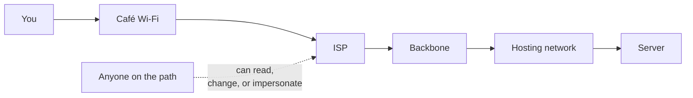

Without protection, every one of those hops can:

- **read** what you send — passwords, cookies, messages
- **change** it — inject ads, malware, a different bank account number
- **pretend** to be the server you meant to reach

---

## Three Promises

TLS exists to give two programs a channel with three properties, even over a hostile network.

<div style="display:grid;grid-template-columns:repeat(3,1fr);gap:14px;margin-top:12px">
<div style="background:var(--surface0);border:1px solid var(--surface1);border-radius:10px;padding:14px 16px"><b>Confidentiality</b><br><small style="color:var(--subtext0)">Only the two endpoints can read the data. Eavesdroppers see noise.</small></div>
<div style="background:var(--surface0);border:1px solid var(--surface1);border-radius:10px;padding:14px 16px"><b>Integrity</b><br><small style="color:var(--subtext0)">Any change in transit is detected, and the connection is torn down.</small></div>
<div style="background:var(--surface0);border:1px solid var(--surface1);border-radius:10px;padding:14px 16px"><b>Authentication</b><br><small style="color:var(--subtext0)">You know who is on the other end — at least the server, optionally the client too.</small></div>
</div>

These map directly onto RFC 8446 §1: *"the primary goal of TLS is to provide a secure channel between two communicating peers"*, with authentication, confidentiality and integrity as the listed properties.

What TLS does **not** hide: that you connected, to which IP, when, and roughly how much data moved.

---

## Where TLS Sits

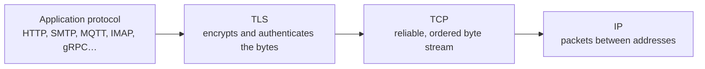

- TLS takes the byte stream an application wants to send and turns it into protected **records**
- It needs a reliable, ordered transport underneath — normally TCP
- For datagrams there is **DTLS** (RFC 9147), and **QUIC** carries the TLS 1.3 handshake inside its own packets (RFC 9001)
- `https://` is simply HTTP spoken inside TLS, usually on port 443

---

## The Lock Icon, Decoded

When a browser shows `https://` and a lock, it has checked all of this:

| Check | Meaning |
| --- | --- |
| The handshake completed | both sides derived the same secret keys |
| The certificate chains to a trusted root | a CA the browser trusts vouched for this key |
| The name matches | the certificate is for **this** hostname, not another |
| The certificate is in date and not revoked | as far as the client can tell |
| The server proved it holds the private key | a signature over this very handshake |
| Every record decrypts and verifies | nothing was changed in transit |

It does **not** mean the site is honest. It means you are talking privately to whoever controls that domain name.

---

## A Short History, With the SSL Part

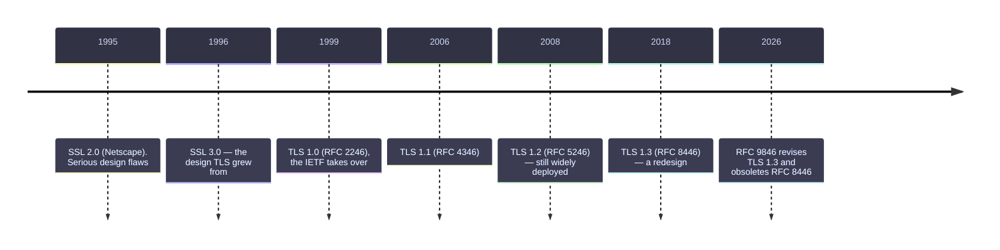

SSL 1.0 was never released. Every version before TLS 1.2 is now formally dead: SSL 2.0 (RFC 6176), SSL 3.0 (RFC 7568), TLS 1.0 and 1.1 (RFC 8996).

---

## "SSL" Today Means TLS

The protocol was renamed in 1999, but the old name never left:

| You see | It actually means |
| --- | --- |
| "SSL certificate" | an X.509 certificate used for TLS |
| OpenSSL, LibreSSL, BoringSSL | TLS libraries; the name is historical |
| `import ssl` in Python | Python's TLS module |
| "SSL termination" at a load balancer | TLS termination |
| "SSL/TLS" in documentation | TLS; SSL itself should be disabled |

```bash
# every SSL version must be off — this should fail on a sane server
openssl s_client -connect example.com:443 -ssl3
```

⚠️ Actual SSL 3.0 was broken by POODLE in 2014 (RFC 7568). If a system still negotiates it, that is a finding, not a feature.

---

## Who Uses TLS

<div style="display:grid;grid-template-columns:repeat(4,1fr);gap:12px;margin-top:12px">
<div style="background:var(--surface0);border:1px solid var(--surface1);border-radius:10px;padding:12px 14px"><b>Web</b><br><small style="color:var(--subtext0)">HTTPS, HTTP/2, HTTP/3</small></div>
<div style="background:var(--surface0);border:1px solid var(--surface1);border-radius:10px;padding:12px 14px"><b>Email</b><br><small style="color:var(--subtext0)">SMTP, IMAP, POP3 with STARTTLS or implicit TLS</small></div>
<div style="background:var(--surface0);border:1px solid var(--surface1);border-radius:10px;padding:12px 14px"><b>APIs</b><br><small style="color:var(--subtext0)">REST, gRPC, webhooks</small></div>
<div style="background:var(--surface0);border:1px solid var(--surface1);border-radius:10px;padding:12px 14px"><b>IoT</b><br><small style="color:var(--subtext0)">MQTT on 8883, CoAP over DTLS</small></div>
<div style="background:var(--surface0);border:1px solid var(--surface1);border-radius:10px;padding:12px 14px"><b>DNS</b><br><small style="color:var(--subtext0)">DNS over TLS and over HTTPS</small></div>
<div style="background:var(--surface0);border:1px solid var(--surface1);border-radius:10px;padding:12px 14px"><b>Databases</b><br><small style="color:var(--subtext0)">PostgreSQL, MySQL, Redis</small></div>
<div style="background:var(--surface0);border:1px solid var(--surface1);border-radius:10px;padding:12px 14px"><b>Service meshes</b><br><small style="color:var(--subtext0)">mutual TLS between every service</small></div>
<div style="background:var(--surface0);border:1px solid var(--surface1);border-radius:10px;padding:12px 14px"><b>VPNs</b><br><small style="color:var(--subtext0)">several are TLS or DTLS based</small></div>
</div>

TLS is the most widely deployed security protocol there is. Understanding it pays off almost everywhere.

---

## The Core Puzzle

Two programs that have **never met** must agree on a secret key, while **everyone can watch** the conversation, and while an attacker may **change** messages.

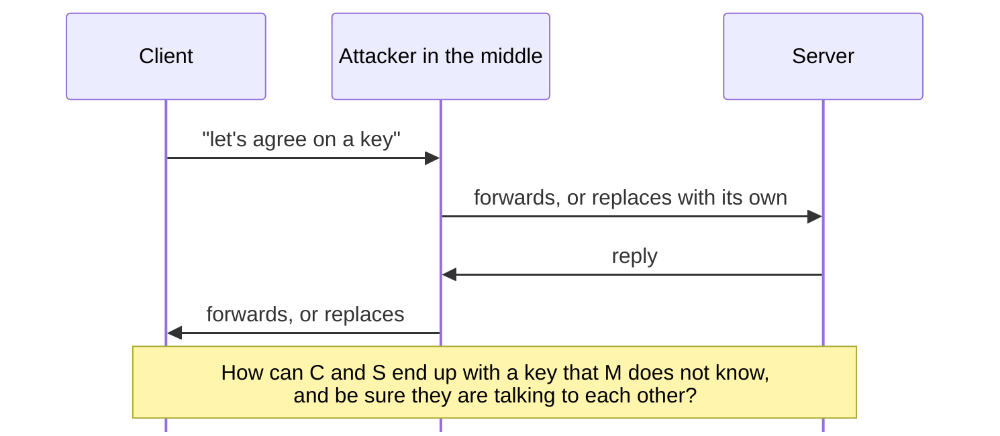

Part 2 introduces the tools that make this possible. Parts 4 and 5 show how TLS assembles them.

---

## Recap of Part 1

- The network path is untrusted: anyone on it can read, change or impersonate
- TLS gives a channel with **confidentiality, integrity and authentication**
- It sits between the application and TCP; DTLS and QUIC cover datagrams
- SSL 2.0/3.0 and TLS 1.0/1.1 are formally deprecated; **TLS 1.2 and 1.3** are what you deploy
- "SSL" survives only as a name: OpenSSL, `import ssl`, "SSL certificate"
- TLS 1.3 is specified in **RFC 8446**, now revised and obsoleted by **RFC 9846** (July 2026)

---

# Part 2 · The Building Blocks

*Five cryptographic tools, and what each one is for*

---

## The Toolbox at a Glance

| Tool | Answers the question | Examples in TLS |
| --- | --- | --- |
| **Symmetric encryption** | how do we hide data fast, once we share a key? | AES, ChaCha20 |
| **Hash function** | how do we fingerprint data? | SHA-256, SHA-384 |
| **MAC / AEAD** | how do we detect tampering? | HMAC, AES-GCM, ChaCha20-Poly1305 |
| **Key exchange** | how do two strangers get a shared key in public? | ECDHE with X25519 or P-256 |
| **Digital signature** | how do I prove a message came from me? | ECDSA, RSA-PSS, Ed25519 |
| **Key derivation** | how do we turn one secret into many keys? | HKDF (TLS 1.3), the TLS 1.2 PRF |

TLS does not invent cryptography. It is a careful **composition** of these primitives — and most historic TLS breaks were composition mistakes, not broken primitives.

---

## Symmetric Encryption

One key both locks and unlocks. Very fast; hardware-accelerated on almost every modern CPU.

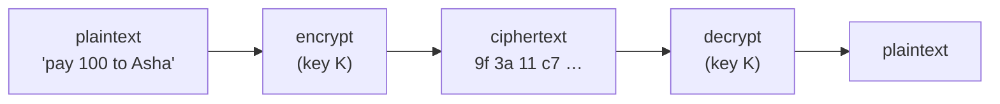

- **AES** (a block cipher) and **ChaCha20** (a stream cipher) are the two used by TLS 1.3
- ChaCha20 is faster in software, which matters on phones and microcontrollers without AES instructions
- The catch: both sides need the **same key** — and we have not met yet. Key exchange solves that

---

## Hashes: Fingerprints

```python
>>> import hashlib
>>> hashlib.sha256(b"hello").hexdigest()
'2cf24dba5fb0a30e26e83b2ac5b9e29e1b161e5c1fa7425e73043362938b9824'
>>> hashlib.sha256(b"hellp").hexdigest()
'fdd7585e08c4e2afd71dcabdb4636c89d557a3f42db9e2040c8bbd1708aa4ce7'
# one letter changed, a completely different fingerprint
```

- Fixed-size output from any input; changing one bit changes about half the output bits
- Infeasible to find two inputs with the same hash (collision resistance)
- TLS uses hashes to fingerprint the **transcript** — every handshake message so far — so both sides can check they saw the same conversation
- MD5 and SHA-1 are broken for this purpose; TLS 1.3 signatures use SHA-256 and up

---

## Integrity: MAC and AEAD

A **MAC** is a keyed fingerprint: only someone with the key can compute it, so it proves the data was not altered.

```text
HMAC-SHA256(key, message) → 32-byte tag
```

**AEAD** (Authenticated Encryption with Associated Data) does encryption and integrity **in one step**:

```text
ciphertext, tag = AEAD-Encrypt(key, nonce, plaintext, associated_data)
plaintext       = AEAD-Decrypt(key, nonce, ciphertext, associated_data)  # or fails
```

- TLS 1.3 allows **only** AEAD ciphers (RFC 8446 §5.2): AES-GCM, ChaCha20-Poly1305, AES-CCM
- TLS 1.2's older "MAC-then-encrypt" CBC suites caused a decade of padding-oracle attacks (Lucky13, POODLE)
- A nonce must **never repeat** under the same key; TLS builds it from a sequence number (RFC 8446 §5.3)

---

## Key Exchange: Mixing Paint in Public

Diffie–Hellman lets two parties derive the same secret while an eavesdropper sees every message.

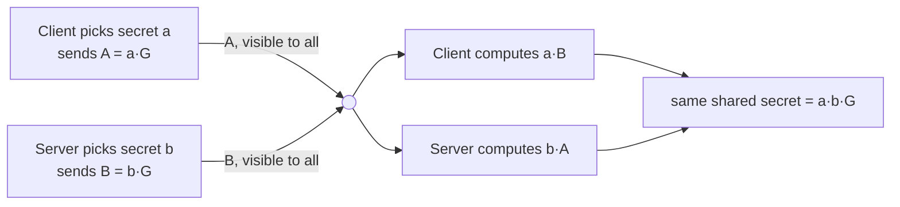

- An eavesdropper sees `A` and `B` but cannot compute `a·b·G` without `a` or `b`
- Modern TLS uses **elliptic curves**: X25519 (RFC 7748) and P-256 are the common groups
- **E**phemeral (the "E" in ECDHE): fresh `a` and `b` for every connection, thrown away afterwards

⚠️ Plain Diffie–Hellman has **no authentication**. An attacker in the middle can run one exchange with each side. Signatures fix that.

---

## Forward Secrecy

Imagine an attacker records encrypted traffic today and steals the server's private key years later.

| | Static RSA key exchange (TLS 1.2) | Ephemeral (EC)DHE |
| --- | --- | --- |
| How the session key is set up | client encrypts it with the server's **long-term** RSA key | a **fresh** key pair per connection, deleted afterwards |
| What the long-term key does | decrypts the session secret | only **signs** the handshake |
| Key stolen in 2030 | every recorded session since 2020 decrypts | past sessions stay private |

**Forward secrecy** means compromise of a long-term key does not reveal past traffic. TLS 1.3 removed static RSA and static DH key exchange entirely (RFC 8446 §1.2), so every full TLS 1.3 handshake is forward secret.

---

## Signatures: Proving Who You Are

```text
signature = Sign(private_key, message)
Verify(public_key, message, signature) → true / false
```

- Only the holder of the **private key** can produce a valid signature; anyone with the **public key** can check it
- In TLS the server signs a hash of the **handshake transcript**, which includes both sides' key-exchange values. That binds the key exchange to the server's identity and defeats the man in the middle
- TLS 1.3 signature schemes (RFC 8446 §4.2.3): `ecdsa_secp256r1_sha256`, `rsa_pss_rsae_sha256`, `ed25519` and others. RSA PKCS#1 v1.5 is allowed only inside certificates, not for handshake signatures

The remaining question — *whose public key is this?* — is answered by certificates (Part 3).

---

## Key Derivation: One Secret, Many Keys

After the key exchange there is one shared secret. TLS needs several independent keys: one per direction, for the handshake and for application data, plus IVs.

```text
HKDF-Extract(salt, input_keying_material)      → pseudorandom key   (RFC 5869)
HKDF-Expand(prk, info, length)                 → as many bytes as needed

TLS 1.3 wraps it (RFC 8446 §7.1):
HKDF-Expand-Label(Secret, Label, Context, Length)
   info = length ‖ "tls13 " + Label ‖ Context
```

- Different **labels** ("c hs traffic", "s ap traffic", …) give independent keys from the same secret
- The **context** is usually a hash of the transcript, so keys are bound to this exact handshake
- TLS 1.2 used its own PRF built from HMAC (RFC 5246 §5); TLS 1.3 uses standard HKDF throughout

---

## Randomness Holds It All Up

Every ephemeral key, every nonce seed, every `random` field in the hello messages comes from a random number generator.

- Predictable randomness breaks everything above it, silently
- Real-world failures include the 2008 Debian OpenSSL bug (only 32,767 possible keys) and embedded devices generating keys at boot before they had collected entropy
- On a microcontroller, make sure the hardware RNG is seeded and enabled before the first handshake

```python
import secrets
secrets.token_bytes(32)      # what your own code should use — never random.random()
```

---

## Recap of Part 2

- **Symmetric ciphers** (AES, ChaCha20) encrypt bulk data fast, once a key is shared
- **Hashes** fingerprint data; TLS fingerprints the whole handshake transcript
- **AEAD** encrypts and authenticates together — the only kind TLS 1.3 allows
- **(EC)DHE** gives a shared secret in public; **ephemeral** keys give forward secrecy
- **Signatures** bind the key exchange to an identity, defeating the man in the middle
- **HKDF** turns one secret into many independent, transcript-bound keys
- None of it works without good **randomness**

---

# Part 3 · Certificates and Trust

*Whose public key is this, really?*

---

## The Problem Signatures Leave Open

A signature proves "the holder of this private key signed it". It does not say **who** that holder is.

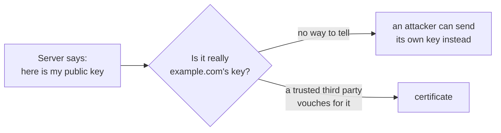

A **certificate** is a signed statement: *"the public key K belongs to the name example.com, valid from date X to date Y"* — signed by a **Certificate Authority** your software already trusts.

---

## Inside an X.509 Certificate

```bash
openssl s_client -connect example.com:443 -servername example.com </dev/null 2>/dev/null \
  | openssl x509 -noout -subject -issuer -dates -ext subjectAltName
```

```text
subject=CN=example.com                                    # illustrative output:
issuer=C=US, O=Example CA Inc, CN=Example TLS Issuing CA 1   # names and dates vary
notBefore=Jan 15 00:00:00 2026 GMT
notAfter=Jul 15 23:59:59 2026 GMT
X509v3 Subject Alternative Name:
    DNS:example.com, DNS:www.example.com
```

| Field | Purpose (RFC 5280) |
| --- | --- |
| Subject / **SAN** | the names this key may be used for; SAN is what clients check |
| Issuer | the CA that signed it |
| Validity | `notBefore` / `notAfter` |
| Public key | the key the server will prove it holds |
| Extensions | key usage, basic constraints, OCSP/CRL locations, SCTs |
| Signature | the issuer's signature over all of the above |

---

## The Chain of Trust

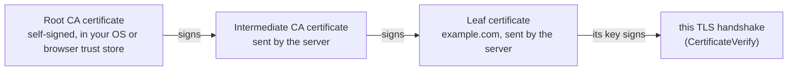

- Roots are kept offline; intermediates do the day-to-day issuing
- The server sends leaf + intermediates; the client already has the root
- The client verifies each signature up the chain, checks dates and constraints, and stops at a root it trusts

⚠️ The single most common deployment bug: the server sends the leaf **without** its intermediate. Browsers sometimes paper over it; `curl`, Python and IoT devices fail.

---

## Hostname Verification

The chain can be perfect and the connection still wrong, if the certificate is for a different name.

| Client asked for | Certificate SAN | Result |
| --- | --- | --- |
| `api.example.com` | `DNS:api.example.com` | match |
| `api.example.com` | `DNS:*.example.com` | match — a wildcard covers one label |
| `a.b.example.com` | `DNS:*.example.com` | **no match** |
| `example.com` | `DNS:*.example.com` | **no match** |
| `10.0.0.5` | `IP Address:10.0.0.5` | match — IPs need an IP SAN |
| `evil.com` | `DNS:example.com` | **no match** — this is the check that stops impersonation |

The rules are in RFC 9525 (which replaced RFC 6125). Libraries do this for you **only if you let them**: turning hostname checking off turns TLS back into encryption with nobody verified on the other end.

---

## Trust Stores

| Platform | Where the roots live |
| --- | --- |
| Windows, macOS, iOS, Android | the operating system store |
| Firefox | Mozilla's own root program (NSS) |
| Linux | `/etc/ssl/certs` and `ca-certificates`, built from Mozilla's list |
| Python `requests` | the `certifi` package — a copy of Mozilla's list |
| Python `ssl` | OpenSSL's default paths, or `truststore` to use the OS store |
| Microcontrollers | whatever CA you compiled in — often exactly one |

Root programs audit CAs continuously and **remove** those that misbehave. A trust store is a policy decision, not a static fact.

---

## When a Certificate Must Die Early: Revocation

| Mechanism | How | Reality |
| --- | --- | --- |
| **CRL** (RFC 5280) | the CA publishes a list of revoked serial numbers | lists get large; clients rarely fetch them live |
| **OCSP** (RFC 6960) | client asks the CA "is serial N still good?" | leaks browsing to the CA; adds latency; soft-fails |
| **OCSP stapling** (RFC 6066 / 6961) | the server fetches a fresh signed OCSP answer and sends it in the handshake | fixes privacy and latency |
| **Short-lived certificates** | expire before revocation would matter | the direction the industry is taking |

Several large CAs have been winding down OCSP in favour of CRLs and short lifetimes. Browsers increasingly rely on their own compressed revocation lists.

---

## Certificate Lifetimes Keep Shrinking

The CA/Browser Forum's ballot **SC-081v3** (2025) sets a schedule for the maximum validity of public TLS certificates:

| From | Maximum validity |
| --- | --- |
| before March 2026 | 398 days |
| 15 March 2026 | **200 days** |
| 15 March 2027 | **100 days** |
| 15 March 2029 | **47 days** |

The consequence is simple: **manual renewal stops being viable.** Certificate issuance and rotation must be automated end to end.

---

## Automation: ACME

ACME (RFC 8555) is the protocol behind Let's Encrypt and many other CAs.

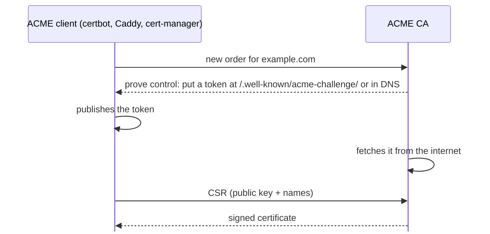

- `http-01`, `dns-01` and `tls-alpn-01` challenges prove you control the name
- Renewal is the same flow, on a timer — which is the whole point with 47-day certificates

---

## Certificate Transparency

Every publicly trusted certificate must be logged in public, append-only **CT logs** (RFC 6962, v2 in RFC 9162).

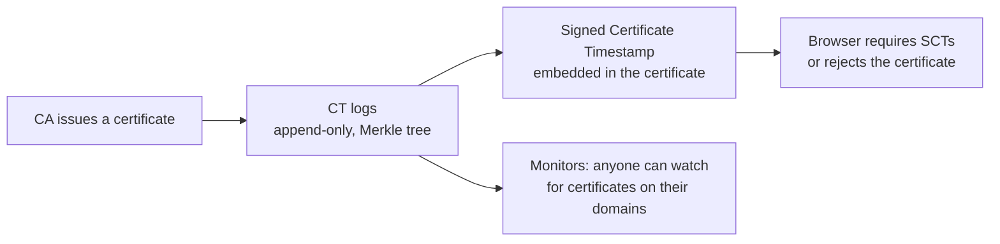

- A CA can no longer issue a certificate for your domain **secretly**
- Search the logs for your own domains (for example with crt.sh) to spot mis-issuance or forgotten subdomains
- Side effect: every hostname you put in a public certificate becomes public

---

## Mutual TLS: the Client Proves Itself Too

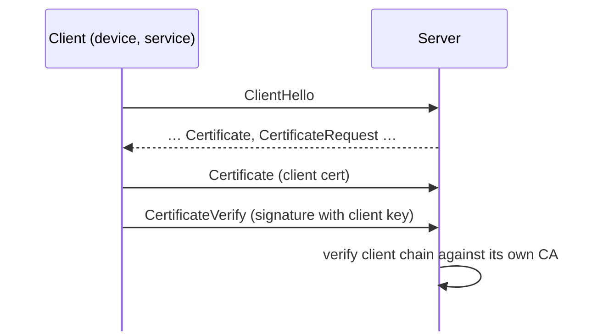

- Common in IoT (AWS IoT Core uses it), service meshes, B2B APIs and zero-trust networks
- The server usually trusts a **private CA**, not the public web roots
- Identity comes from the client certificate's subject or SAN, which then drives authorization

---

## Recap of Part 3

- A **certificate** binds a public key to names, signed by a CA
- Clients verify the **chain** to a trusted root, then check the **hostname** against the SAN (RFC 9525)
- Send your intermediates; missing ones are the top deployment bug
- Revocation is weak in practice; **short lifetimes** are replacing it: 200 days from March 2026, 47 days by 2029
- **ACME** (RFC 8555) automates issuance and renewal; **CT** (RFC 6962/9162) makes issuance public
- **Mutual TLS** authenticates the client with its own certificate

---

# Part 4 · TLS 1.2

*The version most of the internet still speaks — RFC 5246*

---

## Two Layers

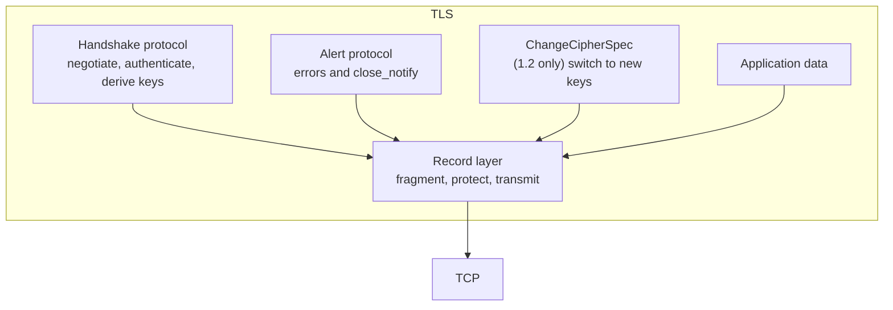

Everything TLS sends — handshake messages, alerts, your data — travels in **records**. The handshake decides the keys; the record layer uses them.

---

## The TLS 1.2 Record

```text
struct {                                     RFC 5246 §6.2
    ContentType type;         // 20 CCS, 21 alert, 22 handshake, 23 application_data
    ProtocolVersion version;  // 3,3 for TLS 1.2
    uint16 length;            // ≤ 2^14 bytes of plaintext (+ overhead)
    opaque fragment[length];
} TLSCiphertext;
```

```text
17 03 03 00 45   a4 1c 9e …
│  └──┘ └──┘     └ encrypted fragment (69 bytes)
│   │    └ length
│   └ version 1.2
└ type 23: application data
```

In TLS 1.2 the **content type is visible**, so an observer can tell handshake from alerts from data. TLS 1.3 hides it.

---

## Cipher Suites in TLS 1.2

A TLS 1.2 cipher suite names **everything** at once:

```text
TLS _ ECDHE _ RSA _ WITH _ AES_128_GCM _ SHA256
      └key     └auth       └bulk cipher   └PRF hash (and MAC for non-AEAD)
       exchange  (cert type)
```

| Suite | Key exchange | Forward secret | Verdict |
| --- | --- | --- | --- |
| `TLS_ECDHE_ECDSA_WITH_AES_128_GCM_SHA256` | ECDHE | yes | good |
| `TLS_ECDHE_RSA_WITH_CHACHA20_POLY1305_SHA256` | ECDHE | yes | good |
| `TLS_RSA_WITH_AES_128_GCM_SHA256` | static RSA | **no** | avoid |
| `TLS_ECDHE_RSA_WITH_AES_128_CBC_SHA` | ECDHE | yes | legacy CBC; avoid |
| `TLS_RSA_WITH_3DES_EDE_CBC_SHA` | static RSA | no | broken (Sweet32) |

Hundreds of suites were registered; RFC 9325 (BCP 195) recommends a handful — ECDHE with AES-GCM or ChaCha20-Poly1305.

---

## The Full Handshake (ECDHE)

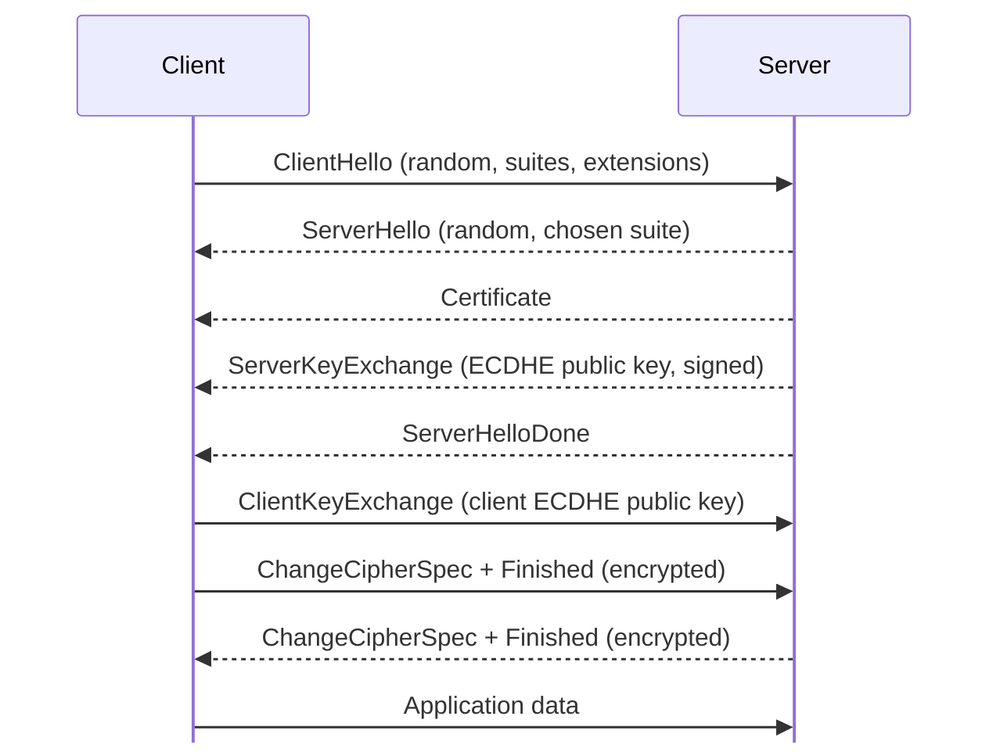

**Two round trips** before the first byte of application data. Everything before the Finished messages is sent in the clear, including the certificate.

---

## Message by Message

| Message | What it carries | RFC 5246 |
| --- | --- | --- |
| `ClientHello` | 32-byte random, session id, offered suites, extensions (SNI, ALPN, groups…) | §7.4.1.2 |
| `ServerHello` | 32-byte random, chosen suite and extensions | §7.4.1.3 |
| `Certificate` | the server's chain | §7.4.2 |
| `ServerKeyExchange` | ECDHE parameters and public key, **signed** with the certificate key over both randoms | §7.4.3 |
| `CertificateRequest` | only for mutual TLS | §7.4.4 |
| `ServerHelloDone` | "your turn" | §7.4.5 |
| `ClientKeyExchange` | client's ECDHE public key (or RSA-encrypted premaster, legacy) | §7.4.7 |
| `ChangeCipherSpec` | "records from now on use the new keys" | §7.1 |
| `Finished` | a MAC over the entire handshake transcript | §7.4.9 |

The **Finished** messages are what catch tampering: if an attacker altered any earlier message, the two transcripts differ and Finished fails.

---

## From Shared Secret to Keys (TLS 1.2)

```text
pre_master_secret = ECDHE shared secret
                                                            RFC 5246 §8.1
master_secret = PRF(pre_master_secret, "master secret",
                    ClientHello.random + ServerHello.random)[0..47]
                                                            RFC 5246 §6.3
key_block = PRF(master_secret, "key expansion",
                ServerHello.random + ClientHello.random)
          → client_write_key, server_write_key, client_write_IV, server_write_IV (…MAC keys for CBC)

verify_data = PRF(master_secret, "client finished" | "server finished",
                  Hash(handshake_messages))[0..11]           RFC 5246 §7.4.9
```

- The **PRF** is HMAC-based `P_SHA256` (or the suite's hash)
- **Extended Master Secret** (RFC 7627) replaces the randoms with a hash of the whole handshake, closing the "triple handshake" attack. Always enable it with TLS 1.2

---

## The Old RSA Key Exchange

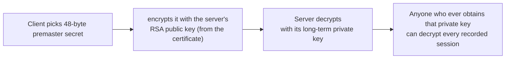

- No forward secrecy, as Part 2 showed
- PKCS#1 v1.5 decryption keeps leaking through timing and error differences: Bleichenbacher (1998) and ROBOT (2017)
- TLS 1.3 removed it completely. In TLS 1.2 configurations, **disable every `TLS_RSA_WITH_*` suite**

---

## Resumption in TLS 1.2

A full handshake costs two round trips and public-key operations. Resumption reuses a previous master secret.

| Mechanism | How | Server state |
| --- | --- | --- |
| **Session ID** (RFC 5246 §7.4.1.2) | server caches the master secret under an id; client sends the id back | stateful cache, shared across servers |
| **Session ticket** (RFC 5077) | server encrypts the session state (including the master secret) with a **ticket key** and hands the blob to the client | stateless |

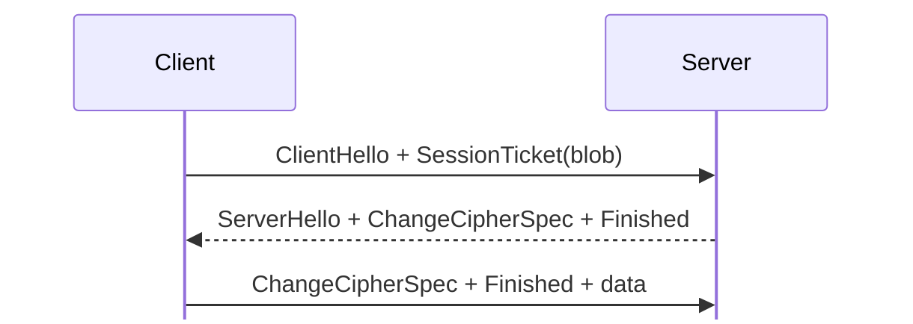

⚠️ With RFC 5077 tickets, anyone who steals the **ticket-encryption key** can decrypt every session resumed with it — and the *original* sessions too, because the ticket holds their master secret. Rotate ticket keys often, or disable tickets.

---

## Renegotiation

TLS 1.2 allowed a new handshake **inside** an existing connection — to request a client certificate midway, or to refresh keys.

- In 2009 a flaw let an attacker splice its own prefix onto a victim's renegotiated connection
- Fixed by the `renegotiation_info` extension (RFC 5746), which binds each renegotiation to the previous handshake
- Renegotiation was complex, rarely needed, and a steady source of bugs

TLS 1.3 **removed** renegotiation. Key refresh became `KeyUpdate`, and client certificates after the handshake became **post-handshake authentication** (Part 5).

---

## A Decade of Attacks, and What They Taught

| Attack (year) | Target | Lesson |
| --- | --- | --- |
| BEAST (2011) | CBC with predictable IVs in TLS 1.0 | explicit IVs; then abandon CBC |
| CRIME / BREACH (2012–13) | compression | compression before encryption leaks secrets; TLS 1.3 removed it |
| Lucky 13 (2013) | CBC MAC-then-encrypt timing | use AEAD |
| POODLE (2014) | SSL 3.0 padding | kill SSL 3.0 (RFC 7568) |
| Heartbleed (2014) | an OpenSSL bug, not the protocol | implementations matter as much as specs |
| FREAK / Logjam (2015) | export-grade RSA and DH | remove weak options entirely |
| DROWN (2016) | SSL 2.0 on the same key | never share keys with legacy protocols |
| Sweet32 (2016) | 64-bit block ciphers (3DES) | block size matters at scale |
| ROBOT (2017) | RSA key exchange | remove RSA key exchange |

Most of these became **design constraints** for TLS 1.3: remove, don't configure.

---

## A Good TLS 1.2 Configuration

```nginx
# nginx, following Mozilla's "intermediate" profile
ssl_protocols TLSv1.2 TLSv1.3;
ssl_ciphers ECDHE-ECDSA-AES128-GCM-SHA256:ECDHE-RSA-AES128-GCM-SHA256:\
ECDHE-ECDSA-AES256-GCM-SHA384:ECDHE-RSA-AES256-GCM-SHA384:\
ECDHE-ECDSA-CHACHA20-POLY1305:ECDHE-RSA-CHACHA20-POLY1305;
ssl_prefer_server_ciphers off;
ssl_session_tickets off;          # or rotate ticket keys frequently
ssl_stapling on;
```

- ECDHE only, AEAD only, no RSA key exchange, no CBC, no 3DES
- Extended Master Secret and secure renegotiation on (defaults in modern libraries)
- RFC 9325 (BCP 195) is the IETF's current guidance for both 1.2 and 1.3

---

## Recap of Part 4

- TLS has a **handshake** layer and a **record** layer; in 1.2 the record type is visible
- A 1.2 cipher suite names key exchange, authentication, cipher and hash together
- The full ECDHE handshake takes **two round trips**; the certificate is sent in clear
- Keys come from the **PRF**: premaster → master secret → key block; **Finished** MACs the transcript
- Static RSA key exchange has no forward secrecy and a long history of oracle attacks
- Resumption uses session IDs or **RFC 5077 tickets**; stolen ticket keys expose sessions
- The attack history explains TLS 1.3's philosophy: remove weak options rather than configure them away

---

# Part 5 · TLS 1.3

*A redesign: faster, simpler, and private by default — RFC 8446, revised as RFC 9846*

---

## What TLS 1.3 Set Out to Fix

RFC 8446 §1.2 lists the major differences from TLS 1.2. In short:

<div style="display:grid;grid-template-columns:1fr 1fr;gap:14px;margin-top:10px">
<div style="background:var(--surface0);border:1px solid var(--surface1);border-radius:10px;padding:12px 16px"><b>Removed</b><br><small style="color:var(--subtext0)">static RSA and static DH key exchange · CBC and RC4 · compression · renegotiation · custom DH groups · export ciphers · MD5/SHA-1 handshake signatures · ChangeCipherSpec (kept only as a disguise)</small></div>
<div style="background:var(--surface0);border:1px solid var(--surface1);border-radius:10px;padding:12px 16px"><b>Added or changed</b><br><small style="color:var(--subtext0)">1-RTT handshake · encryption from the ServerHello onwards · HKDF key schedule · PSK-based resumption · optional 0-RTT · downgrade protection · encrypted record type and padding · KeyUpdate · post-handshake auth</small></div>
</div>

The guiding idea from the attack history: **if an option has ever been broken, remove it instead of letting people configure it.**

---

## Five Cipher Suites, Down From Hundreds

In TLS 1.3 a cipher suite only names the **AEAD** and the **hash**. Key exchange and signatures are negotiated separately.

| Cipher suite (RFC 8446 §B.4) | AEAD | Hash |
| --- | --- | --- |
| `TLS_AES_128_GCM_SHA256` | AES-128-GCM | SHA-256 — mandatory to implement |
| `TLS_AES_256_GCM_SHA384` | AES-256-GCM | SHA-384 |
| `TLS_CHACHA20_POLY1305_SHA256` | ChaCha20-Poly1305 | SHA-256 |
| `TLS_AES_128_CCM_SHA256` | AES-128-CCM | SHA-256 — constrained devices |
| `TLS_AES_128_CCM_8_SHA256` | AES-128-CCM, 8-byte tag | SHA-256 — rarely enabled |

| Negotiated separately | Extension |
| --- | --- |
| Key exchange group (X25519, P-256, hybrid PQ…) | `supported_groups` + `key_share` |
| Signature algorithm | `signature_algorithms` |

---

## The 1-RTT Handshake

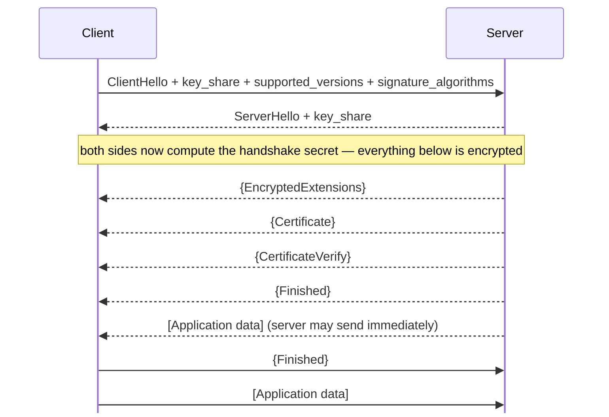

The client **guesses** a key-exchange group and sends its public key in the very first message. That removes a whole round trip compared with TLS 1.2. `{}` = handshake keys, `[]` = application keys (RFC 8446 §2).

---

## Inside the ClientHello

```text
ClientHello                                     RFC 8446 §4.1.2
  legacy_version       = 0x0303                 (always "TLS 1.2" — real version is in an extension)
  random               = 32 bytes
  legacy_session_id    = 32 random bytes        (middlebox compatibility)
  cipher_suites        = [TLS_AES_128_GCM_SHA256, TLS_CHACHA20_POLY1305_SHA256, …]
  legacy_compression   = [0]
  extensions:
    server_name          example.com             SNI, RFC 6066
    supported_versions   [0x0304, 0x0303]        §4.2.1
    supported_groups     [X25519MLKEM768, x25519, secp256r1]
    key_share            x25519: 32-byte public key (+ a hybrid share)   §4.2.8
    signature_algorithms [ecdsa_secp256r1_sha256, rsa_pss_rsae_sha256, ed25519]
    alpn                 [h2, http/1.1]          RFC 7301
    psk_key_exchange_modes [psk_dhe_ke]          §4.2.9
    pre_shared_key       (only when resuming — must be the last extension)  §4.2.11
```

Everything a server needs to finish the key exchange is in this first message.

---

## The Server's First Flight

| Message | Encrypted? | Purpose (RFC 8446) |
| --- | --- | --- |
| `ServerHello` | no | chosen suite, `supported_versions = 0x0304`, the server's `key_share` (§4.1.3) |
| `EncryptedExtensions` | **yes** | the rest of the extensions, e.g. ALPN — now hidden from observers (§4.3.1) |
| `CertificateRequest` | yes | only for mutual TLS (§4.3.2) |
| `Certificate` | **yes** | the chain — in 1.2 this was visible to everyone (§4.4.2) |
| `CertificateVerify` | yes | signature over the transcript hash (§4.4.3) |
| `Finished` | yes | HMAC over the transcript (§4.4.4) |

Encrypting the certificate means a passive observer can no longer read **which** certificate — and so which site among many on one IP — you received.

---

## What the Server Actually Signs

```text
CertificateVerify signature input                   RFC 8446 §4.4.3

  0x20 × 64                                (64 spaces — prevents cross-protocol reuse)
  "TLS 1.3, server CertificateVerify"      (context string: role-specific)
  0x00
  Transcript-Hash(ClientHello … Certificate)
```

- The transcript includes **both** key shares, so the signature binds the ephemeral key exchange to the certificate's key
- A man in the middle who substitutes its own key share changes the transcript, and the signature no longer verifies
- The fixed prefix and context string mean a TLS signature cannot be replayed as a signature in some other protocol or role

---

## Finished

```text
finished_key = HKDF-Expand-Label(BaseKey, "finished", "", Hash.length)      RFC 8446 §4.4.4
verify_data  = HMAC(finished_key, Transcript-Hash(Handshake Context,
                                                  Certificate*, CertificateVerify*))
```

- `BaseKey` is the sender's **handshake traffic secret**
- Each side proves it saw the same transcript and holds the right keys
- A client that is **not** authenticated still sends Finished; it is what confirms key agreement

After the client's Finished, the handshake is complete and both directions switch to application traffic keys.

---

## The Key Schedule

```text
                 0
                 |
       PSK ──►  HKDF-Extract = Early Secret ─┬─► "ext binder" / "res binder"   → binder_key
                 |                            ├─► "c e traffic"  (ClientHello)  → 0-RTT keys
                 |                            └─► "e exp master" (ClientHello)
             Derive-Secret(., "derived", "")
                 |
   (EC)DHE ──►  HKDF-Extract = Handshake Secret ─┬─► "c hs traffic" (CH…SH) → client handshake keys
                 |                               └─► "s hs traffic" (CH…SH) → server handshake keys
             Derive-Secret(., "derived", "")
                 |
         0 ──►  HKDF-Extract = Master Secret ─┬─► "c ap traffic" (CH…server Finished) → client app keys
                                              ├─► "s ap traffic" (CH…server Finished) → server app keys
                                              ├─► "exp master"   → exporter (RFC 5705-style keying material)
                                              └─► "res master"   (CH…client Finished) → resumption secret
```

RFC 8446 §7.1. Without a PSK the input is zeros; without (EC)DHE (psk_ke mode) it is zeros too. RFC 9846 calls the last one the "main" secret in prose; the computation is unchanged.

---

## Reading the Key Schedule

- **Three stages, each fed one new input:** the PSK, then the (EC)DHE secret, then nothing — every later key depends on everything before it
- **Transcript hashes as context** tie each secret to the exact messages exchanged up to that point
- **Separate secrets per direction and per phase**: early data, handshake, application
- `Derive-Secret(Secret, Label, Messages) = HKDF-Expand-Label(Secret, Label, Transcript-Hash(Messages), Hash.length)`
- Actual record keys come one step further down (§7.3):

```text
[sender]_write_key = HKDF-Expand-Label(Secret, "key", "", key_length)
[sender]_write_iv  = HKDF-Expand-Label(Secret, "iv",  "", iv_length)
```

This is also exactly what an `SSLKEYLOGFILE` contains: `CLIENT_HANDSHAKE_TRAFFIC_SECRET`, `SERVER_TRAFFIC_SECRET_0` and so on — the traffic secrets, per connection.

---

## HelloRetryRequest

What if the client guessed a group the server does not want?

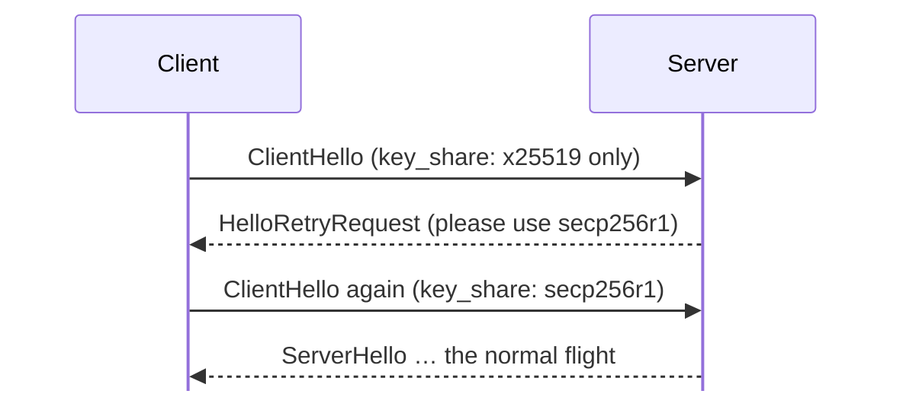

- An HRR is a `ServerHello` whose `random` is the fixed value SHA-256("HelloRetryRequest"):
  `CF21AD74E59A6111BE1D8C021E65B891C2A211167ABB8C5E079E09E2C8A8339C` (RFC 8446 §4.1.3)
- It costs an extra round trip, which is why clients send shares for the groups servers most likely accept
- Hybrid post-quantum shares are large, so clients weigh "send two shares" against "risk an HRR"

---

## Version Negotiation and Downgrade Protection

TLS 1.3 hides its version number inside the `supported_versions` extension, because too many middleboxes broke on a new value in the old field.

```text
If a TLS 1.3 server negotiates TLS 1.2, it sets the last 8 bytes of ServerHello.random to
   44 4F 57 4E 47 52 44 01    "DOWNGRD\x01"
and for TLS 1.1 or lower:
   44 4F 57 4E 47 52 44 00    "DOWNGRD\x00"                       RFC 8446 §4.1.3
```

- A TLS 1.3 client that sees this sentinel while ending up on an older version **aborts**
- The random is covered by the server's signature, so an attacker cannot strip the sentinel
- Result: an attacker in the middle cannot force two TLS 1.3-capable peers down to TLS 1.2

---

## Middlebox Compatibility Mode

Early TLS 1.3 deployments failed because firewalls and proxies dropped anything that did not look like TLS 1.2. The fix is a disguise (RFC 8446 Appendix D.4):

| Trick | Why |
| --- | --- |
| `legacy_version` stays `0x0303` | old code checks this field |
| The client sends a non-empty `legacy_session_id` | looks like a TLS 1.2 resumption attempt |
| Both sides send a dummy `ChangeCipherSpec` | middleboxes expect one before encrypted data |
| Records carry `application_data` as their outer type | hides the real content type |

On the wire, a TLS 1.3 handshake looks like a resumed TLS 1.2 session. Ossification — the network freezing around old behaviour — is a real design constraint.

---

## The TLS 1.3 Record

```text
struct {                                         RFC 8446 §5.2
    opaque content[length];
    ContentType type;             // the real type: handshake, alert, application_data
    uint8 zeros[length_of_padding];
} TLSInnerPlaintext;

struct {
    ContentType opaque_type = application_data;  // always 23 on the wire
    ProtocolVersion legacy_record_version = 0x0303;
    uint16 length;
    opaque encrypted_record[TLSCiphertext.length];
} TLSCiphertext;
```

- The **real content type is encrypted**; observers see only "application data"
- Optional **padding** can hide message lengths
- The nonce is the static IV XORed with a 64-bit record sequence number (§5.3), so it never repeats and records cannot be reordered or replayed

---

## After the Handshake

| Post-handshake message | Purpose | RFC 8446 |
| --- | --- | --- |
| `NewSessionTicket` | give the client a resumption ticket (Part 6) | §4.6.1 |
| `KeyUpdate` | move to the next generation of traffic keys | §4.6.3 |
| `CertificateRequest` | ask for a client certificate now — **post-handshake auth** | §4.6.2 |

```text
application_traffic_secret_N+1 =
    HKDF-Expand-Label(application_traffic_secret_N, "traffic upd", "", Hash.length)     §7.2
```

**KeyUpdate** matters for long-lived connections: AES-GCM keys have a safe usage limit, about 2^24.5 full-size records (§5.5). RFC 9846 makes updating before the limit mandatory.

---

## TLS 1.2 vs TLS 1.3

| | TLS 1.2 | TLS 1.3 |
| --- | --- | --- |
| Full handshake | 2 RTT | **1 RTT** |
| Resumption | 1 RTT | 1 RTT, or **0-RTT** with early data |
| Key exchange | RSA, DHE, ECDHE | (EC)DHE or PSK only — always forward secret for full handshakes |
| Ciphers | many, including CBC and RC4 | 5 AEAD suites |
| Certificate visible to observers | yes | **no** |
| Record content type visible | yes | no |
| Key derivation | TLS PRF | HKDF with a staged key schedule |
| Renegotiation | yes | removed; KeyUpdate and post-handshake auth instead |
| Downgrade protection | Finished only | sentinel in ServerHello.random |
| Specification | RFC 5246 + many extensions | RFC 8446, revised as RFC 9846 |

---

## Recap of Part 5

- TLS 1.3 **removed** everything with a history of attacks and kept only forward-secret, AEAD designs
- Cipher suites now name only the AEAD and hash; groups and signatures are negotiated separately
- The client sends its **key_share** immediately: one round trip, and everything after ServerHello is encrypted
- The server signs the **transcript**, binding the ephemeral key exchange to its certificate
- The **key schedule** runs Early → Handshake → Master secrets through HKDF, bound to transcript hashes
- HelloRetryRequest, the **DOWNGRD** sentinel and middlebox compatibility mode handle the messy real world
- KeyUpdate, post-handshake auth and NewSessionTicket all happen **after** the handshake

---

# Part 6 · Session Tickets, PSKs and 0-RTT

*Resumption in TLS 1.3, and why it is not the same as in TLS 1.2*

---

## Why Resume at All?

A full handshake costs a round trip **and** public-key work: an ECDHE key generation, a signature on the server, certificate chain verification on the client.

| Situation | Cost of a full handshake every time |
| --- | --- |
| A phone reopening an app every few minutes | battery and latency |
| A browser opening dozens of connections to one site | server CPU for signatures |
| An IoT device waking from deep sleep to publish one reading | the handshake can cost more energy than the data |

**Resumption** lets a client prove "we have talked before" with a secret from the earlier session — and skip the certificate and signature entirely.

---

## In TLS 1.3, Everything Is a PSK

TLS 1.3 unified resumption and externally configured keys into one idea: a **pre-shared key** (RFC 8446 §2.2).

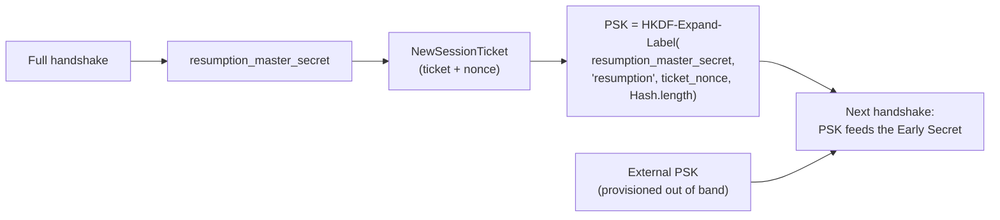

- Session IDs and RFC 5077 tickets from TLS 1.2 are gone; the ticket is now just **an identity for a PSK**
- The same machinery serves provisioned PSKs, common in constrained IoT deployments without certificates

---

## The NewSessionTicket Message

Sent by the server **after** the handshake, encrypted with application traffic keys. The server may send several, at any time.

```text
struct {                                       RFC 8446 §4.6.1
    uint32 ticket_lifetime;       // seconds; MUST NOT exceed 604800 (7 days)
    uint32 ticket_age_add;        // random value to obscure the ticket's age
    opaque ticket_nonce<1..255>;  // makes each ticket's PSK unique
    opaque ticket<1..2^16-1>;     // opaque to the client
    Extension extensions<0..2^16-2>;   // e.g. early_data (max_early_data_size)
} NewSessionTicket;
```

| Field | Why it exists |
| --- | --- |
| `ticket_lifetime` | the upper bound on reuse; clients must not cache longer than 7 days |
| `ticket_age_add` | the client sends `age + ticket_age_add` so an observer cannot link a resumption to a ticket by timing |
| `ticket_nonce` | several tickets from one connection each derive a **different** PSK |
| `ticket` | whatever the server needs to recover the PSK later |

---

## Stateful or Stateless — the Server Chooses

The `ticket` field is opaque to the client. The server decides what to put in it.

<div style="display:grid;grid-template-columns:1fr 1fr;gap:16px;margin-top:10px">
<div style="background:var(--surface0);border:1px solid var(--surface1);border-radius:10px;padding:14px 18px"><b>Stateless ticket</b><br><small style="color:var(--subtext0)">The server encrypts the PSK and session parameters with a <b>session ticket encryption key (STEK)</b> and hands the blob to the client. No database, scales across a fleet — but every server needs the STEK, and it must be rotated.</small></div>
<div style="background:var(--surface0);border:1px solid var(--surface1);border-radius:10px;padding:14px 18px"><b>Stateful ticket</b><br><small style="color:var(--subtext0)">The ticket is a random lookup key into a server-side store. Easy to revoke and to make <b>single-use</b> — which matters for 0-RTT — at the cost of a shared cache.</small></div>
</div>

Either way the client stores: the ticket, the derived PSK, the lifetime, `ticket_age_add`, the cipher suite hash, the SNI and the ALPN it was issued for.

---

## A Resumed Handshake

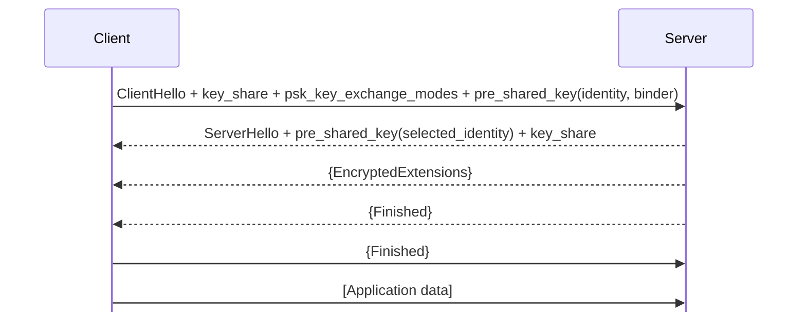

- **No Certificate, no CertificateVerify**: authentication comes from possessing the PSK (RFC 8446 §2.2)
- Still one round trip, but much less CPU on both sides
- With `psk_dhe_ke`, a fresh (EC)DHE still happens, so the new session keeps forward secrecy

---

## The `pre_shared_key` Extension

```text
struct {                                        RFC 8446 §4.2.11
    opaque identity<1..2^16-1>;       // the ticket
    uint32 obfuscated_ticket_age;     // (age in ms + ticket_age_add) mod 2^32
} PskIdentity;

struct {
    PskIdentity identities<7..2^16-1>;
    PskBinderEntry binders<33..2^16-1>;   // one HMAC per identity
} OfferedPsks;
```

- It **must be the last extension** in the ClientHello, because the binder is computed over the ClientHello up to that point
- The **binder** is an HMAC keyed from the PSK (`"res binder"` for tickets, `"ext binder"` for external PSKs) over the partial ClientHello (§4.2.11.2)
- It proves the client actually holds the PSK, and binds the offer to this exact ClientHello — so an attacker cannot copy a ticket into their own handshake

---

## `psk_ke` vs `psk_dhe_ke`

```text
enum { psk_ke(0), psk_dhe_ke(1), (255) } PskKeyExchangeMode;      RFC 8446 §4.2.9
```

| Mode | Key exchange on resumption | Forward secrecy | Use |
| --- | --- | --- | --- |
| `psk_ke` | PSK only, no (EC)DHE | **no** — steal the PSK, read the session | the very smallest devices, carefully |
| `psk_dhe_ke` | PSK **and** a fresh (EC)DHE | **yes** | the default in browsers and mainstream libraries |

With `psk_dhe_ke` the (EC)DHE secret enters the key schedule at the Handshake Secret stage, so even a stolen ticket-encryption key does not reveal resumed traffic. That is the key improvement over TLS 1.2's RFC 5077 tickets.

---

## TLS 1.2 Tickets vs TLS 1.3 Tickets

| | TLS 1.2 (RFC 5077) | TLS 1.3 (RFC 8446 §4.6.1) |
| --- | --- | --- |
| Sent | in the handshake, before ChangeCipherSpec | after the handshake, **encrypted** |
| Contains | the session's **master secret** | state to recover a **PSK derived** from `resumption_master_secret` |
| Reusing a ticket | reuses the same master secret | each ticket has its own nonce-derived PSK |
| Resumed session keys | derived from the old master secret | fresh (EC)DHE mixed in with `psk_dhe_ke` |
| Stolen ticket key exposes | the original session **and** resumptions | resumed sessions only in `psk_ke` mode, plus 0-RTT data |
| Visible to observers | yes | no |
| Lifetime cap | server policy | at most 7 days |
| Early data | no | optional 0-RTT |

---

## Tickets and Privacy

A ticket is a stable identifier. Presenting the same ticket twice lets an observer — or the server — link two connections.

- Servers commonly send **several** tickets per connection (OpenSSL issues two by default)
- Clients **should use each ticket only once** (RFC 8446 Appendix C.4) and discard it
- `obfuscated_ticket_age` hides the ticket's age on the wire
- Tickets are bound to the server name and ALPN; clients must not offer them to a different server

```text
Client ticket cache, one entry per ticket
  ticket, psk, issued_at, lifetime, age_add, suite hash, sni, alpn, max_early_data
```

---

## 0-RTT: Sending Data in the First Flight

With a ticket that allows it, the client can send application data **alongside** the ClientHello.

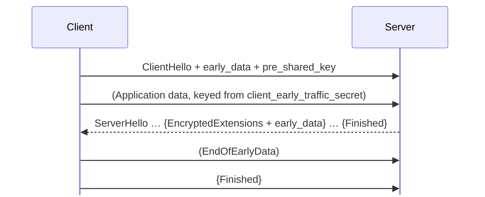

- The server advertises willingness with `max_early_data_size` in the ticket's `early_data` extension (§4.2.10)
- Early data is protected with keys from the **Early Secret** alone: the PSK, no fresh (EC)DHE
- The server may **reject** early data; the client must then resend it after the handshake

---

## The Price of 0-RTT: Replay

```mermaid
flowchart LR
  C["Client sends:<br/>ClientHello + 'POST /transfer?amount=100'"] --> S1["Server A accepts"]
  A["Attacker records the same bytes"] --> S2["replays to Server B"]
  S2 --> X["Transfer happens twice"]
```

RFC 8446 §8 is explicit: **0-RTT data has no protection against replay** and is not forward secret with respect to the PSK.

| Defence (RFC 8446 §8) | How |
| --- | --- |
| Single-use tickets (§8.1) | server remembers used tickets; needs shared state |
| ClientHello recording (§8.2) | reject a ClientHello seen before within a time window |
| Freshness checks (§8.3) | reject if the claimed ticket age is inconsistent with the time elapsed |
| **Application rules** | only accept **idempotent** requests in early data |

---

## 0-RTT and HTTP

RFC 8470 defines how HTTP deals with early data:

```http
GET /index.html HTTP/1.1
Host: example.com
Early-Data: 1          ← added by a proxy that forwarded the request before the handshake finished
```

```http
HTTP/1.1 425 Too Early  ← "retry this after the handshake completes"
```

- `GET` for a static page: fine in 0-RTT
- `POST /checkout`, `DELETE`, anything with side effects: must not be processed until the handshake completes
- Many servers and CDNs support 0-RTT but enable it only for safe methods, or not at all

For IoT and APIs, the safe default is simple: **turn 0-RTT off unless you have designed the application for replay.**

---

## Resumption in Practice

| Setting | Where |
| --- | --- |
| How many tickets a server sends | OpenSSL `SSL_CTX_set_num_tickets`, Python `SSLContext.num_tickets` |
| Disable tickets | `SSL_OP_NO_TICKET`, Python `OP_NO_TICKET`, nginx `ssl_session_tickets off` |
| Ticket key rotation | nginx `ssl_session_ticket_key` files, rotated by automation; managed LBs rotate for you |
| Allow 0-RTT | OpenSSL `max_early_data`, nginx `ssl_early_data on` (off by default) |
| Test resumption | `openssl s_client -sess_out s.pem` then `-sess_in s.pem`, look for `Reused` |

```bash
# send a request so the post-handshake tickets actually arrive before we disconnect
printf 'HEAD / HTTP/1.1\r\nHost: example.com\r\nConnection: close\r\n\r\n' |
  openssl s_client -connect example.com:443 -tls1_3 -sess_out sess.pem -quiet >/dev/null 2>&1

openssl s_client -connect example.com:443 -tls1_3 -sess_in sess.pem </dev/null 2>/dev/null | grep -E "Reused|New"
# Reused, TLSv1.3, Cipher is TLS_AES_256_GCM_SHA384
```

---

## Recap of Part 6

- TLS 1.3 turns resumption into **PSK** handshakes: the ticket is an identity, the PSK comes from `resumption_master_secret` and `ticket_nonce`
- **NewSessionTicket** arrives after the handshake, encrypted; lifetime is capped at **7 days**
- Tickets may be **stateless** (encrypted with a rotated STEK) or **stateful** (a lookup key)
- The **binder** proves PSK possession and must sit in the last ClientHello extension
- Prefer **`psk_dhe_ke`**: resumed sessions keep forward secrecy, unlike TLS 1.2 tickets
- Use each ticket **once** for privacy
- **0-RTT** saves a round trip but can be **replayed**: only for idempotent requests, and HTTP signals it with `Early-Data` and `425 Too Early` (RFC 8470)

---

# Part 7 · The Bigger Picture

*Where TLS sits in the systems you actually build*

---

## TLS Is Everywhere, Differently

```mermaid
flowchart TB
  subgraph Apps["Applications"]
    H1["HTTP/1.1, HTTP/2"] 
    H3["HTTP/3"]
    M["MQTT, SMTP, IMAP, gRPC, DB drivers"]
  end
  H1 --> TLS["TLS 1.2 / 1.3 over TCP"]
  M --> TLS
  H3 --> Q["QUIC over UDP<br/>TLS 1.3 handshake inside"]
  C["CoAP, VPNs, WebRTC"] --> D["DTLS over UDP"]
```

The TLS 1.3 **handshake and key schedule** are the common core. What differs is how records are carried: TLS records over TCP, QUIC packets over UDP, or DTLS datagrams.

---

## SNI and ALPN: Choosing Before Encrypting

Two ClientHello extensions let one IP address and port serve many things.

| Extension | Carries | Lets the server | RFC |
| --- | --- | --- | --- |
| **SNI** `server_name` | the hostname the client wants | pick the right certificate among thousands of sites on one IP | RFC 6066 §3 |
| **ALPN** | the application protocols the client speaks | agree on `h2` or `http/1.1` (or `mqtt`, `acme-tls/1`…) in the handshake | RFC 7301 |

```bash
openssl s_client -connect example.com:443 -servername example.com -alpn h2 </dev/null 2>/dev/null | grep ALPN
# ALPN protocol: h2
```

SNI travels **in the clear** in the ClientHello, so observers can see which site you are visiting — even with TLS 1.3. That is what ECH fixes.

---

## Encrypted Client Hello

ECH (RFC 9849) encrypts the sensitive parts of the ClientHello — including SNI — to a public key the client learns from DNS.

```mermaid
flowchart LR
  DNS["DNS HTTPS record<br/>publishes the ECH config (public key)"] --> C["Client"]
  C -- "outer ClientHello:<br/>SNI = cover name (e.g. the CDN)" --> F["Client-facing server"]
  C -. "inner ClientHello, encrypted:<br/>real SNI, ALPN…" .-> F
  F --> B["Backend for the real site"]
```

- Observers see only the provider's shared cover name, not which of its sites you visited
- It needs a provider hosting many sites behind one front — ECH on a single-site server hides little
- Supported by major browsers and CDNs; OpenSSL added support in 2026

---

## HTTPS, End to End

```mermaid
%%{init: {"sequence": {"mirrorActors": false}}}%%
sequenceDiagram
  participant B as Browser
  participant D as DNS
  participant S as Server
  B->>D: A / AAAA / HTTPS records for example.com
  D-->>B: address, ALPN hints, ECH config
  B->>S: TCP handshake (1 RTT)
  B->>S: TLS 1.3 ClientHello (SNI, ALPN h2)
  S-->>B: ServerHello … Finished (1 RTT)
  B->>S: HTTP/2 GET /
  S-->>B: response
```

Two round trips before the first request byte over TCP + TLS 1.3. **HSTS** (RFC 6797) then makes the browser refuse plain HTTP for that site in future, closing the "first request over HTTP" gap.

---

## QUIC and HTTP/3

QUIC (RFC 9000) runs over UDP and uses **the TLS 1.3 handshake** for its keys (RFC 9001) — but not TLS records.

| | TCP + TLS 1.3 | QUIC |
| --- | --- | --- |
| Connection setup | TCP 1 RTT + TLS 1 RTT | **1 RTT combined** |
| Resumption with 0-RTT | yes | yes |
| Record protection | TLS records | QUIC packet protection, keys from the TLS key schedule |
| Encrypted transport headers | no (TCP headers visible) | mostly yes |
| Head-of-line blocking | yes, across HTTP/2 streams | no, per stream |
| Version | TLS 1.3 or 1.2 | TLS 1.3 only |

Everything in Parts 5 and 6 — key schedule, tickets, 0-RTT replay concerns — applies to QUIC unchanged.

---

## DTLS: TLS for Datagrams

DTLS 1.3 (RFC 9147) adapts TLS 1.3 for UDP, where packets can be lost, duplicated or reordered.

- Adds its own **retransmission**, sequence numbers and epochs to the handshake
- Record headers are compacted — valuable on constrained networks
- A **cookie exchange** defends servers against spoofed-address amplification
- Used by CoAP (IoT), WebRTC media keys, some VPNs, and SIP

If TLS over TCP is available, prefer it; choose DTLS when the application genuinely needs datagrams.

---

## STARTTLS vs Implicit TLS

| Style | How | Examples |
| --- | --- | --- |
| **Implicit TLS** | TLS from the first byte on a dedicated port | HTTPS 443, SMTPS submission 465, IMAPS 993, MQTT 8883 |
| **STARTTLS** | connect in plaintext, then the application asks to upgrade | SMTP 25/587, IMAP 143, XMPP, PostgreSQL |

```text
S: 220 mail.example.com ESMTP
C: EHLO client.example
S: 250-STARTTLS
C: STARTTLS
S: 220 Ready to start TLS         ← TLS handshake begins here
```

⚠️ STARTTLS can be **stripped** by an attacker who removes the `STARTTLS` capability from the plaintext reply. RFC 8314 recommends implicit TLS for mail submission and access.

---

## Terminating TLS

```mermaid
flowchart LR
  U["Users"] -- "TLS 1.3 (public cert)" --> LB["Load balancer / CDN<br/>terminates TLS"]
  LB -- "plain HTTP" --> A1["app (inside a trusted network?)"]
  LB -- "re-encrypted TLS or mTLS" --> A2["app"]
```

- **Termination** at the edge offloads crypto and lets the proxy route on HTTP headers
- The hop from the proxy to the application is plain text unless you **re-encrypt**
- **TLS passthrough** keeps end-to-end encryption, but the proxy can only route on SNI
- Zero-trust designs re-encrypt every hop, usually with mutual TLS

---

## Mutual TLS in Service Meshes

```mermaid
flowchart LR
  subgraph Pod A
    A["service A"] --> PA["sidecar proxy"]
  end
  subgraph Pod B
    PB["sidecar proxy"] --> B["service B"]
  end
  PA -- "mTLS: both present short-lived<br/>workload certificates" --> PB
  CA["Mesh CA<br/>issues and rotates certs (hours)"] -.-> PA & PB
```

- Every workload gets an identity certificate (often a SPIFFE ID in the SAN)
- Certificates live for **hours**, rotated automatically — revocation stops mattering
- Services get encryption and identity without changing application code

---

## Post-Quantum TLS

A large quantum computer could break today's elliptic-curve key exchange. Traffic recorded **now** could be decrypted **later** ("harvest now, decrypt later").

| Piece | Status (2026) |
| --- | --- |
| Hybrid key exchange **X25519MLKEM768** | X25519 plus ML-KEM-768 (FIPS 203); specified in `draft-ietf-tls-ecdhe-mlkem` |
| Deployment | enabled by default in recent Chrome, Firefox, Safari, OpenSSL, Go; over half of human traffic to Cloudflare by late 2025 |
| Cost | a much larger `key_share` (about 1.2 KB from the client) — sometimes an extra packet |
| Post-quantum **signatures** in certificates | still being standardised and deployed; much harder, because certificates and chains grow |

Key exchange came first because it protects confidentiality against future decryption; signatures only need to be quantum-safe once a quantum attacker exists in real time.

---

## Recap of Part 7

- The TLS 1.3 handshake is the common core of TLS over TCP, **QUIC** (RFC 9001) and **DTLS 1.3** (RFC 9147)
- **SNI** picks the certificate and **ALPN** the protocol; SNI is visible unless **ECH** (RFC 9849) hides it
- HTTPS over TCP + TLS 1.3 needs two round trips; QUIC needs one; **HSTS** prevents downgrade to HTTP
- Prefer **implicit TLS** over STARTTLS where you can
- Terminating TLS at a proxy leaves the inner hop exposed unless you re-encrypt; meshes use short-lived **mTLS**
- **Hybrid post-quantum key exchange** (X25519MLKEM768) is already the default for most browser traffic

---

# Part 8 · TLS in Python

*Every example on these slides was run against a local test CA*

---

## The Map of Python TLS

```mermaid
flowchart LR
  A["Your code"] --> R["requests · httpx · aiohttp · urllib"]
  A --> S["ssl module<br/>SSLContext, SSLSocket"]
  R --> S
  S --> O["OpenSSL<br/>(the actual TLS implementation)"]
  A --> C["cryptography package<br/>keys, certificates, X.509"]
```

- `ssl` is a thin layer over **OpenSSL**: `ssl.OPENSSL_VERSION` tells you which one, and its TLS features decide yours
- HTTP libraries build an `SSLContext` for you, and accept one if you need control
- The `cryptography` package is for making keys and certificates — not for speaking TLS

---

## The One Rule: Start From `create_default_context()`

```python
import ssl
ctx = ssl.create_default_context()
```

| Default | Value |
| --- | --- |
| Protocol | `PROTOCOL_TLS_CLIENT` |
| `verify_mode` | `CERT_REQUIRED` — the server's chain must verify |
| `check_hostname` | `True` — the certificate must match the name you connect to |
| Minimum version | TLS 1.2 (Python 3.10+) |
| SSL 2 and 3 | disabled |
| Verify flags (3.13+) | `VERIFY_X509_STRICT` and `VERIFY_X509_PARTIAL_CHAIN` |
| Key logging | on only if `SSLKEYLOGFILE` is set (3.8+) |

Build on top of this. Constructing `SSLContext()` by hand and forgetting one of these lines is how insecure clients get written.

---

## A Client, Line by Line

```python
import socket, ssl

HOST, PORT = "localhost", 8443

ctx = ssl.create_default_context(cafile="ca.pem")    # verify against our CA only
ctx.minimum_version = ssl.TLSVersion.TLSv1_2
ctx.set_alpn_protocols(["h2", "http/1.1"])

with socket.create_connection((HOST, PORT)) as raw:
    with ctx.wrap_socket(raw, server_hostname=HOST) as tls:   # SNI + hostname check
        print("version :", tls.version())
        print("cipher  :", tls.cipher())
        print("alpn    :", tls.selected_alpn_protocol())
        print("SAN     :", tls.getpeercert()["subjectAltName"])
        tls.sendall(b"ping")
        print(tls.recv(1024).decode().strip())
```

```text
version : TLSv1.3
cipher  : ('TLS_AES_256_GCM_SHA384', 'TLSv1.3', 256)
alpn    : h2
SAN     : (('DNS', 'localhost'), ('IP Address', '127.0.0.1'))
hello anonymous, you sent 4 bytes over TLSv1.3
```

`server_hostname` does two jobs: it is sent as **SNI**, and it is the name the certificate is **checked against**.

---

## A Server

```python
import socket, ssl

ctx = ssl.SSLContext(ssl.PROTOCOL_TLS_SERVER)
ctx.minimum_version = ssl.TLSVersion.TLSv1_2
ctx.load_cert_chain("server.pem", "server.key")      # leaf (+ intermediates) and key
ctx.set_alpn_protocols(["h2", "http/1.1"])
ctx.num_tickets = 2                                  # TLS 1.3 tickets sent after the handshake

with socket.create_server(("127.0.0.1", 8443)) as srv:
    while True:
        conn, addr = srv.accept()
        try:
            with ctx.wrap_socket(conn, server_side=True) as tls:
                data = tls.recv(1024)
                tls.sendall(b"hello, you sent %d bytes over %s\n"
                            % (len(data), tls.version().encode()))
        except (ssl.SSLError, OSError) as e:
            print("handshake failed:", e)    # one bad client must not stop the server
```

- `server.pem` must contain the leaf **followed by its intermediates**
- The handshake happens inside `wrap_socket`; a failed handshake raises there, so catch it per connection

---

## Mutual TLS, Both Sides

```python
# server: require a client certificate from our private CA
ctx.verify_mode = ssl.CERT_REQUIRED
ctx.load_verify_locations("ca.pem")
```

```python
# client: trust the server's CA, and present our own identity
ctx = ssl.create_default_context(cafile="ca.pem")
ctx.load_cert_chain("device-42.pem", "device-42.key")

with socket.create_connection(("localhost", 8443)) as raw:
    with ctx.wrap_socket(raw, server_hostname="localhost") as tls:
        tls.sendall(b"telemetry")
        print(tls.recv(1024).decode().strip())
```

```text
hello device-42, you sent 9 bytes over TLSv1.3
```

On the server, `tls.getpeercert()["subject"]` and `["subjectAltName"]` give you the verified client identity to authorise against.

---

## Making a Test CA With `cryptography`

```python
from cryptography import x509
from cryptography.x509.oid import NameOID
from cryptography.hazmat.primitives import hashes
from cryptography.hazmat.primitives.asymmetric import ec
import datetime, ipaddress

now = datetime.datetime.now(datetime.timezone.utc)
ca_key = ec.generate_private_key(ec.SECP256R1())
ca_name = x509.Name([x509.NameAttribute(NameOID.COMMON_NAME, "Demo Root CA")])
ca = (x509.CertificateBuilder()
      .subject_name(ca_name).issuer_name(ca_name)
      .public_key(ca_key.public_key())
      .serial_number(x509.random_serial_number())
      .not_valid_before(now).not_valid_after(now + datetime.timedelta(days=3650))
      .add_extension(x509.BasicConstraints(ca=True, path_length=0), critical=True)
      .sign(ca_key, hashes.SHA256()))

srv_key = ec.generate_private_key(ec.SECP256R1())
srv = (x509.CertificateBuilder()
       .subject_name(x509.Name([x509.NameAttribute(NameOID.COMMON_NAME, "server")]))
       .issuer_name(ca.subject).public_key(srv_key.public_key())
       .serial_number(x509.random_serial_number())
       .not_valid_before(now).not_valid_after(now + datetime.timedelta(days=90))
       .add_extension(x509.SubjectAlternativeName(
           [x509.DNSName("localhost"), x509.IPAddress(ipaddress.ip_address("127.0.0.1"))]),
           critical=False)
       .sign(ca_key, hashes.SHA256()))
```

For tests and private systems only. Public names get certificates from an ACME CA.

---

## Session Resumption From Python

```python
import socket, ssl

ctx = ssl.create_default_context(cafile="ca.pem")

def connect(session=None):
    raw = socket.create_connection(("localhost", 8443))
    tls = ctx.wrap_socket(raw, server_hostname="localhost", session=session)
    tls.sendall(b"ping")
    tls.recv(1024)                        # TLS 1.3 tickets arrive after the handshake:
    s = tls.session                       # read something before grabbing the session
    print(tls.version(), "reused:", tls.session_reused,
          "ticket lifetime hint:", s.ticket_lifetime_hint, "s")
    tls.close()
    return s

first = connect()
second = connect(session=first)
```

```text
TLSv1.3 reused: False ticket lifetime hint: 7200 s
TLSv1.3 reused: True ticket lifetime hint: 7200 s
```

The classic mistake is taking `tls.session` immediately after the handshake: in TLS 1.3 the `NewSessionTicket` has not arrived yet (Part 6).

---

## HTTP Libraries

```python
import requests
requests.get("https://api.example.com/v1/items", timeout=10)             # verifies by default (certifi CA bundle)
requests.get("https://internal.example", verify="/etc/acme/ca.pem")       # a private CA
requests.get("https://api.example.com", cert=("client.pem", "client.key"))   # mutual TLS
```

```python
import ssl, httpx
ctx = ssl.create_default_context(cafile="ca.pem")
ctx.load_cert_chain("client.pem", "client.key")
with httpx.Client(verify=ctx, http2=True) as client:          # http2 needs `pip install httpx[http2]`
    r = client.get("https://localhost:8443/")
    print(r.http_version)
```

```python
import truststore
truststore.inject_into_ssl()     # use the operating system's trust store instead of certifi
```

⚠️ `verify=False` does not make TLS "a bit less strict". It removes authentication entirely; anyone on the path can impersonate the server.

---

## asyncio

```python
import asyncio, ssl

async def main():
    ctx = ssl.create_default_context(cafile="ca.pem")
    reader, writer = await asyncio.open_connection("localhost", 8443, ssl=ctx)
    tls = writer.get_extra_info("ssl_object")
    print("negotiated", tls.version(), tls.cipher()[0])
    writer.write(b"ping")
    await writer.drain()
    print((await reader.readline()).decode().strip())
    writer.close()
    await writer.wait_closed()

asyncio.run(main())
```

```text
negotiated TLSv1.3 TLS_AES_256_GCM_SHA384
hello anonymous, you sent 4 bytes over TLSv1.3
```

For servers, `asyncio.start_server(handler, host, port, ssl=server_ctx)` does the same on the other side. `server_hostname` defaults to the host you connect to.

---

## Reading the Errors

```python
try:
    with ctx.wrap_socket(raw, server_hostname=host) as tls: ...
except ssl.SSLCertVerificationError as e:
    print(e.verify_message)
except ssl.SSLError as e:
    print(e.reason)
```

| What we did | Client sees | Server sees |
| --- | --- | --- |
| used only system CAs against a private CA | `self-signed certificate in certificate chain` | `TLSV1_ALERT_UNKNOWN_CA` |
| connected as `api.example.com` | `Hostname mismatch, certificate is not valid for 'api.example.com'` | `SSLV3_ALERT_BAD_CERTIFICATE` |
| no client certificate to an mTLS server | `TLSV13_ALERT_CERTIFICATE_REQUIRED` | `PEER_DID_NOT_RETURN_A_CERTIFICATE` |
| server sent no intermediate | `unable to get local issuer certificate` | — |
| expired certificate | `certificate has expired` | — |

Notice `SSLV3_ALERT_…`: OpenSSL still names alerts after the SSL 3.0 spec they first appeared in — the SSL name surviving again.

---

## Advanced Knobs

```python
ctx.maximum_version = ssl.TLSVersion.TLSv1_2        # force 1.2, e.g. to compare behaviour
ctx.set_ciphers("ECDHE+AESGCM")                      # TLS 1.2 suites only — 1.3 suites are not affected
ctx.options |= ssl.OP_NO_TICKET                      # no session tickets
ctx.post_handshake_auth = True                       # TLS 1.3 client cert after the handshake (3.8+)
ctx.keylog_filename = "keys.log"                      # debugging only (3.8+)

contexts = {"a.example": ctx_a, "b.example": ctx_b}    # one server context per hostname
def pick_cert(tls_sock, server_name, original_ctx):  # server side, per-SNI certificates (3.7+)
    tls_sock.context = contexts.get(server_name, original_ctx)
ctx.sni_callback = pick_cert
```

| Attribute | Tells you |
| --- | --- |
| `tls.version()` | `'TLSv1.3'` |
| `tls.cipher()` | name, protocol, secret bits |
| `tls.shared_ciphers()` | server side: suites both offered |
| `tls.session_reused` | whether this was a resumption |
| `tls.getpeercert(binary_form=True)` | the DER certificate, for pinning or logging |

---

## Recap of Part 8

- Python's `ssl` wraps **OpenSSL**; `create_default_context()` gives verification, hostname checking and TLS 1.2+
- `server_hostname` is both the **SNI** and the name the certificate is checked against
- Servers load **leaf + intermediates**; mutual TLS is `CERT_REQUIRED` + `load_verify_locations` on the server and `load_cert_chain` on the client
- In TLS 1.3, grab `tls.session` **after** reading data — tickets arrive post-handshake
- `requests` and `httpx` verify by default; pass a CA file or an `SSLContext` for private CAs, **never** `verify=False`
- Error messages map directly to Part 3's checks: unknown CA, hostname mismatch, missing intermediate, expiry

---

# Part 9 · Debugging, Operations and Wrap-Up

*Seeing what actually happened on the wire*

---

## `openssl s_client`: the First Tool to Reach For

```bash
# what did we negotiate?
openssl s_client -connect example.com:443 -servername example.com -brief </dev/null

# the full chain the server sends — count the certificates
openssl s_client -connect example.com:443 -servername example.com -showcerts </dev/null

# force a version, a group, an ALPN
openssl s_client -connect example.com:443 -tls1_2
openssl s_client -connect example.com:443 -tls1_3 -groups X25519
openssl s_client -connect example.com:443 -alpn h2

# mutual TLS, and a private CA
openssl s_client -connect broker.example:8883 -CAfile ca.pem \
  -cert device.pem -key device.key

# STARTTLS protocols
openssl s_client -connect mail.example.com:587 -starttls smtp
```

```text
CONNECTION ESTABLISHED
Protocol version: TLSv1.3
Ciphersuite: TLS_AES_256_GCM_SHA384
Peer certificate: CN=example.com
Verification: OK
```

---

## Reading a Certificate From the Command Line

```bash
openssl x509 -in server.pem -noout -text | less               # everything
openssl x509 -in server.pem -noout -subject -issuer -dates      # the essentials
openssl x509 -in server.pem -noout -ext subjectAltName          # the names clients check
openssl x509 -in server.pem -noout -fingerprint -sha256         # for pinning or logs

openssl verify -CAfile ca.pem server.pem                        # does the chain verify?
openssl verify -CAfile root.pem -untrusted intermediate.pem leaf.pem

# does this key belong to this certificate?
openssl x509 -in server.pem -noout -pubkey | sha256sum
openssl pkey -in server.key -pubout | sha256sum
```

Mismatched key and certificate is the second most common deployment mistake after missing intermediates.

---

## Decrypting Your Own Traffic in Wireshark

```bash
export SSLKEYLOGFILE=$HOME/tls-keys.log        # curl, Firefox, Chrome and Python all honour it
curl -s https://example.com -o /dev/null
python3 client.py                               # Python 3.8+ reads it via create_default_context
```

```text
Wireshark → Preferences → Protocols → TLS → (Pre)-Master-Secret log filename → ~/tls-keys.log
```

```text
CLIENT_HANDSHAKE_TRAFFIC_SECRET  <client_random> <secret>
SERVER_HANDSHAKE_TRAFFIC_SECRET  <client_random> <secret>
CLIENT_TRAFFIC_SECRET_0          <client_random> <secret>
SERVER_TRAFFIC_SECRET_0          <client_random> <secret>
EXPORTER_SECRET                  <client_random> <secret>
```

These are exactly the traffic secrets from the Part 5 key schedule. With them Wireshark shows every TLS 1.3 message, including the encrypted certificate and your HTTP/2 frames.

⚠️ A key log file decrypts everything it covers. Never enable it in production.

---

## Scanners and Graders

| Tool | Use |
| --- | --- |
| `curl -v --tlsv1.3 https://…` | quick check of version, ALPN, certificate and verification |
| **testssl.sh** | a thorough command-line audit: versions, suites, known vulnerabilities, headers |
| **SSL Labs** server test | the public grade for an internet-facing server |
| **crt.sh** | search Certificate Transparency logs for your domains |
| **Mozilla SSL Configuration Generator** | known-good nginx, Apache, HAProxy… configs |
| `nmap --script ssl-enum-ciphers -p 443 host` | inventory of what a host accepts |

```bash
./testssl.sh --protocols --server-defaults --vulnerable example.com
```

---

## A Deployment Checklist

- **Protocols:** TLS 1.2 and 1.3 only (RFC 8996 and RFC 9325)
- **TLS 1.2 suites:** ECDHE + AEAD only; no static RSA, no CBC, no 3DES
- **Groups:** X25519 and P-256, plus the hybrid X25519MLKEM768 where the stack supports it
- **Certificates:** full chain sent, SAN correct, ECDSA P-256 or RSA 2048+
- **Automation:** ACME issuance and renewal, with expiry alerting well before the deadline
- **Tickets:** rotate ticket keys frequently, or disable stateless tickets; 0-RTT **off** unless designed for replay
- **HTTP:** HSTS enabled, HTTP redirected to HTTPS
- **Clients:** verification and hostname checking on, everywhere, including internal services and devices

---

## Common Failures and Their Causes

| Symptom | Likely cause |
| --- | --- |
| Works in the browser, fails in `curl` / Python | missing intermediate certificate |
| `certificate has expired` on a subset of clients | old clients with an outdated root store, or clock skew on devices |
| `Hostname mismatch` | connecting by IP or an internal alias not in the SAN |
| Handshake failure only on old devices | server disabled a suite or version they need |
| Intermittent failures behind a load balancer | nodes with different certificates or ticket keys |
| TLS works, then long-lived connections drop | idle timeouts, or a peer not handling KeyUpdate |
| Embedded device fails on first boot | no correct time yet, so every certificate looks invalid |
| Everything fails after renewal | new certificate installed without the new intermediate |

---

## Test Yourself (1/2)

- **1.** What three properties does TLS provide?
  - *Confidentiality, integrity and authentication (of the server, optionally the client).* {reveal}
- **2.** Why does TLS 1.3 need only one round trip for a full handshake?
  - *The client sends its key_share in the ClientHello, guessing the group, so the server can finish the key exchange immediately.* {reveal}
- **3.** What gives forward secrecy, and which TLS 1.2 key exchange lacks it?
  - *Ephemeral (EC)DHE keys discarded after use; static RSA key exchange has none.* {reveal}

---

## Test Yourself (2/2)

- **4.** How is the resumption PSK derived in TLS 1.3?
  - *HKDF-Expand-Label(resumption_master_secret, "resumption", ticket_nonce, Hash.length) — RFC 8446 §4.6.1.* {reveal}
- **5.** Why should 0-RTT data only carry idempotent requests?
  - *Early data can be replayed by an attacker; RFC 8446 §8 offers only partial server-side defences.* {reveal}
- **6.** Your Python client resumes nothing even though the server sends tickets. Why?
  - *It grabbed tls.session straight after the handshake; TLS 1.3 tickets arrive afterwards, so read data first.* {reveal}

---

## Glossary

| Term | Meaning |
| --- | --- |
| **AEAD** | encryption and integrity in one primitive (AES-GCM, ChaCha20-Poly1305) |
| **ALPN** | negotiates the application protocol inside the handshake (RFC 7301) |
| **CA** | certificate authority: signs certificates binding keys to names |
| **ECDHE** | ephemeral elliptic-curve Diffie–Hellman key exchange |
| **ECH** | Encrypted Client Hello: hides SNI and other ClientHello fields (RFC 9849) |
| **Forward secrecy** | long-term key compromise does not expose past sessions |
| **HKDF** | extract-and-expand key derivation (RFC 5869), the base of the 1.3 key schedule |
| **mTLS** | both sides present certificates |
| **PSK** | pre-shared key; in TLS 1.3 also how resumption works |
| **SNI** | the hostname the client asks for, in the ClientHello (RFC 6066) |
| **STEK** | session ticket encryption key, used by stateless ticket servers |
| **Transcript hash** | a running hash of all handshake messages, used to bind keys and signatures |

---

## References: the RFCs

| RFC | Title / role |
| --- | --- |
| **RFC 9846** | TLS 1.3 (July 2026) — obsoletes RFC 8446 |
| **RFC 8446** | TLS 1.3 (2018) — the original; sections cited throughout |
| **RFC 5246** | TLS 1.2 |
| RFC 5077 · RFC 7627 · RFC 5746 | TLS 1.2 session tickets · extended master secret · renegotiation fix |
| RFC 8996 · RFC 7568 · RFC 6176 | deprecating TLS 1.0/1.1 · SSL 3.0 · SSL 2.0 |
| **RFC 9325** (BCP 195) | recommendations for secure use of TLS and DTLS |
| RFC 5869 · RFC 7748 · RFC 8439 | HKDF · X25519 · ChaCha20-Poly1305 |
| RFC 6066 · RFC 7301 · RFC 9849 | SNI and other extensions · ALPN · Encrypted Client Hello |
| RFC 8470 | using early data (0-RTT) in HTTP |

---

## References: Certificates and the Wider Stack

| RFC / document | Title / role |
| --- | --- |
| **RFC 5280** | X.509 certificates and CRLs for the internet |
| RFC 9525 | service identity: how hostnames are checked (replaces RFC 6125) |
| RFC 6960 | OCSP |
| RFC 6962 · RFC 9162 | Certificate Transparency v1 and v2 |
| RFC 8555 | ACME, automated certificate issuance |
| RFC 6797 | HTTP Strict Transport Security |
| RFC 8314 | implicit TLS for email submission and access |
| RFC 9000 · RFC 9001 | QUIC · using TLS to secure QUIC |
| RFC 9147 | DTLS 1.3 |
| draft-ietf-tls-ecdhe-mlkem | hybrid post-quantum key agreement for TLS 1.3 |
| CA/B Forum Ballot SC-081v3 | the 200 → 100 → 47-day certificate lifetime schedule |
| Python `ssl` documentation | the API used in Part 8 |

---

## Your Learning Path

```mermaid
flowchart LR
  A["1 · openssl s_client<br/>against a few sites"] --> B["2 · Read one cert<br/>and its chain"]
  B --> C["3 · Build a test CA<br/>and a Python server"]
  C --> D["4 · Wireshark +<br/>SSLKEYLOGFILE"]
  D --> E["5 · Read RFC 8446 §2<br/>and §4 with the capture"]
  E --> F["6 · Resumption and<br/>tickets, by experiment"]
  F --> G["7 · mTLS between<br/>two services"]
  G --> H["8 · Harden a real server,<br/>grade it with testssl.sh"]
```

**Also good:** *The Illustrated TLS 1.3 Connection* (tls13.xargs.org) walks through every byte of a real handshake · Mozilla's server-side TLS guidelines · RFC 8446 Appendix E, the security analysis

---

## The Whole Story in One Picture

<div style="display:grid;grid-template-columns:repeat(4,1fr);gap:16px;margin-top:16px">
<div><div style="font-family:var(--font-mono);font-size:0.72em;letter-spacing:.09em;text-transform:uppercase;color:var(--overlay1);margin-bottom:8px">Why</div><div style="background:var(--surface0);border:1px solid var(--surface1);border-radius:8px;padding:8px 12px;margin-bottom:8px">confidentiality, integrity, authentication</div><div style="background:var(--surface0);border:1px solid var(--surface1);border-radius:8px;padding:8px 12px;margin-bottom:8px">SSL is history; TLS 1.2 and 1.3 remain</div></div>
<div><div style="font-family:var(--font-mono);font-size:0.72em;letter-spacing:.09em;text-transform:uppercase;color:var(--overlay1);margin-bottom:8px">Built from</div><div style="background:var(--surface0);border:1px solid var(--surface1);border-radius:8px;padding:8px 12px;margin-bottom:8px">AEAD, ECDHE, signatures, HKDF</div><div style="background:var(--surface0);border:1px solid var(--surface1);border-radius:8px;padding:8px 12px;margin-bottom:8px">certificates and CAs for identity</div></div>
<div><div style="font-family:var(--font-mono);font-size:0.72em;letter-spacing:.09em;text-transform:uppercase;color:var(--overlay1);margin-bottom:8px">Protocol</div><div style="background:var(--surface0);border:1px solid var(--surface1);border-radius:8px;padding:8px 12px;margin-bottom:8px">1.2: 2-RTT, PRF, many options</div><div style="background:var(--surface0);border:1px solid var(--surface1);border-radius:8px;padding:8px 12px;margin-bottom:8px">1.3: 1-RTT, key schedule, PSK tickets, 0-RTT</div></div>
<div><div style="font-family:var(--font-mono);font-size:0.72em;letter-spacing:.09em;text-transform:uppercase;color:var(--overlay1);margin-bottom:8px">Practice</div><div style="background:var(--surface0);border:1px solid var(--surface1);border-radius:8px;padding:8px 12px;margin-bottom:8px">Python ssl, verification always on</div><div style="background:var(--surface0);border:1px solid var(--surface1);border-radius:8px;padding:8px 12px;margin-bottom:8px">openssl, Wireshark, automation</div></div>
</div>

Left to right is also the order to learn them in.

---

# Thank You

### Now go read every line of your own handshake.

```bash
openssl s_client -connect <your-site>:443 -brief
```

```text
Protocol version: TLSv1.3
Ciphersuite: TLS_AES_128_GCM_SHA256
Verification: OK
```

Questions?
